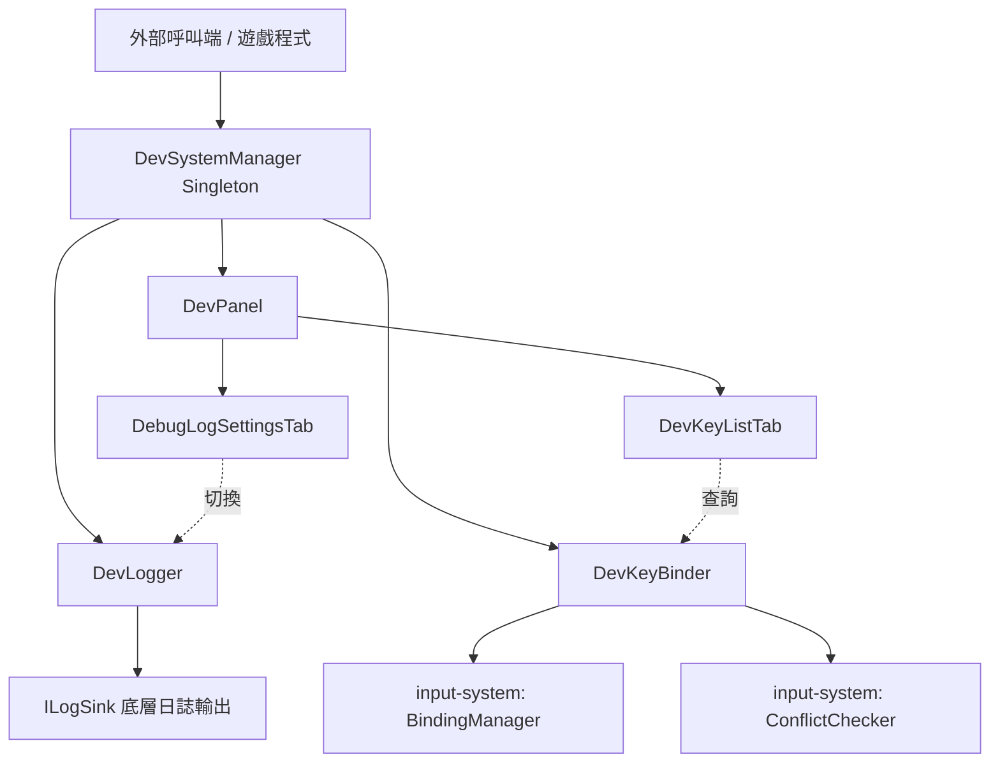
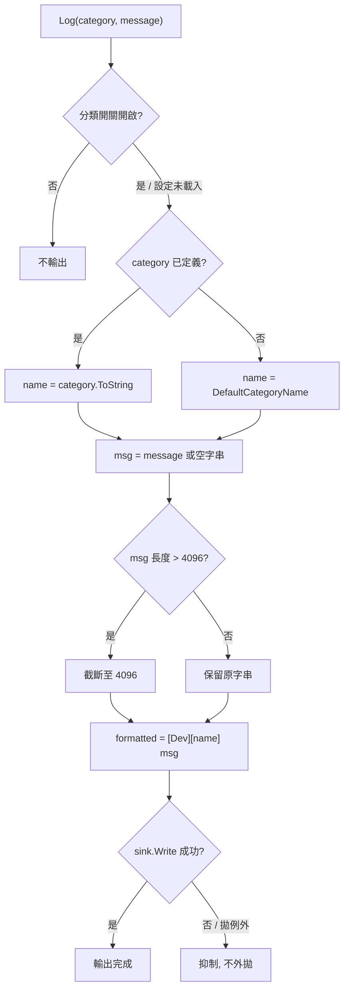
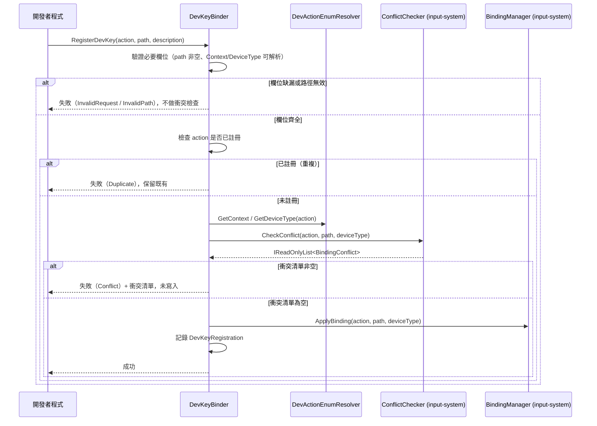
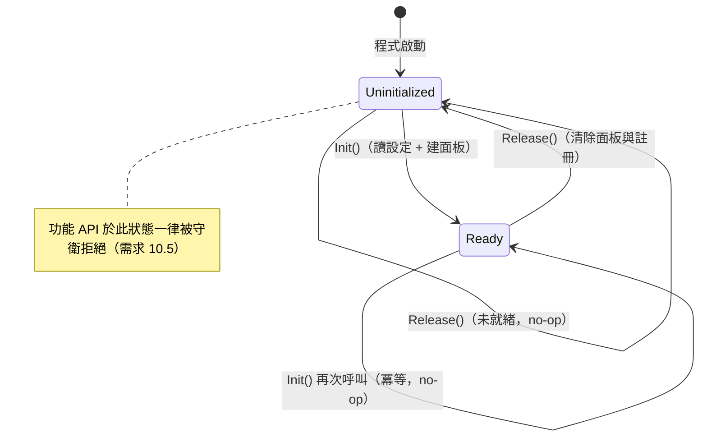

# 技術設計文件：DevSystem（開發者工具系統）

## 目錄

- [Overview](#overview)
- [Architecture](#architecture)
  - [整體結構](#整體結構)
  - [設計決策](#設計決策)
- [Components and Interfaces](#components-and-interfaces)
  - [1. DevSystemManager — 開發者系統管理器](#1-devsystemmanager--開發者系統管理器)
  - [2. DevLogger — 分類日誌元件](#2-devlogger--分類日誌元件)
  - [3. DevKeyBinder — 開發者按鍵綁定元件](#3-devkeybinder--開發者按鍵綁定元件)
  - [4. DevPanel — 通用面板架構](#4-devpanel--通用面板架構)
  - [5. Built-in Tabs — 內建分頁](#5-built-in-tabs--內建分頁)
  - [6. DEV_MODE Gating 策略](#6-dev_mode-gating-策略)
- [Data Models](#data-models)
  - [DevKeyRegistration](#devkeyregistration)
  - [PanelDefinition 與 PanelNode](#paneldefinition-與-panelnode)
  - [列舉與生命週期狀態](#列舉與生命週期狀態)
- [Correctness Properties](#correctness-properties)
  - [Property 1: Log Format Structure and Robustness — 日誌格式結構與健壯性](#property-1-log-format-structure-and-robustness--日誌格式結構與健壯性)
  - [Property 2: Category Toggle Gate Correctness — 分類開關閘控正確性](#property-2-category-toggle-gate-correctness--分類開關閘控正確性)
  - [Property 3: Toggle Config Application and Non-Persistence — 開關設定套用與不持久化](#property-3-toggle-config-application-and-non-persistence--開關設定套用與不持久化)
  - [Property 4: Dev Key Registration Query Consistency — 按鍵註冊查詢一致性](#property-4-dev-key-registration-query-consistency--按鍵註冊查詢一致性)
  - [Property 5: Dev Key Conflict Gate and Scope Reuse — 按鍵衝突閘控與範圍重用](#property-5-dev-key-conflict-gate-and-scope-reuse--按鍵衝突閘控與範圍重用)
  - [Property 6: Panel Depth Validity Invariant — 面板階層有效性不變式](#property-6-panel-depth-validity-invariant--面板階層有效性不變式)
  - [Property 7: Panel Navigation and Ordering — 面板導覽與順序保留](#property-7-panel-navigation-and-ordering--面板導覽與順序保留)
  - [Property 8: Dev Key List Ordering and Currency — 按鍵列表排序與即時性](#property-8-dev-key-list-ordering-and-currency--按鍵列表排序與即時性)
  - [Property 9: Log Settings UI-Model Sync — 日誌設定 UI 與模型同步](#property-9-log-settings-ui-model-sync--日誌設定-ui-與模型同步)
  - [Property 10: Lifecycle Correctness — 生命週期正確性](#property-10-lifecycle-correctness--生命週期正確性)
  - [Property 11: DEV_MODE No-Op Equivalence — DEV_MODE 未定義時的空實作等價性](#property-11-dev_mode-no-op-equivalence--dev_mode-未定義時的空實作等價性)
- [Error Handling](#error-handling)
  - [錯誤場景與對應策略](#錯誤場景與對應策略)
  - [錯誤回傳設計](#錯誤回傳設計)
- [Testing Strategy](#testing-strategy)
  - [使用的測試框架](#使用的測試框架)
  - [測試撰寫與執行分離](#測試撰寫與執行分離)
  - [屬性導向測試（PBT）](#屬性導向測試pbt)
  - [範例導向測試（Unit Tests）](#範例導向測試unit-tests)
  - [注意事項](#注意事項)

---

## Overview

DevSystem 是一套統一的開發者除錯與工具框架，讓開發者能在開發期間快速掛載除錯功能，並在正式版本中完全消失。本設計文件依據 `requirements.md` 的 10 項需求，定義以下核心元件：

- **DevSystemManager**：頂層管理器，繼承既有 `Singleton<DevSystemManager>`，提供 `Init` / `Release` 生命週期 API 與就緒狀態守衛（對應需求 10）。
- **DevLogger**：分類化除錯日誌，固定 `[Dev][分類] MSG` 格式，提供 enum 分類、逐分類記憶體開關與設定檔載入（對應需求 2、3）。
- **DevKeyBinder**：開發者按鍵綁定，透過既有 input-system 的 `BindingManager` 進行動態綁定、透過既有 `ConflictChecker` 進行衝突檢查後才寫入 `DevKeyRegistration`（對應需求 4、5）。
- **DevPanel**：以 UI Toolkit 建置的通用面板，支援 1～100 個分頁、1～10 階層深度、宣告式建構、無執行期公開變更 API（對應需求 6、7）。
- **內建分頁**：`DevKeyListTab`（列出按鍵註冊）與 `DebugLogSettingsTab`（切換日誌分類開關）（對應需求 8、9）。

設計核心原則有二。其一為**低耦合的整合**：DevSystem 不重新實作綁定與衝突邏輯，而是重用 input-system spec 已定義的真實 API（`InputSystemManager.BindingManager`、`InputSystemManager.ConflictChecker`、`BindingConflict`、`[InputActionEnum]`、`ActionEnumResolver`），並沿用 singleton-pattern spec 的 `Singleton<T>` 基底。其二為**編譯期消失**：以單一 compilation symbol `DEV_MODE` 控制所有開發者功能邏輯，未定義時公開 API 仍可編譯但方法主體為 no-op、回傳 `default(T)`，使正式版呼叫端零警告、零副作用（對應需求 1）。

程式以 **C#** 實作，遵循 Unity 6000.5.7f1 相容版本、New Input System、UI Toolkit，並符合本專案 StyleCop 規範。所有程式置於 `Assets/Scripts/DevSystem` 子資料夾與對應命名空間下。

[↩](#目錄)
---

## Architecture

### 整體結構

DevSystem 以 `DevSystemManager`（Singleton）為單一入口，聚合 `DevLogger`、`DevKeyBinder`、`DevPanel` 三個子元件。`DevKeyBinder` 透過關聯持有既有 input-system 的 `BindingManager` 與 `ConflictChecker`（自 `InputSystemManager.Instance` 取得），不重新實作綁定或衝突邏輯。內建分頁 `DevKeyListTab`、`DebugLogSettingsTab` 實作 `IDevPanelTab` 介面，分別對 `DevKeyBinder` 與 `DevLogger` 進行查詢與切換。

完整類別關係圖如下：


各層責任分工：



### 設計決策

| 決策 | 選項 | 採用方案 | 理由 |
|------|------|----------|------|
| DevSystemManager 生命週期 | 靜態類別 vs Singleton | **繼承 `Singleton<DevSystemManager>`** | 需求 10.2 要求 Singleton 慣例；重用專案既有基底與執行緒安全延遲初始化 |
| 生命週期 API 命名 | Setup/Teardown vs Init/Release | **`Init` / `Release`** | 符合專案 manager 命名慣例與需求 10 用語 |
| 就緒狀態表示 | bool 旗標 vs enum | **`DevSystemState` enum（Uninitialized / Ready）** | 對齊 input-system 的 `SystemState` 模式，語意清晰、便於守衛判斷（需求 10.5） |
| DEV_MODE gating 模型 | 排除整個型別 vs 保留型別＋空方法主體 | **保留型別，方法主體以 `#if DEV_MODE ... #else (no-op) #endif` 包裹** | 需求 1.2～1.5 要求未定義時仍可編譯且呼叫端零警告；排除型別會使呼叫端編譯失敗 |
| void API 的 gating | `#if` no-op vs `[Conditional("DEV_MODE")]` | **void 且無回傳的 API 可用 `[Conditional("DEV_MODE")]`；有回傳值者一律用 `#if/#else` no-op 主體** | `[Conditional]` 只能施用於 `void` 方法（呼叫端整句被移除）；有回傳值方法無法使用，須以 `#else` 分支回傳 `default` |
| 日誌分類型別 | `string` vs `enum` | **`LogCategory` enum** | 需求 2.3 限制呼叫端僅能指定已定義分類；需求 2.4 靠新增列舉成員擴充 |
| 未定義分類值處理 | 拋例外 vs 固定預設名稱 | **`Enum.IsDefined` 檢查，未定義時使用固定預設分類名稱（如 `General`）** | 需求 2.6 要求不拋例外並以固定預設名稱輸出 |
| 底層日誌抽象 | 直接呼叫 `UnityEngine.Debug` vs `ILogSink` 介面 | **`ILogSink` 介面（預設實作包裹 `Debug.Log`）** | 需求 2.8 要求底層失敗時優雅抑制；介面便於測試注入失敗情境 |
| 日誌開關儲存位置 | 寫回設定檔 vs 純記憶體暫存 | **純記憶體 `Dictionary<LogCategory, bool>`，永不寫回** | 需求 3.7 明確禁止寫回設定檔或任何持久化，避免個人設定誤入版本控制 |
| 開關設定檔格式 | 每分類一個 bool property vs 啟用分類的 enum 清單 | **ScriptableObject + `[ShowInInspector] List<LogCategory>`（啟用清單，非 `[SerializeField]`）** | 以啟用分類的 enum 清單儲存，新增 `LogCategory` 成員時無需修改設定類別（利於擴充）；清單內＝啟用、清單外＝停用；純 property 不被序列化 → 不落地、不進版本控制（需求 3.7）；Odin `[ShowInInspector]` 於 Editor 顯示與調整（Odin 視為既有套件）；`ILogToggleConfigLoader` 介面仍保留以解耦與便於測試 |
| 綁定與衝突實作 | DevSystem 自行實作 vs 重用 input-system | **重用 `InputSystemManager.BindingManager` 與 `ConflictChecker`** | 需求 4.1、5.1 明確要求透過既有系統；避免重複邏輯與衝突判定分歧 |
| 衝突判定範圍 | DevSystem 自訂 vs 完全委派 ConflictChecker | **完全委派 `ConflictChecker.CheckConflict`** | 需求 5.2 要求與 ConflictChecker 相同判定範圍（同 Context＋同 DeviceType＋區分大小寫路徑相等） |
| Dev 動作識別 | `string` vs `enum + [InputActionEnum]` | **`DevAction` enum（Dev 前綴）並標註 `[InputActionEnum]`** | 需求 4.5 要求 Dev 前綴；重用 input-system 的 Attribute 與 `ActionEnumResolver` 取得 Context |
| 面板變更時機 | 執行期動態 API vs 宣告式建構 | **建構時傳入 `PanelDefinition`，不公開執行期變更 API** | 需求 7.5 禁止對外公開執行期新增/排序/升降 API |
| Panel_Max_Depth 設定方式 | 執行期可設定 vs 固定編譯期常數 | **固定編譯期 `const`（同 MaxTabCount）** | 深度上限為固定值、無需執行期調整；簡化 API 並移除未設定深度時停用面板的狀態；建構時仍驗證節點深度不超過該常數（需求 6.5/7.3） |
| 面板結構定義方式 | 扁平清單（ParentId+Order） vs 巢狀定義（Children 清單） | **巢狀 `PanelNodeDefinition`（含 `List<PanelNodeDefinition> Children`，順序即清單順序）** | 巢狀結構直接對應樹狀階層，作者撰寫直覺、無需維護 ParentId 對應；顯示順序即清單順序，免除獨立 Order 欄位；`DevPanel.Build` 直接依巢狀定義建立 `PanelNode` 樹並驗證深度 |
| 節點顯示判定 | 顯式標記 leaf vs 由是否有子節點推導 | **由 `Children` 是否為空推導 `PanelNodeKind`** | 需求 6.2/6.3/6.8：有子分頁顯示選擇器，無子分頁顯示葉內容 |
| 錯誤回傳風格 | 例外 vs 回傳值/結果物件 | **回傳值模式（`bool` 或結果物件），沿用 input-system 慣例** | 遊戲迴圈避免 try-catch 成本；與既有系統一致 |

[↩](#目錄)
---

## Components and Interfaces

### 1. DevSystemManager — 開發者系統管理器

繼承 `Singleton<DevSystemManager>`，作為 DevSystem 的統一入口，聚合三個子元件並維護就緒狀態。所有功能 API 在非就緒狀態下拒絕呼叫（需求 10.5）；`Init` 具冪等性（需求 10.6）；`Release` 需完整清除，任一部分無法清除即回傳失敗，但狀態仍轉為未就緒（需求 10.4、10.7）。

```csharp
/// <summary>
/// DevSystem 的頂層管理器，繼承 Singleton 確保全域唯一存取。
/// 負責初始化與釋放日誌、按鍵綁定與面板子系統，並維護就緒狀態守衛。
/// </summary>
public class DevSystemManager : Singleton<DevSystemManager>
{
    private DevSystemState _state = DevSystemState.Uninitialized;
    private DevLogger _logger;
    private DevKeyBinder _keyBinder;
    private DevPanel _panel;

    /// <summary>
    /// Initializes a new instance of the <see cref="DevSystemManager"/> class.
    /// </summary>
    protected DevSystemManager()
    {
    }

    /// <summary>
    /// Gets 目前的系統就緒狀態。
    /// </summary>
    public DevSystemState State
    {
        get
        {
#if DEV_MODE
            return this._state;
#else
            return default;
#endif
        }
    }

    /// <summary>
    /// Gets 分類日誌元件（未就緒時為 null）。
    /// </summary>
    public DevLogger Logger { get; private set; }

    /// <summary>
    /// Gets 開發者按鍵綁定元件（未就緒時為 null）。
    /// </summary>
    public DevKeyBinder KeyBinder { get; private set; }

    /// <summary>
    /// Gets 開發者面板（未就緒時為 null）。
    /// </summary>
    public DevPanel Panel { get; private set; }

    /// <summary>
    /// 初始化 DevSystem：讀取日誌開關設定、建立面板並標記為就緒。
    /// 已就緒時再次呼叫為冪等操作，不重複建立或重讀設定。
    /// </summary>
    /// <param name="definition">面板宣告式結構定義。</param>
    /// <returns>初始化成功回傳 true。</returns>
    public bool Init(PanelDefinition definition)
    {
#if DEV_MODE
        // 需求 10.6：已就緒時為 no-op 並維持既有狀態
        // 需求 10.1：讀取 Log_Toggle_Config、建立 DevPanel、標記 Ready
        return default; // 實作省略
#else
        return default;
#endif
    }

    /// <summary>
    /// 釋放 DevSystem：釋放面板資源、清除所有 DevKeyRegistration。
    /// 未就緒時為 no-op；無法完整清除時回傳 false，但狀態仍轉為未就緒。
    /// </summary>
    /// <returns>完整清除回傳 true；任一部分未清除回傳 false。</returns>
    public bool Release()
    {
#if DEV_MODE
        // 需求 10.3、10.4、10.7
        return default; // 實作省略
#else
        return default;
#endif
    }
}
```

**公開介面摘要：**

| 成員 | 回傳型別 | 說明 | 對應需求 |
|------|----------|------|----------|
| `Init(PanelDefinition)` | `bool` | 讀取設定、建立面板、標記就緒（冪等） | 10.1, 10.6 |
| `Release()` | `bool` | 釋放面板、清除註冊；未完整清除回傳 false | 10.3, 10.4, 10.7 |
| `State` | `DevSystemState` | 目前就緒狀態 | 10.5 |
| `Logger` / `KeyBinder` / `Panel` | 各子元件 | 子元件存取點 | 2, 4, 6 |

### 2. DevLogger — 分類日誌元件

提供 `Log(LogCategory, string)` API，依 `[Dev][分類] MSG` 格式輸出。維護逐分類記憶體開關（`Dictionary<LogCategory, bool>`），從 `ILogToggleConfigLoader` 載入初始狀態，並提供執行期切換 API 給 `DebugLogSettingsTab`。開關狀態永不寫回設定檔（需求 3.7）。

預設的 `ILogToggleConfigLoader` 實作（`DevLogToggleConfigLoader`）讀取一個 `DevLogToggleConfig` ScriptableObject，其開關以「啟用的 `LogCategory` 清單」（`List<LogCategory>`）儲存：清單內的分類＝啟用、清單外的分類＝停用（清單為權威來源）。以 enum 清單儲存的好處是新增 `LogCategory` 列舉成員時無需修改設定類別（利於擴充）。該清單標註 Odin Inspector `[ShowInInspector]` 呈現，且為純 C# property（非 `[SerializeField]`），Unity 不會序列化其值，因此值不落地、不進版本控制，直接滿足需求 3.7「永不寫回」的要求；開發者於執行前在 Editor Inspector 中手動設定啟用清單。`ILogToggleConfigLoader` 介面仍保留，以解耦載入來源並便於測試/mock。

需注意「所有分類預設為開啟」僅為 **DevLogger** 於「尚無設定檔」或「載入尚未完成」時的行為（需求 3.5、3.6），並非設定檔的語意；一旦設定檔載入完成，未出現於啟用清單的分類即為停用。

```csharp
/// <summary>
/// 分類化除錯日誌元件，輸出固定格式 [Dev][分類] MSG，
/// 並維護逐分類的記憶體開關（載入時套用設定檔、執行期可切換、永不寫回）。
/// </summary>
public class DevLogger
{
    /// <summary>訊息字串長度上限。</summary>
    public const int MaxMessageLength = 4096;

    /// <summary>未定義 LogCategory 值時使用的固定預設分類名稱。</summary>
    private const string DefaultCategoryName = "General";

    private readonly Dictionary<LogCategory, bool> _toggles = new Dictionary<LogCategory, bool>();
    private readonly ILogSink _sink;
    private bool _configLoaded;

    /// <summary>
    /// Initializes a new instance of the <see cref="DevLogger"/> class.
    /// </summary>
    /// <param name="sink">底層日誌輸出接收器。</param>
    public DevLogger(ILogSink sink)
    {
        this._sink = sink;
    }

    /// <summary>
    /// 輸出一筆分類日誌。分類開關關閉時不輸出；
    /// 訊息為 null/空字串時 MSG 為空；超過上限截斷至 <see cref="MaxMessageLength"/>；
    /// 未定義分類值使用固定預設名稱；底層輸出失敗時抑制且不拋例外。
    /// </summary>
    /// <param name="category">日誌分類列舉值。</param>
    /// <param name="message">訊息字串。</param>
    public void Log(LogCategory category, string message)
    {
#if DEV_MODE
        // 需求 2.2/2.5/2.6/2.7/2.8、3.1/3.2/3.6/3.10
#else
        // no-op
#endif
    }

    /// <summary>
    /// 切換指定分類的暫存開關狀態（供 Debug_Log_Settings_Tab 於執行期呼叫）。
    /// 僅更新記憶體狀態，永不寫回設定檔。
    /// </summary>
    /// <param name="category">目標分類。</param>
    /// <param name="enabled">目標開關狀態。</param>
    /// <returns>更新成功回傳 true；失敗回傳 false（供 UI 還原）。</returns>
    public bool SetCategoryEnabled(LogCategory category, bool enabled)
    {
#if DEV_MODE
        return default; // 需求 3.7、3.9、3.10、9.4
#else
        return default;
#endif
    }

    /// <summary>
    /// 查詢指定分類目前的開關狀態。設定尚未載入時一律視為開啟。
    /// </summary>
    /// <param name="category">目標分類。</param>
    /// <returns>開啟回傳 true。</returns>
    public bool IsCategoryEnabled(LogCategory category)
    {
#if DEV_MODE
        return default; // 需求 3.6（載入前預設 ON）
#else
        return default;
#endif
    }

    /// <summary>
    /// 取得目前所有可用的 LogCategory（供 Debug_Log_Settings_Tab 列出）。
    /// </summary>
    /// <returns>分類清單。</returns>
    public IReadOnlyList<LogCategory> GetCategories()
    {
#if DEV_MODE
        return default; // 需求 9.2、9.3
#else
        return default;
#endif
    }

    /// <summary>
    /// 依設定檔重新套用各分類的暫存開關狀態。
    /// 設定檔以啟用清單表示：出現於清單者為啟用、未出現者為停用（清單為權威來源）。
    /// 重新載入會覆蓋任何執行期調整（需求 3.8）。載入前的「全部開啟」為 DevLogger 於無設定/載入前的行為（需求 3.5/3.6）。
    /// </summary>
    /// <param name="loader">開關設定載入器。</param>
    public void LoadToggleConfig(ILogToggleConfigLoader loader)
    {
#if DEV_MODE
        // 需求 3.3/3.4/3.5/3.8
#else
        // no-op
#endif
    }
}
```

**格式化與閘控流程：**



**ILogSink / ILogToggleConfigLoader 介面：**

```csharp
/// <summary>
/// 底層日誌輸出接收器抽象。預設實作包裹 UnityEngine.Debug.Log。
/// </summary>
public interface ILogSink
{
    /// <summary>
    /// 輸出一筆已格式化的日誌字串。
    /// </summary>
    /// <param name="formatted">已格式化字串。</param>
    /// <returns>輸出成功回傳 true；失敗回傳 false（DevLogger 據此抑制）。</returns>
    bool Write(string formatted);
}

/// <summary>
/// 日誌開關設定載入器抽象。僅提供讀取，永不寫入（需求 3.7）。
/// </summary>
public interface ILogToggleConfigLoader
{
    /// <summary>
    /// 載入各 LogCategory 的初始開關狀態。回傳的對映涵蓋所有已定義的 LogCategory：
    /// 出現於設定啟用清單者為 true、未出現者為 false（清單為權威來源）。
    /// </summary>
    /// <returns>分類到開關狀態的唯讀對映。</returns>
    IReadOnlyDictionary<LogCategory, bool> Load();
}
```

**DevLogToggleConfig / DevLogToggleConfigLoader（預設實作）：** 預設載入來源為 `DevLogToggleConfig` ScriptableObject，其開關以「啟用的 `LogCategory` 清單」（`List<LogCategory>`）儲存：清單內＝啟用、清單外＝停用。此設計使新增 `LogCategory` 列舉成員時無需修改設定類別。該清單以 `[ShowInInspector]` C# property（非 `[SerializeField]`）呈現，因此值不被 Unity 序列化、不落地、不進版本控制（需求 3.7）；預設的 `ILogToggleConfigLoader` 實作 `DevLogToggleConfigLoader` 包裹一個 `DevLogToggleConfig` 實例，於 `Load()` 中將啟用清單映射為涵蓋所有 `LogCategory` 的 `IReadOnlyDictionary<LogCategory, bool>`。

```csharp
/// <summary>
/// 日誌開關設定（ScriptableObject）。以「啟用的 LogCategory 清單」儲存開關，
/// 新增 LogCategory 列舉成員時無需修改本類別（利於擴充）。
/// 清單以 Odin Inspector 的 [ShowInInspector] 呈現，且為純 C# property（非 [SerializeField]），
/// 因此值不被 Unity 序列化、不落地、不進版本控制（需求 3.7）。
/// </summary>
[CreateAssetMenu(menuName = "DevSystem/Log Toggle Config")]
public class DevLogToggleConfig : ScriptableObject
{
    /// <summary>啟用的日誌分類清單；清單內為開啟、清單外為關閉。</summary>
    [ShowInInspector]
    public List<LogCategory> EnabledCategories { get; set; } = new List<LogCategory>();
}

/// <summary>
/// 預設 ILogToggleConfigLoader 實作。包裹一個 DevLogToggleConfig 實例，
/// 於 Load() 中將其啟用清單映射為涵蓋所有 LogCategory 的 IReadOnlyDictionary&lt;LogCategory, bool&gt;。
/// </summary>
public class DevLogToggleConfigLoader : ILogToggleConfigLoader
{
    private readonly DevLogToggleConfig _config;

    /// <summary>
    /// Initializes a new instance of the <see cref="DevLogToggleConfigLoader"/> class.
    /// </summary>
    /// <param name="config">開關設定 ScriptableObject。</param>
    public DevLogToggleConfigLoader(DevLogToggleConfig config)
    {
        this._config = config;
    }

    /// <inheritdoc/>
    public IReadOnlyDictionary<LogCategory, bool> Load()
    {
        // 清單內＝啟用、清單外＝停用；涵蓋所有已定義的 LogCategory
        var enabled = new HashSet<LogCategory>(this._config.EnabledCategories);
        var map = new Dictionary<LogCategory, bool>();
        foreach (LogCategory category in System.Enum.GetValues(typeof(LogCategory)))
        {
            map[category] = enabled.Contains(category);
        }

        return map;
    }
}
```

### 3. DevKeyBinder — 開發者按鍵綁定元件

提供 `RegisterDevKey`、`Unbind`、`GetRegistrations` API。註冊時**先**透過 input-system 的 `ConflictChecker.CheckConflict` 檢查衝突（與所有 Normal_Binding 及既有 Dev 註冊），衝突清單為空且欄位齊全才透過 `BindingManager.ApplyBinding` 綁定並寫入 `DevKeyRegistration`（需求 5.1、5.4）。`BindingManager` 與 `ConflictChecker` 由 `InputSystemManager.Instance` 取得，DevSystem 不重新實作綁定與衝突邏輯。

```csharp
/// <summary>
/// 開發者按鍵綁定元件。透過 input-system 的 BindingManager 執行動態綁定、
/// 透過 ConflictChecker 於寫入前進行衝突檢查，並維護 DevKeyRegistration 清單。
/// </summary>
public class DevKeyBinder
{
    private readonly Dictionary<DevAction, DevKeyRegistration> _registrations
        = new Dictionary<DevAction, DevKeyRegistration>();
    private readonly BindingManager _bindingManager;
    private readonly ConflictChecker _conflictChecker;

    /// <summary>
    /// Initializes a new instance of the <see cref="DevKeyBinder"/> class.
    /// </summary>
    /// <param name="bindingManager">既有 input-system 的按鍵綁定管理器。</param>
    /// <param name="conflictChecker">既有 input-system 的衝突檢查器。</param>
    public DevKeyBinder(BindingManager bindingManager, ConflictChecker conflictChecker)
    {
        this._bindingManager = bindingManager;
        this._conflictChecker = conflictChecker;
    }

    /// <summary>
    /// 註冊開發者按鍵。流程：驗證必要欄位 → ConflictChecker 衝突檢查 →
    /// 無衝突則 BindingManager.ApplyBinding 並記錄 DevKeyRegistration。
    /// 路徑無效、重複 DevAction、有衝突或欄位缺漏皆拒絕並回傳對應結果。
    /// </summary>
    /// <param name="action">開發者動作列舉值（Dev 前綴，標註 [InputActionEnum]）。</param>
    /// <param name="bindingPath">目標按鍵路徑（Binding Path）。</param>
    /// <param name="description">功能敘述文字。</param>
    /// <returns>綁定結果，包含成功旗標、失敗原因與衝突清單。</returns>
    public DevKeyBindResult RegisterDevKey(DevAction action, string bindingPath, string description)
    {
#if DEV_MODE
        // 需求 4.1/4.2/4.3/4.4、5.1/5.2/5.3/5.4/5.5
        return default; // 實作省略
#else
        return default;
#endif
    }

    /// <summary>
    /// 解除指定 DevAction 的綁定並移除其 DevKeyRegistration。
    /// 查無對應註冊時不變更任何綁定。
    /// </summary>
    /// <param name="action">要解除的開發者動作列舉值。</param>
    /// <returns>解除成功回傳 true；查無註冊回傳 false。</returns>
    public bool Unbind(DevAction action)
    {
#if DEV_MODE
        return default; // 需求 4.7、4.8
#else
        return default;
#endif
    }

    /// <summary>
    /// 回傳目前所有已註冊的 DevKeyRegistration 清單（供 Dev_Key_List_Tab 使用）。
    /// </summary>
    /// <returns>目前註冊清單。</returns>
    public IReadOnlyList<DevKeyRegistration> GetRegistrations()
    {
#if DEV_MODE
        return default; // 需求 4.9
#else
        return default;
#endif
    }

    /// <summary>
    /// 清除所有 DevKeyRegistration 並解除其綁定（供 Release 呼叫）。
    /// </summary>
    /// <returns>完整清除回傳 true。</returns>
    public bool ClearAll()
    {
#if DEV_MODE
        return default; // 需求 10.3、10.4
#else
        return default;
#endif
    }
}
```

**註冊流程（衝突檢查在寫入之前）：**



### 4. DevPanel — 通用面板架構

以 UI Toolkit 建置的通用面板，於**建構時**接受巢狀的 `PanelDefinition`（頂層 `Nodes` 即 Panel_Tabs，依清單順序排列；每個節點的 `Children` 清單為其子分頁，同樣依清單順序排列），建立為 `PanelNode` 樹。支援 1～100 個頂層分頁；Panel_Max_Depth 為固定編譯期 `const`（`MaxDepth`），面板恆為可操作、無需執行期設定。由於父子關係以巢狀結構表達，「指定父節點不存在」的情境（需求 7.4）在巢狀定義下結構上不可能發生；建構時仍驗證每個節點深度不超過 `MaxDepth` 常數，並拒絕深度超限的定義、保留既有結構（需求 6.5、7.3）。不對外公開任何執行期新增/排序/升降或深度變更 API（需求 7.5）。

```csharp
/// <summary>
/// 開發者面板，以 UI Toolkit 呈現分頁與子分頁樹。
/// 於建構時依 PanelDefinition 宣告式建立結構，不提供執行期公開變更 API。
/// </summary>
public class DevPanel
{
    /// <summary>面板階層深度下限。</summary>
    public const int MinDepth = 1;

    /// <summary>面板階層深度上限。</summary>
    public const int MaxDepth = 10;

    /// <summary>頂層分頁數量上限。</summary>
    public const int MaxTabCount = 100;

    private PanelNode _root;

    /// <summary>
    /// 依巢狀 PanelDefinition 建構面板結構。
    /// 節點深度超過固定上限 <see cref="MaxDepth"/> 或分頁數量超限時拒絕並保留既有結構。
    /// </summary>
    /// <param name="definition">巢狀面板結構定義（Nodes 為頂層 Panel_Tabs，依清單順序）。</param>
    /// <returns>建構成功回傳 true；否則回傳 false 並保留既有結構。</returns>
    public bool Build(PanelDefinition definition)
    {
#if DEV_MODE
        return default; // 需求 6.1、6.5、7.1/7.2/7.3
#else
        return default;
#endif
    }

    /// <summary>
    /// 釋放面板 UI 資源。
    /// </summary>
    /// <returns>完整釋放回傳 true。</returns>
    public bool Release()
    {
#if DEV_MODE
        return default; // 需求 10.3、10.4
#else
        return default;
#endif
    }

    /// <summary>
    /// 取得目前所有頂層 Panel_Tab 節點（依顯示順序）。
    /// </summary>
    /// <returns>頂層節點清單。</returns>
    public IReadOnlyList<PanelNode> GetTabs()
    {
#if DEV_MODE
        return default;
#else
        return default;
#endif
    }
}
```

**導覽顯示規則（需求 6.2/6.3/6.8）：** 對任一被選取節點，若其 `Children` 非空則顯示下一層子分頁選擇器；若為空則顯示該節點的葉內容（`Tab.BuildContent()`）。`PanelNode.Kind` 由是否有子節點推導，不需外部顯式標記。

### 5. Built-in Tabs — 內建分頁

兩個內建分頁皆實作 `IDevPanelTab`，於面板建構時作為 `PanelNodeDefinition.Tab` 掛入。

```csharp
/// <summary>
/// 開發者面板分頁的公開契約。葉節點透過 BuildContent 提供內容，
/// OnShown 於分頁顯示時觸發、OnUpdate 於更新週期觸發。
/// </summary>
public interface IDevPanelTab
{
    /// <summary>Gets 分頁標題。</summary>
    string Title { get; }

    /// <summary>建立分頁內容的 UI Toolkit 元素。</summary>
    /// <returns>內容根元素。</returns>
    VisualElement BuildContent();

    /// <summary>分頁被顯示時呼叫（重新整理資料來源）。</summary>
    void OnShown();

    /// <summary>更新週期呼叫（同步外部變更）。</summary>
    void OnUpdate();
}
```

**DevKeyListTab（需求 8）：** 顯示時（`OnShown`）向 `DevKeyBinder.GetRegistrations()` 取得**當下最新**清單，依 `BindingPath` 以 `StringComparer.Ordinal` 升冪排序後，逐筆顯示綁定按鍵與功能敘述；清單為空時顯示空清單提示且顯示零筆。

```csharp
/// <summary>
/// 內建分頁：列出所有已註冊的開發者按鍵及其功能敘述，
/// 依綁定按鍵字典序（ordinal 升冪）排序，反映顯示當下的最新清單。
/// </summary>
public class DevKeyListTab : IDevPanelTab
{
    private readonly DevKeyBinder _keyBinder;

    /// <summary>
    /// Initializes a new instance of the <see cref="DevKeyListTab"/> class.
    /// </summary>
    /// <param name="keyBinder">開發者按鍵綁定元件。</param>
    public DevKeyListTab(DevKeyBinder keyBinder)
    {
        this._keyBinder = keyBinder;
    }

    /// <inheritdoc/>
    public string Title => "Dev Keys";

    /// <inheritdoc/>
    public VisualElement BuildContent()
    {
#if DEV_MODE
        return default; // 需求 8.2/8.3/8.4
#else
        return default;
#endif
    }

    /// <inheritdoc/>
    public void OnShown()
    {
#if DEV_MODE
        // 需求 8.5：重新讀取 GetRegistrations 取得最新清單
#endif
    }

    /// <inheritdoc/>
    public void OnUpdate()
    {
    }
}
```

**DebugLogSettingsTab（需求 9）：** 顯示時為 `DevLogger.GetCategories()` 每個分類建立一個 `Toggle`，顯示其 `IsCategoryEnabled` 狀態；分類集合為空時顯示空狀態訊息。使用者切換某 Toggle 時，透過 `DevLogger.SetCategoryEnabled(category, target)` 更新，並在同一影格將該列顯示狀態同步為 `DevLogger.IsCategoryEnabled` 回報值（需求 9.5）；更新失敗時還原該列顯示狀態並顯示錯誤（需求 9.7）。`OnUpdate` 於每個更新週期將各列同步為 `DevLogger` 最新狀態，以反映外部來源變更（需求 9.6）。

```csharp
/// <summary>
/// 內建分頁：列出各 LogCategory 的開關狀態並提供執行期切換。
/// 切換透過 DevLogger API 完成，同影格同步顯示；外部變更於下一更新週期同步；更新失敗則還原。
/// </summary>
public class DebugLogSettingsTab : IDevPanelTab
{
    private readonly DevLogger _logger;
    private readonly Dictionary<LogCategory, Toggle> _rows = new Dictionary<LogCategory, Toggle>();

    /// <summary>
    /// Initializes a new instance of the <see cref="DebugLogSettingsTab"/> class.
    /// </summary>
    /// <param name="logger">分類日誌元件。</param>
    public DebugLogSettingsTab(DevLogger logger)
    {
        this._logger = logger;
    }

    /// <inheritdoc/>
    public string Title => "Log Settings";

    /// <inheritdoc/>
    public VisualElement BuildContent()
    {
#if DEV_MODE
        return default; // 需求 9.2、9.3
#else
        return default;
#endif
    }

    /// <inheritdoc/>
    public void OnShown()
    {
    }

    /// <inheritdoc/>
    public void OnUpdate()
    {
#if DEV_MODE
        // 需求 9.6：將各列同步為 DevLogger 最新狀態
#endif
    }
}
```

### 6. DEV_MODE Gating 策略

需求 1 要求 DevSystem 在 `DEV_MODE` 未定義時**仍可編譯**，但公開 API 為 no-op、有回傳值者回傳 `default(T)`，且呼叫端零警告。本設計採**保留型別、gate 方法主體**的策略，而非以 `#if` 排除整個型別（排除型別會導致呼叫端無法解析符號而編譯失敗，違反需求 1.4）。

兩種 gating 手法：

1. **`#if DEV_MODE ... #else ... #endif` 包裹方法主體**（通用，適用所有 API）：
   - 有回傳值的方法在 `#else` 分支 `return default;`，確保需求 1.5。
   - 無回傳值方法的 `#else` 分支為空主體。
   - 型別、簽章始終存在，呼叫端在兩種組態下都能編譯。

2. **`[System.Diagnostics.Conditional("DEV_MODE")]`**（僅限 `void` 且不需回傳值的 API）：
   - 未定義 `DEV_MODE` 時，編譯器直接**移除呼叫端的整句呼叫**（連同引數運算式），效能負擔為零。
   - **限制**：`[Conditional]` 只能施用於回傳型別為 `void` 的方法；任何有回傳值的 API（如 `Init`、`RegisterDevKey`、`GetRegistrations`）**不可**使用此屬性，必須改用手法 1 的 `#if/#else` no-op 主體回傳 `default`。

因此本設計以手法 1 作為預設（涵蓋所有有回傳值 API），並在純副作用的 `void` API（例如 `DevLogger.Log`）上額外標註 `[Conditional("DEV_MODE")]` 以在正式版完全消除呼叫。`DEV_MODE` 為唯一控制符號（需求 1.6）。

[↩](#目錄)
---

## Data Models

### DevKeyRegistration

記錄單筆開發者按鍵註冊的對應關係。`Context` 與 `DeviceType` 由 `DevActionEnumResolver` 自 `DevAction` 的 `[InputActionEnum]` 標註與慣例解析取得，供衝突檢查範圍使用。

```csharp
/// <summary>
/// 開發者按鍵註冊資訊，記錄某個開發者功能、其綁定按鍵路徑與功能敘述的對應關係。
/// </summary>
public class DevKeyRegistration
{
    /// <summary>
    /// Initializes a new instance of the <see cref="DevKeyRegistration"/> class.
    /// </summary>
    /// <param name="action">開發者動作列舉值。</param>
    /// <param name="bindingPath">綁定按鍵路徑。</param>
    /// <param name="description">功能敘述文字。</param>
    /// <param name="context">所屬輸入情境（衝突範圍）。</param>
    /// <param name="deviceType">所屬裝置類型（衝突範圍）。</param>
    public DevKeyRegistration(
        DevAction action,
        string bindingPath,
        string description,
        InputContext context,
        InputDeviceType deviceType)
    {
        this.Action = action;
        this.BindingPath = bindingPath;
        this.Description = description;
        this.Context = context;
        this.DeviceType = deviceType;
    }

    /// <summary>Gets 開發者動作列舉值。</summary>
    public DevAction Action { get; }

    /// <summary>Gets 綁定按鍵路徑。</summary>
    public string BindingPath { get; }

    /// <summary>Gets 功能敘述文字。</summary>
    public string Description { get; }

    /// <summary>Gets 所屬輸入情境。</summary>
    public InputContext Context { get; }

    /// <summary>Gets 所屬裝置類型。</summary>
    public InputDeviceType DeviceType { get; }
}
```

`DevKeyBindResult` 為 `RegisterDevKey` 的回傳結果物件，攜帶失敗原因與衝突清單（需求 5.3 要求回傳所有衝突對象供呼叫端處理）：

```csharp
/// <summary>
/// 開發者按鍵綁定結果。成功時 Success 為 true；失敗時 FailureReason 指出原因，
/// Conflicts 於衝突失敗時攜帶所有衝突對象。
/// </summary>
public class DevKeyBindResult
{
    /// <summary>Gets a value indicating whether 綁定是否成功。</summary>
    public bool Success { get; }

    /// <summary>Gets 失敗原因（成功時為 None）。</summary>
    public DevKeyBindFailure FailureReason { get; }

    /// <summary>Gets 衝突對象清單（僅衝突失敗時非空，重用 input-system 的 BindingConflict）。</summary>
    public IReadOnlyList<BindingConflict> Conflicts { get; }
}

/// <summary>
/// 開發者按鍵綁定失敗原因。
/// </summary>
public enum DevKeyBindFailure
{
    None,
    InvalidRequest,   // 需求 5.5：缺少必要欄位
    InvalidPath,      // 需求 4.2：路徑空或無法解析
    Duplicate,        // 需求 4.4：DevAction 已註冊
    Conflict,         // 需求 5.3：與既有綁定衝突
    NotReady,         // 需求 10.5：系統未就緒
}
```

### PanelDefinition 與 PanelNode

`PanelDefinition` 為建構時傳入的宣告式結構，其 `Nodes` 為頂層的 `PanelNodeDefinition` 清單（即 Panel_Tabs，清單順序即顯示順序）。每個 `PanelNodeDefinition` 以 `Children` 清單直接巢狀表示其子節點，父子關係由巢狀結構表達、顯示順序即清單順序，無需獨立的 `ParentId` 或 `Order` 欄位。`DevPanel.Build` 直接依巢狀定義建立 `PanelNode` 樹並驗證深度。深度上限由 `DevPanel.MaxDepth` 這個固定 `const` 決定，定義本身不再攜帶執行期最大深度。

```csharp
/// <summary>
/// 宣告式面板結構定義，於 DevPanel 建構時提供。
/// Nodes 為頂層 Panel_Tabs（清單順序即顯示順序），各節點以巢狀 Children 表達子分頁。
/// 深度上限由 DevPanel.MaxDepth 固定常數決定，定義不再攜帶最大深度。
/// </summary>
public class PanelDefinition
{
    /// <summary>Gets 頂層節點定義清單（Panel_Tabs，清單順序即顯示順序）。</summary>
    public IReadOnlyList<PanelNodeDefinition> Nodes { get; }
}

/// <summary>
/// 巢狀的面板節點定義。子節點以 Children 清單直接表示，顯示順序即清單順序；
/// 葉節點提供 Tab 內容，含子節點的容器節點可將 Tab 留為 null。
/// </summary>
public class PanelNodeDefinition
{
    /// <summary>Gets 節點標題。</summary>
    public string Title { get; }

    /// <summary>Gets 葉節點內容分頁；含子節點的容器節點可為 null。</summary>
    public IDevPanelTab Tab { get; }

    /// <summary>Gets 子節點定義清單；清單順序即顯示順序（無子節點則為空）。</summary>
    public IReadOnlyList<PanelNodeDefinition> Children { get; }
}

/// <summary>
/// 建構後的面板節點樹。Depth 由巢狀層級推導（頂層為 1），Children 順序即定義的清單順序；
/// Kind 由是否有子節點推導：有子節點為 SubTabContainer，否則為 Leaf。
/// </summary>
public class PanelNode
{
    private readonly List<PanelNode> _children = new List<PanelNode>();

    /// <summary>Gets 節點在樹中的深度（頂層 Panel_Tab 為 1，由巢狀層級推導）。</summary>
    public int Depth { get; }

    /// <summary>Gets 節點種類（容器或葉）。</summary>
    public PanelNodeKind Kind { get; }

    /// <summary>Gets 節點標題。</summary>
    public string Title { get; }

    /// <summary>Gets 葉節點內容分頁（容器節點為 null）。</summary>
    public IDevPanelTab Tab { get; }

    /// <summary>Gets 子節點清單（保留定義的 Children 清單順序）。</summary>
    public IReadOnlyList<PanelNode> Children => this._children;
}
```

### 列舉與生命週期狀態

```csharp
/// <summary>DevSystem 就緒狀態。</summary>
public enum DevSystemState
{
    Uninitialized,
    Ready,
}

/// <summary>
/// 日誌分類。開發者可新增列舉成員擴充分類，無需修改日誌輸出邏輯（需求 2.4）。
/// </summary>
public enum LogCategory
{
    General,
    Network,
    Gameplay,
    UI,
}

/// <summary>
/// 開發者動作列舉。每個成員以 Dev 前綴命名（需求 4.5），並以 [InputActionEnum] 關聯輸入情境。
/// </summary>
[InputActionEnum(InputContext.Gameplay)]
public enum DevAction
{
    DevTogglePanel,
    DevReloadScene,
    DevToggleGodMode,
}

/// <summary>面板節點種類。</summary>
public enum PanelNodeKind
{
    SubTabContainer,
    Leaf,
}
```

`DevSystem` 就緒狀態機：



**關鍵資料結構：**

| 資料結構 | 型別 | 用途 | 對應需求 |
|----------|------|------|----------|
| `DevLogger._toggles` | `Dictionary<LogCategory, bool>` | 逐分類記憶體開關（永不寫回） | 3.1, 3.2, 3.7 |
| `DevKeyBinder._registrations` | `Dictionary<DevAction, DevKeyRegistration>` | 目前所有按鍵註冊 | 4.3, 4.9 |
| `DevPanel._root` | `PanelNode` | 建構後的分頁樹根 | 6, 7 |
| `DevKeyBindResult.Conflicts` | `IReadOnlyList<BindingConflict>` | 重用 input-system 衝突模型 | 5.3 |

[↩](#目錄)
---

## Correctness Properties

*屬性（Property）是在所有合法執行情境下均應成立的行為特徵——本質上是對「系統應做什麼」的形式化陳述。屬性作為人類可讀規格與機器可驗證正確性保證之間的橋樑。*

> **屬性反思說明：**
> 經去重分析後合併如下：
> - 日誌格式（2.2）、null/空訊息（2.5）、未定義分類預設名（2.6）、截斷（2.7）、底層失敗抑制（2.8）合併為 **Property 1**。
> - 開關閘控（3.1、3.2）與執行期切換即時生效（3.10）合併為 **Property 2**。
> - 設定載入套用（3.3、3.4）、缺漏預設 ON（3.5）、重載決定性（3.8）與永不寫回（3.7）合併為 **Property 3**。
> - 註冊查詢一致（4.3、4.9）、重複拒絕（4.4）、解綁移除（4.7）合併為 **Property 4**。
> - 衝突閘控（5.1、5.3、5.4）與範圍重用（5.2）合併為 **Property 5**。
> - 建構深度不變式（6.5、7.3）合併為 **Property 6**（深度上限為固定 `const`，不再有執行期設定）。
> - 導覽顯示（6.2、6.3、6.8）與宣告式順序/結構保留（7.2）合併為 **Property 7**。
> - 按鍵列表列出（8.2）、排序（8.3）、即時反映（8.5）合併為 **Property 8**。
> - 日誌設定列出（9.2）、切換（9.4）、同影格同步（9.5）、外部同步（9.6）合併為 **Property 9**。
> - 生命週期初始化冪等（10.1、10.6）、就緒守衛（10.5）、釋放完整性（10.4）合併為 **Property 10**。
> - DEV_MODE 空實作等價（1.2、1.3、1.5）為 **Property 11**。
> - API 存在性（2.1、3.9、4.1、10.2）、編譯組態（1.1、1.4、1.6、2.3、2.4、4.6）、命名慣例（4.5）、無執行期 API（7.5）、空狀態邊界（2.5 部分、3.6、8.4、9.3、9.7、4.2、4.8、5.5、7.4、10.7）歸為範例/邊界測試。

---

### Property 1: Log Format Structure and Robustness — 日誌格式結構與健壯性

*對於任意 `LogCategory` 值（含強制轉型的未定義整數值）與任意訊息字串（含 null、空字串、超過 4096 字元者），當該分類開關為開啟時，`DevLogger.Log` 輸出的字串應恆為 `"[Dev][" + name + "] " + msg` 結構，其中 name 於分類已定義時為其列舉名稱、未定義時為固定預設名稱；msg 於 null/空時為空字串、於長度超過 4096 時為原字串前 4096 字元的前綴、否則等於原字串；且 `Log` 在任何情況下（含底層 `ILogSink` 失敗）均不得拋出例外。*

**Validates: Requirements 2.2, 2.5, 2.6, 2.7, 2.8**

---

### Property 2: Category Toggle Gate Correctness — 分類開關閘控正確性

*對於任意 `LogCategory` 與任意開關狀態序列，`DevLogger.Log(category, message)` 實際寫入底層 `ILogSink` 的次數，應恰等於「該分類於呼叫當下開關為開啟」時為 1、否則為 0；且以 `SetCategoryEnabled` 切換後的狀態，於後續第一筆該分類日誌請求即生效。*

**Validates: Requirements 3.1, 3.2, 3.10**

---

### Property 3: Toggle Config Application and Non-Persistence — 開關設定套用與不持久化

*對於任意啟用的 `LogCategory` 清單設定，於 `LoadToggleConfig` 後，任一分類 `c` 的 `IsCategoryEnabled(c)` 應等於「該清單是否包含 `c`」（清單內＝啟用、清單外＝停用，清單為權威來源）；於無設定或載入完成前，所有分類應視為開啟；重複載入相同設定所得的狀態應與載入一次完全相同（重載為決定性且覆蓋任何執行期調整）；且對於任意 `SetCategoryEnabled` 呼叫序列，設定來源（`ILogToggleConfigLoader` 或任何持久化）永不被寫入。*

**Validates: Requirements 3.3, 3.4, 3.5, 3.7, 3.8**

---

### Property 4: Dev Key Registration Query Consistency — 按鍵註冊查詢一致性

*對於任意一組具唯一 `DevAction`、有效路徑且互不衝突的註冊請求，依序 `RegisterDevKey` 後，`GetRegistrations` 回傳的集合應與成功註冊的請求一一對應（action、bindingPath、description 相符）；對已註冊的 `DevAction` 再次註冊應被拒絕且既有註冊不變；對已註冊的 `DevAction` 呼叫 `Unbind` 後，`GetRegistrations` 不再包含該項。*

**Validates: Requirements 4.3, 4.4, 4.7, 4.9**

---

### Property 5: Dev Key Conflict Gate and Scope Reuse — 按鍵衝突閘控與範圍重用

*對於任意欄位齊全的註冊請求，`DevKeyBinder` 應先呼叫 `ConflictChecker.CheckConflict` 再決定是否寫入：當回傳的衝突清單非空時，該次註冊被拒絕、不新增 `DevKeyRegistration`、不修改任何既有綁定，且回傳結果攜帶與 `CheckConflict` 回傳完全相同的衝突清單；當衝突清單為空時，該次註冊完成。`DevKeyBinder` 不施加任何自訂衝突範圍邏輯，衝突判定完全由 `ConflictChecker`（同 `InputContext`＋同 `InputDeviceType`＋區分大小寫路徑相等）決定。*

**Validates: Requirements 5.1, 5.2, 5.3, 5.4**

---

### Property 6: Panel Depth Validity Invariant — 面板階層有效性不變式

*對於任意面板結構定義，`DevPanel.Build` 應僅在每個節點的深度皆不超過固定 `const` `DevPanel.MaxDepth` 時才成功建構；任何包含深度超過該常數之節點的定義皆應被拒絕，且既有結構保持不變。*

**Validates: Requirements 6.5, 7.3**

---

### Property 7: Panel Navigation and Ordering — 面板導覽與順序保留

*對於任意巢狀的面板結構定義，`Build` 後所得樹的父子關係應與定義的巢狀結構一致，且每一層同層節點的順序應等於該層 `Children` 清單的順序；對於樹中任一節點，其顯示種類應為「`Children` 非空時顯示子分頁選擇器（SubTabContainer）、`Children` 為空時顯示葉內容（Leaf）」。*

**Validates: Requirements 6.2, 6.3, 6.8, 7.2**

---

### Property 8: Dev Key List Ordering and Currency — 按鍵列表排序與即時性

*對於任意 `DevKeyRegistration` 集合，`DevKeyListTab` 顯示時列出的項目應與 `DevKeyBinder.GetRegistrations()` 於顯示當下回傳的集合一一對應，並依各項 `BindingPath` 以 ordinal 升冪排序；亦即列表恆反映顯示當下的最新註冊清單。*

**Validates: Requirements 8.2, 8.3, 8.5**

---

### Property 9: Log Settings UI-Model Sync — 日誌設定 UI 與模型同步

*對於任意 `LogCategory` 與任意切換目標狀態，當使用者於 `DebugLogSettingsTab` 切換某列時，元件應以 `DevLogger.SetCategoryEnabled(category, target)` 更新，且更新成功後該列於同一影格顯示的狀態應等於 `DevLogger.IsCategoryEnabled(category)` 回報值；於每次更新週期後，各列顯示狀態應與 `DevLogger` 目前狀態一致（涵蓋外部來源造成的變更）。*

**Validates: Requirements 9.2, 9.4, 9.5, 9.6**

---

### Property 10: Lifecycle Correctness — 生命週期正確性

*對於任意次數（n ≥ 1）的 `Init` 呼叫，面板僅建立一次、日誌設定僅讀取一次，且最終狀態為 `Ready`（初始化冪等）；於未就緒狀態下對任意功能 API 的呼叫應被拒絕且不改變系統狀態（就緒守衛）；於就緒狀態呼叫 `Release`，成功時應清空所有 `DevKeyRegistration` 並釋放面板、狀態轉為未就緒，任一部分無法清除時回傳失敗但狀態仍轉為未就緒。*

**Validates: Requirements 10.1, 10.4, 10.5, 10.6**

---

### Property 11: DEV_MODE No-Op Equivalence — DEV_MODE 未定義時的空實作等價性

*在 `DEV_MODE` 未定義的編譯組態下，對於任意公開 API 與任意引數，該呼叫不得產生任何可觀察的狀態變更或副作用；且具回傳值的 API 應恆回傳其回傳型別的預設值 `default(T)`。*

**Validates: Requirements 1.2, 1.3, 1.5**

[↩](#目錄)
---

## Error Handling

### 錯誤場景與對應策略

| 場景 | 觸發條件 | 處理方式 | 對應需求 |
|------|----------|----------|----------|
| 系統未就緒時呼叫功能 API | `State != Ready` 時呼叫 `KeyBinder`/`Panel`/`Logger` 功能 | 拒絕操作，回傳失敗指示（`false` / `DevKeyBindFailure.NotReady` / 空集合），不改變狀態 | 10.5 |
| Init 已就緒時再次呼叫 | `State == Ready` 時呼叫 `Init` | no-op，不重建面板或重讀設定，維持就緒 | 10.6 |
| Release 未就緒時呼叫 | `State == Uninitialized` 時呼叫 `Release` | no-op，維持未就緒 | 10.7 |
| Release 無法完整清除 | 面板釋放或註冊清除任一失敗 | 回傳 `false` 表示未完整清除，但狀態仍標記為未就緒 | 10.4 |
| 訊息為 null/空字串 | `Log(category, null/"" )` | 仍輸出，MSG 為空字串，前綴 `[Dev][分類] ` 不變 | 2.5 |
| 未定義的 LogCategory 值 | 傳入強制轉型超出範圍的整數 | 以固定預設分類名稱輸出，不拋例外 | 2.6 |
| 訊息超過 4096 字元 | 訊息長度 > `MaxMessageLength` | 截斷至 4096 字元後輸出 | 2.7 |
| 底層日誌系統失敗 | `ILogSink.Write` 回傳 false 或拋例外 | 抑制該筆輸出，不外拋例外 | 2.8 |
| 設定尚未載入 | `LoadToggleConfig` 尚未完成 | 所有分類視為開啟並輸出 | 3.6 |
| 按鍵路徑無效 | 路徑為空或 `BindingManager` 無法解析 | 拒絕註冊、不建立註冊，回傳 `InvalidPath` | 4.2 |
| 重複 DevAction 註冊 | `DevAction` 已存在於註冊清單 | 拒絕、保留既有，回傳 `Duplicate` | 4.4 |
| 解綁不存在的 DevAction | `Unbind` 的 action 無對應註冊 | 不變更任何綁定，回傳 `false` | 4.8 |
| 綁定請求缺必要欄位 | 缺 `InputContext` / `InputDeviceType` / 路徑 | **不執行衝突檢查**、拒絕，回傳 `InvalidRequest` | 5.5 |
| 按鍵綁定衝突 | `ConflictChecker.CheckConflict` 回傳非空 | 拒絕、不建立註冊、不改既有，回傳 `Conflict` + 衝突清單 | 5.3 |
| 節點深度超過上限 | 建構定義含深度 > `MaxDepth` 常數的節點 | 拒絕建構，保留既有結構，回傳深度上限錯誤 | 6.5, 7.3 |
| 指定父節點不存在 | 巢狀定義結構上不會發生（無 ParentId 參照） | 以巢狀結構表達父子關係，天然不存在懸空父參照；需求 7.4 於此設計下不可觸發 | 7.4 |
| 沒有任何按鍵註冊 | `GetRegistrations` 為空時顯示 `DevKeyListTab` | 顯示空清單提示，顯示零筆 | 8.4 |
| 無可用 LogCategory | `GetCategories` 為空時顯示 `DebugLogSettingsTab` | 顯示空狀態訊息，不列出項目 | 9.3 |
| 切換開關更新失敗 | `SetCategoryEnabled` 回傳 false | 還原該列顯示狀態，顯示更新失敗錯誤提示 | 9.7 |

### 錯誤回傳設計

沿用 input-system spec 的**回傳值模式**，避免遊戲迴圈中頻繁 try-catch：

- **布林回傳**：`Init`、`Release`、`Unbind`、`Build`、`SetCategoryEnabled` 等操作型方法以 `true`/`false` 表示成敗。
- **結果物件回傳**：`RegisterDevKey` 回傳 `DevKeyBindResult`，攜帶 `FailureReason` 與 `Conflicts`（需求 5.3 要求回傳所有衝突對象）。
- **空集合回傳**：`GetRegistrations`、`GetCategories` 等查詢型方法失敗或無資料時回傳空集合，不拋例外。
- **就緒守衛**：各功能方法開頭檢查 `State == Ready`，否則立即回傳失敗指示（需求 10.5）。

```csharp
// 就緒守衛範例（各功能方法開頭）
if (DevSystemManager.Instance.State != DevSystemState.Ready)
{
    return new DevKeyBindResult(false, DevKeyBindFailure.NotReady, Array.Empty<BindingConflict>());
}
```

[↩](#目錄)
---

## Testing Strategy

本功能包含可形式化的行為屬性（日誌格式與截斷、開關閘控、註冊查詢一致、衝突閘控、面板深度與排序不變式、生命週期狀態機等），適合採用**屬性導向測試（Property-Based Testing）** 與 **範例導向測試（Example-Based Testing）** 雙軌策略。UI Toolkit 的實際視覺呈現不適合 PBT，改以範例/整合測試涵蓋，屬性測試針對其背後的資料模型與狀態同步邏輯。

### 使用的測試框架

| 框架 | 用途 |
|------|------|
| [NUnit 3](https://nunit.org/)（Unity Test Framework 內建相容） | 基礎測試框架，以 `[Test]` 方法承載所有測試 |
| [FsCheck 3.x](https://fscheck.github.io/FsCheck/)（`FsCheck.Fluent`） | C# 屬性導向測試（PBT）；**直接於 NUnit `[Test]` 方法內呼叫 FsCheck API**，不使用 `FsCheck.NUnit` 整合套件 |
| Mock（手寫測試替身或既有 mock 工具） | 模擬 `ILogSink`、`ILogToggleConfigLoader`、`BindingManager`、`ConflictChecker` |

**PBT 呼叫方式（重要）：** 依專案規則，本專案**不使用 `FsCheck.NUnit`**（即不使用 `[Property]` attribute）。每個屬性測試改為在標準 NUnit `[Test]` 方法中，透過 `FsCheck.Fluent` 直接建構並執行屬性，例如：

```csharp
using FsCheck;
using FsCheck.Fluent;
using NUnit.Framework;

[Test]
public void Log_Format_Structure_Holds()
{
    Prop.ForAll<LogCategory, string>((category, message) =>
        {
            // 準備 DevLogger（分類開啟），呼叫 Log 攔截 sink 輸出，驗證格式結構
            // return 布林結果
            return true;
        })
        .QuickCheckThrowOnFailure(); // 失敗時拋出例外使 NUnit 判定測試失敗
}
```

- 每個屬性測試最少執行 **100 次隨機迭代**（FsCheck 3.x 預設 `QuickCheck` 為 100 次；如需調整以 `Configuration`/`Config` 設定 `MaxTest`）。
- 測試類別位於**與功能程式不同的組件（assembly）**，以利 Unity Test Runner 執行。
- **不使用 `[Category]` 屬性**。屬性對應關係改以測試方法命名與 XML/註解標記表達，標記格式：`Feature: dev-system, Property N: <property_text>`（以註解形式置於測試方法上方）。

### 測試撰寫與執行分離

依專案「Task Test Handling」規則，**測試實作任務**與**測試執行/驗證任務**分離：測試方法的撰寫不因測試執行失敗而受阻。實務上，於 tasks 階段將「撰寫屬性/範例測試」與「執行並使其通過」列為不同任務（或將執行合併入 checkpoint 任務），本設計於此僅定義測試內容與策略。此外，本專案所需之 FsCheck 3.x 套件安裝由使用者負責，測試策略不含自動安裝步驟。

### 屬性導向測試（PBT）

每個屬性測試最少 **100 次隨機迭代**，並以註解標記對應設計屬性。

| 測試項目 | 對應屬性 | 測試策略 |
|----------|----------|----------|
| 日誌格式結構與健壯性 | Property 1 | 生成隨機 `LogCategory`（含 `(LogCategory)` 強制轉型的越界整數）與隨機訊息（含 null、空、> 4096 長字串），攔截 mock `ILogSink` 輸出，驗證 `[Dev][name] msg` 結構、預設分類名、截斷長度＝`min(len, 4096)` 且為前綴；另注入會拋例外/回傳 false 的 sink，驗證 `Log` 不外拋 |
| 分類開關閘控正確性 | Property 2 | 生成隨機分類 + 隨機開關序列 + 隨機訊息，驗證 sink 被呼叫次數 == (開啟 ? 1 : 0)；切換後首筆日誌即生效 |
| 開關設定套用與不持久化 | Property 3 | 生成隨機部分設定對映，`LoadToggleConfig` 後驗證出現者＝設定值、缺漏者＝開啟；重載兩次結果一致；對 mock 設定來源斷言零寫入呼叫 |
| 按鍵註冊查詢一致性 | Property 4 | 生成唯一 action / 有效路徑 / 敘述集合（mock `ConflictChecker` 回空），註冊後驗證 `GetRegistrations` 一一對應；重複 action 註冊被拒且既有不變；`Unbind` 後不含該項且呼叫 `BindingManager` 解綁 |
| 按鍵衝突閘控與範圍重用 | Property 5 | mock `ConflictChecker.CheckConflict` 對生成輸入回傳受控衝突清單，驗證：非空 → 拒絕且回傳相同清單且未寫入；空 → 完成且呼叫 `BindingManager.ApplyBinding`；驗證 `CheckConflict` 在寫入前被呼叫、且 DevKeyBinder 未加自訂範圍邏輯 |
| 面板階層有效性不變式 | Property 6 | 生成含各種深度的定義（含深度超過固定 `const` `MaxDepth` 者），驗證建構後最大深度 ≤ `MaxDepth`、越界定義被拒且既有結構不變 |
| 面板導覽與順序保留 | Property 7 | 生成隨機巢狀樹定義，驗證建構後同層節點順序等於各層 `Children` 清單順序、父子關係與巢狀結構一致；對每節點驗證 `Kind == (Children 非空 ? SubTabContainer : Leaf)` |
| 按鍵列表排序與即時性 | Property 8 | 生成隨機註冊集合，顯示 `DevKeyListTab`，驗證列出項目 == 當下 `GetRegistrations` 且依 `StringComparer.Ordinal` 排序；於顯示前後變更清單，驗證顯示時反映最新 |
| 日誌設定 UI 與模型同步 | Property 9 | 生成隨機分類與切換目標，觸發切換後驗證該列狀態 == `DevLogger.IsCategoryEnabled`；外部直接改 `DevLogger` 後執行 `OnUpdate`，驗證該列同步 |
| 生命週期正確性 | Property 10 | 生成 `Init` 呼叫次數 n∈[1,10]，驗證面板建立/設定讀取各一次、狀態 Ready；未就緒時對任意功能 API 斷言拒絕且狀態不變；就緒時 `Release` 成功後 `GetRegistrations` 空且面板釋放、狀態未就緒 |
| DEV_MODE 空實作等價性 | Property 11 | 於**未定義 `DEV_MODE`** 的測試組件中，對任意引數呼叫各具回傳值 API，斷言回傳 `default(T)` 且無可觀察狀態變更（透過前後查詢比對） |

### 範例導向測試（Unit Tests）

| 測試項目 | 說明 | 對應需求 |
|----------|------|----------|
| `DevLogger.Log` API 存在且簽章正確 | 反射驗證接受 `(LogCategory, string)` | 2.1 |
| `LogCategory` 為 enum、可新增成員 | 反射驗證型別為 enum；新增成員不影響既有輸出邏輯 | 2.3, 2.4 |
| 設定載入前所有分類視為開啟 | 全新 `DevLogger` 未載入時，`IsCategoryEnabled` 皆為 true | 3.6 |
| 執行期切換 API 存在 | `SetCategoryEnabled` 存在且回傳 bool | 3.9 |
| `RegisterDevKey` 透過 BindingManager 綁定 | mock `BindingManager`，驗證成功路徑呼叫 `ApplyBinding` | 4.1 |
| 空/無效路徑拒絕註冊 | 傳入空/空白路徑，驗證回傳 `InvalidPath` 且無註冊 | 4.2 |
| `DevAction` 皆為 Dev 前綴 | 反射列舉所有成員名稱，斷言以 `Dev` 開頭 | 4.5 |
| 解綁不存在 action | `Unbind` 未註冊 action，回傳 false 且無變更 | 4.8 |
| 缺必要欄位不做衝突檢查 | 缺欄位請求，斷言 `ConflictChecker.CheckConflict` 未被呼叫且回傳 `InvalidRequest` | 5.5 |
| 節點深度超過上限拒絕建構 | 定義含深度 > `DevPanel.MaxDepth` 常數的節點，`Build` 回傳 false 且結構不變 | 6.5, 7.3 |
| 巢狀順序保留建構 | 建構含多個子節點的巢狀定義，驗證各層 `PanelNode.Children` 順序等於定義的 `Children` 清單順序（需求 7.4 於巢狀設計下結構上不可觸發，故不另設拒絕測試） | 7.2, 7.4 |
| 無執行期變更 API | 反射驗證 `DevPanel` 無公開的新增/排序/升降方法 | 7.5 |
| 內建分頁組成 | 驗證 `DevKeyListTab` 與 `DebugLogSettingsTab` 可作為 `PanelNodeDefinition.Tab` 掛入 | 8.1, 9.1 |
| 按鍵列表空清單提示 | 無註冊時 `DevKeyListTab` 顯示空提示、零筆 | 8.4 |
| 日誌設定空狀態 | `GetCategories` 空時 `DebugLogSettingsTab` 顯示空狀態、無項目 | 9.3 |
| 切換更新失敗還原 | mock `SetCategoryEnabled` 回傳 false，驗證該列還原並顯示錯誤 | 9.7 |
| Singleton 全域存取 | `DevSystemManager.Instance` 回傳唯一實例（沿用 singleton-pattern 驗證） | 10.2 |
| Release 未就緒為 no-op | 未就緒呼叫 `Release`，狀態維持未就緒 | 10.7 |
| DEV_MODE 呼叫端零警告編譯 | 於未定義 `DEV_MODE` 組態編譯呼叫端範例，確認零錯誤/警告 | 1.1, 1.4 |

### 整合測試

| 測試項目 | 說明 |
|----------|------|
| 完整 Init 流程 | 傳入有效 `PanelDefinition`，驗證讀取設定、建立面板、狀態 `Ready`，且內建兩分頁掛載成功 |
| 與 input-system 實際整合 | 以真實 `InputSystemManager.Instance` 的 `BindingManager`/`ConflictChecker` 註冊 Dev 按鍵，驗證衝突檢查與綁定套用實際生效 |
| 面板導覽 | 建構多層樹，模擬選取容器/葉節點，驗證顯示子分頁選擇器或葉內容 |
| Release 清理 | 就緒後 `Release`，驗證面板 UI 釋放、`GetRegistrations` 為空、狀態未就緒 |

### 注意事項

- 測試組件與功能組件分離，並使用 Unity Test Framework 的 **Edit Mode Tests** 以利靜態單例狀態於各測試間重置。
- 由於 `DevSystemManager` 繼承 `Singleton<T>` 為全域狀態，`[SetUp]` 需透過反射重置基底 `_instance` 欄位（沿用 singleton-pattern spec 的重置作法）。
- `ILogSink`、`ILogToggleConfigLoader`、`BindingManager`、`ConflictChecker` 以 mock 注入，避免測試依賴實際 Unity Input System 或檔案系統；Property 11 需要在未定義 `DEV_MODE` 的組件設定下編譯並執行。
- FsCheck 3.x（`FsCheck.Fluent`）套件安裝由使用者於 Unity 專案中完成，測試策略不含自動安裝。

[↩](#目錄)
---
