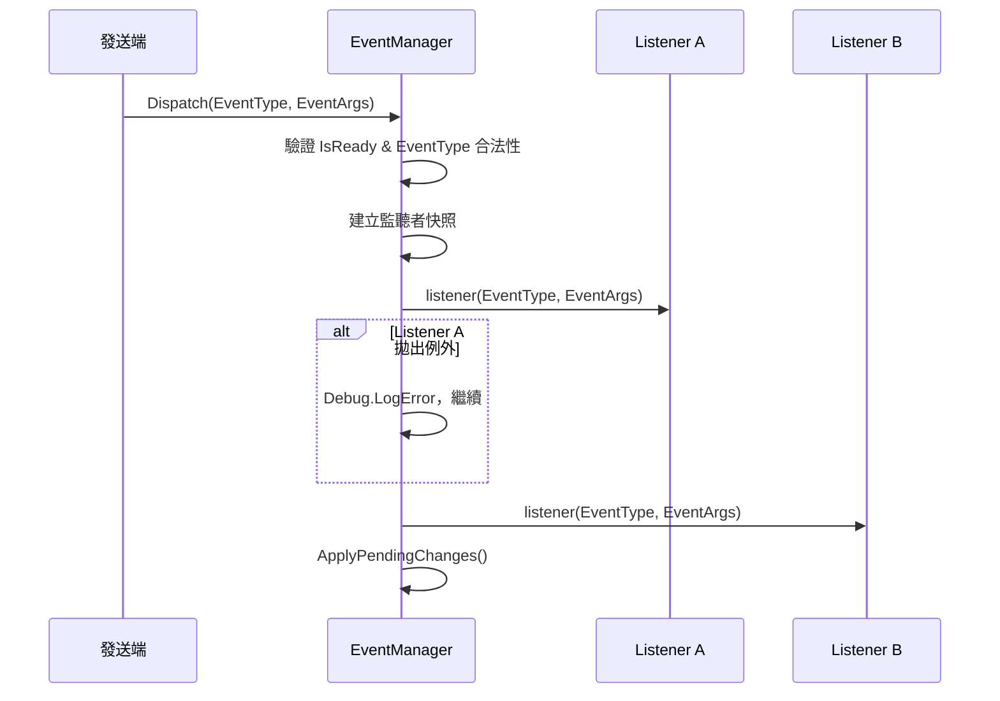
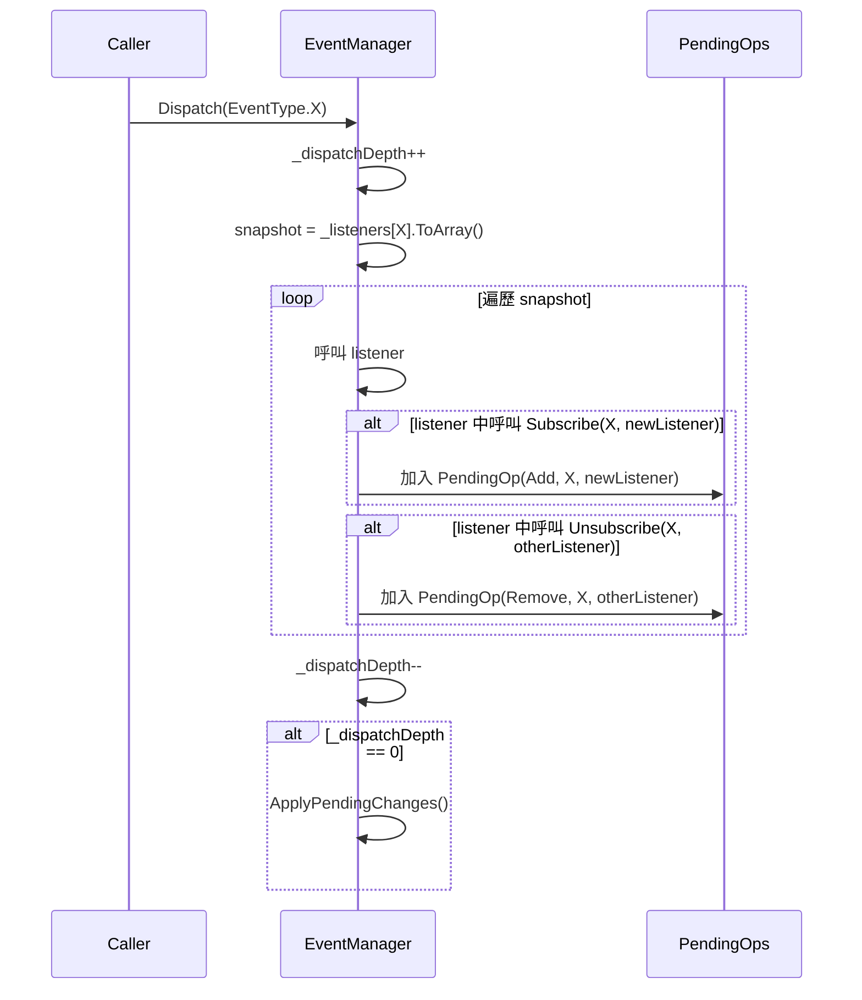
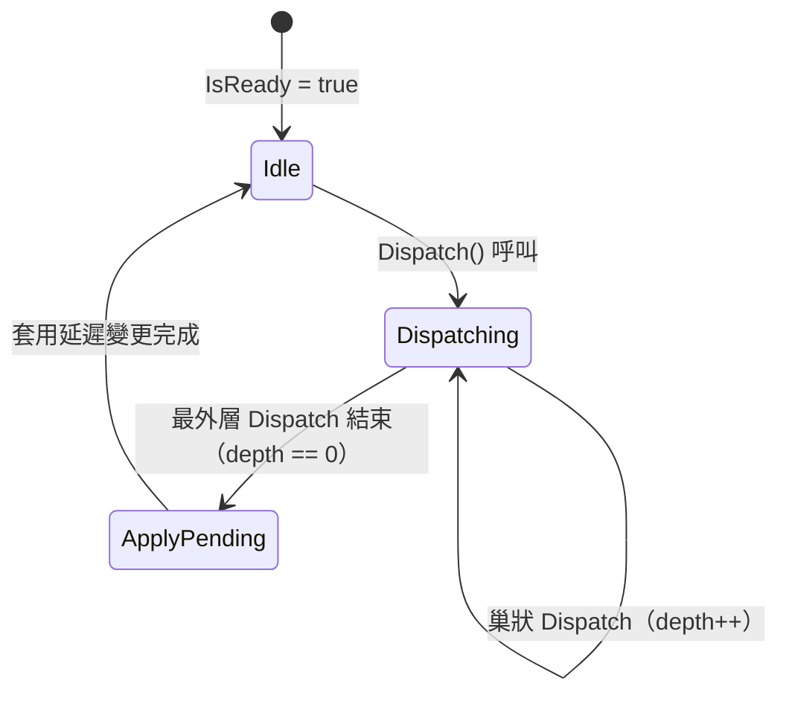

# 技術設計文件：Event System

## 目錄

- [Overview](#overview)
- [Architecture](#architecture)
  - [整體結構](#整體結構)
  - [系統層次](#系統層次)
- [Components and Interfaces](#components-and-interfaces)
  - [EventType 列舉](#eventtype-列舉)
  - [EventArgs 結構](#eventargs-結構)
  - [EventManager 類別](#eventmanager-類別)
- [Data Models](#data-models)
- [Correctness Properties](#correctness-properties)
  - [Property 1: EventArgs Round-Trip](#property-1-eventargs-round-trip)
  - [Property 2: Type Mismatch Returns Default](#property-2-type-mismatch-returns-default)
  - [Property 3: Out-of-Bounds Returns Default](#property-3-out-of-bounds-returns-default)
  - [Property 4: Subscribe Implies Notification](#property-4-subscribe-implies-notification)
  - [Property 5: Unsubscribe Removes Notification](#property-5-unsubscribe-removes-notification)
  - [Property 6: Idempotent Subscription](#property-6-idempotent-subscription)
  - [Property 7: Registration-Order Dispatch](#property-7-registration-order-dispatch)
  - [Property 8: UnsubscribeAll Clears Event](#property-8-unsubscribeall-clears-event)
  - [Property 9: Deferred Subscribe During Dispatch](#property-9-deferred-subscribe-during-dispatch)
  - [Property 10: Deferred Unsubscribe During Dispatch](#property-10-deferred-unsubscribe-during-dispatch)
  - [Property 11: Exception Isolation](#property-11-exception-isolation)
  - [Property 12: Invalid Enum Rejection](#property-12-invalid-enum-rejection)
  - [Property 13: Not-Ready Guard](#property-13-not-ready-guard)
- [Error Handling](#error-handling)
- [Testing Strategy](#testing-strategy)

---

## Overview

本設計描述一個集中式事件系統（Event System），採用發布/訂閱（Pub-Sub）模式，作為遊戲內各系統之間解耦通訊的全域事件匯流排。

核心設計哲學：

- **列舉識別**：事件以 `EventType` enum 識別，編譯期即可驗證事件名稱正確性，杜絕字串拼寫錯誤。
- **彈性參數**：每個事件可攜帶 0～12 個參數，支援 int、long、float、bool、string、Vector2、Vector3 及 object 參考型別。值型別參數透過 struct 專用欄位傳遞（每種型別 2 個 slot），不產生任何堆積配置，且不計入 `ParamCount`。Setter 方法支援在同一實例上組合不同型別的專用欄位，適用於混合型別場景。
- **快照派發**：Dispatch 開始時建立監聽者快照，派發過程中的 Subscribe/Unsubscribe 延遲生效，避免集合修改例外。
- **故障隔離**：單一監聽者拋出例外不影響其餘監聽者的呼叫。
- **單例生命週期**：`EventManager` 繼承 `Singleton<T>` 基底類別，透過 `Init()`/`Release()` 管理系統就緒狀態。

[↩](#目錄)
---

## Architecture

### 整體結構


系統由三個核心元件組成：

1. **EventManager**（單例管理器）：繼承 `Singleton<EventManager>`，負責事件的訂閱、退訂與派發。
2. **EventArgs**（參數容器 struct）：承載事件附帶資料，以值型別結構體避免堆積配置，提供型別安全的參數存取。
3. **EventType**（事件識別）：以 enum 定義所有事件類型，確保編譯期型別安全。

### 系統層次

```
┌─────────────────────────────────────────────────┐
│              EventManager (Singleton)            │
│  - 管理所有 EventType 的監聽者清單                 │
│  - 提供 Subscribe / Unsubscribe / Dispatch       │
│  - Init / Release 生命週期管理                    │
│  - 快照派發 + 延遲佇列機制                        │
├─────────────────────────────────────────────────┤
│              EventArgs (struct)                   │
│  - 常用值型別（int/long/float/bool）各 2 個專用欄位│
│    不產生堆積配置                                  │
│  - Setter 方法支援混合型別組合（SetInt/SetFloat等）│
│  - 混合/參考型別退回 object[] 通用路徑（0～12 個）  │
│  - 提供 GetInt/GetLong/GetFloat/GetBool 直接存取   │
│  - 提供 Get<T>(int index) 泛型存取（通用路徑）     │
│  - ParamCount 僅計通用路徑參數數量                  │
├─────────────────────────────────────────────────┤
│              EventType (enum)                    │
│  - 事件識別碼，可自由擴充成員                      │
└─────────────────────────────────────────────────┘
```

**派發流程：**



[↩](#目錄)
---

## Components and Interfaces

### EventType 列舉

```csharp
namespace EventSystem
{
    /// <summary>
    /// 定義所有可用的事件識別碼。新增事件僅需在此 enum 中新增成員。
    /// </summary>
    public enum EventType
    {
        None = 0,

        // 範例事件（實際專案依需求擴充）
        GameStart,
        GameEnd,
        PlayerDeath,
        SceneLoaded,
    }
}
```

`EventType` 為獨立 enum，新增事件類型僅需新增成員並重新編譯，無需修改 `EventManager` 原始碼。

### EventArgs 結構

```csharp
namespace EventSystem
{
    using UnityEngine;

    /// <summary>
    /// 事件參數容器（值型別結構體），支援 0～12 個參數，提供型別安全的存取方式。
    /// 常見的 1-2 個 int/long/float/bool 參數使用專用欄位，不產生堆積配置。
    /// </summary>
    public struct EventArgs
    {
        private int _int0;
        private int _int1;
        private long _long0;
        private long _long1;
        private float _float0;
        private float _float1;
        private bool _bool0;
        private bool _bool1;
        private object[] _params;

        /// <summary>
        /// Initializes a new instance of the <see cref="EventArgs"/> struct.
        /// 通用建構子，用於混合型別或參考型別參數。
        /// </summary>
        /// <param name="args">事件參數（最多 12 個）。</param>
        public EventArgs(params object[] args)
        {
            this._int0 = 0;
            this._int1 = 0;
            this._long0 = 0;
            this._long1 = 0;
            this._float0 = 0f;
            this._float1 = 0f;
            this._bool0 = false;
            this._bool1 = false;
            this._params = args ?? System.Array.Empty<object>();
        }

        /// <summary>
        /// Gets 通用路徑參數數量。
        /// 通用路徑模式（_params != null）回傳 _params.Length；
        /// 專用欄位模式（_params == null）回傳 0。
        /// 專用欄位（int/long/float/bool）不計入此值，始終可透過 GetInt/GetLong/GetFloat/GetBool 存取。
        /// </summary>
        public int ParamCount => this._params != null
            ? this._params.Length
            : 0;

        // ─── 靜態工廠方法（專用欄位路徑，零堆積配置） ───

        public static EventArgs Create(int v0, int v1 = default)
            => new EventArgs { _int0 = v0, _int1 = v1 };

        public static EventArgs Create(long v0, long v1 = default)
            => new EventArgs { _long0 = v0, _long1 = v1 };

        public static EventArgs Create(float v0, float v1 = default)
            => new EventArgs { _float0 = v0, _float1 = v1 };

        public static EventArgs Create(bool v0, bool v1 = default)
            => new EventArgs { _bool0 = v0, _bool1 = v1 };

        // ─── Setter 方法（支援混合型別組合） ───

        /// <summary>
        /// 設定 int 專用欄位值（兩個 slot 同時設定），結構與 Create(int) 一致。
        /// </summary>
        /// <param name="v0">第一個 int slot 值。</param>
        /// <param name="v1">第二個 int slot 值（預設為 0）。</param>
        public void SetInt(int v0, int v1 = default)
        {
            this._int0 = v0;
            this._int1 = v1;
        }

        /// <summary>
        /// 設定 long 專用欄位值（兩個 slot 同時設定），結構與 Create(long) 一致。
        /// </summary>
        /// <param name="v0">第一個 long slot 值。</param>
        /// <param name="v1">第二個 long slot 值（預設為 0）。</param>
        public void SetLong(long v0, long v1 = default)
        {
            this._long0 = v0;
            this._long1 = v1;
        }

        /// <summary>
        /// 設定 float 專用欄位值（兩個 slot 同時設定），結構與 Create(float) 一致。
        /// </summary>
        /// <param name="v0">第一個 float slot 值。</param>
        /// <param name="v1">第二個 float slot 值（預設為 0）。</param>
        public void SetFloat(float v0, float v1 = default)
        {
            this._float0 = v0;
            this._float1 = v1;
        }

        /// <summary>
        /// 設定 bool 專用欄位值（兩個 slot 同時設定），結構與 Create(bool) 一致。
        /// </summary>
        /// <param name="v0">第一個 bool slot 值。</param>
        /// <param name="v1">第二個 bool slot 值（預設為 false）。</param>
        public void SetBool(bool v0, bool v1 = default)
        {
            this._bool0 = v0;
            this._bool1 = v1;
        }

        /// <summary>
        /// 設定通用參數陣列，用於攜帶參考型別或混合型別參數。
        /// 此方法會覆寫現有的 _params 陣列，ParamCount 將反映新陣列長度。
        /// </summary>
        public void SetParams(params object[] args)
        {
            this._params = args ?? System.Array.Empty<object>();
        }

        // ─── 專用型別存取器（無 boxing） ───

        /// <summary>
        /// 從專用 int 欄位取值。index 僅支援 0 或 1。
        /// </summary>
        public int GetInt(int index)
        {
            if (index == 0)
            {
                return this._int0;
            }

            if (index == 1)
            {
                return this._int1;
            }

            Debug.LogWarning(
                $"[EventArgs] GetInt index {index} out of range (0-1).");
            return default;
        }

        /// <summary>
        /// 從專用 long 欄位取值。index 僅支援 0 或 1。
        /// </summary>
        public long GetLong(int index)
        {
            if (index == 0)
            {
                return this._long0;
            }

            if (index == 1)
            {
                return this._long1;
            }

            Debug.LogWarning(
                $"[EventArgs] GetLong index {index} out of range (0-1).");
            return default;
        }

        /// <summary>
        /// 從專用 float 欄位取值。index 僅支援 0 或 1。
        /// </summary>
        public float GetFloat(int index)
        {
            if (index == 0)
            {
                return this._float0;
            }

            if (index == 1)
            {
                return this._float1;
            }

            Debug.LogWarning(
                $"[EventArgs] GetFloat index {index} out of range (0-1).");
            return default;
        }

        /// <summary>
        /// 從專用 bool 欄位取值。index 僅支援 0 或 1。
        /// </summary>
        public bool GetBool(int index)
        {
            if (index == 0)
            {
                return this._bool0;
            }

            if (index == 1)
            {
                return this._bool1;
            }

            Debug.LogWarning(
                $"[EventArgs] GetBool index {index} out of range (0-1).");
            return default;
        }

        // ─── 泛型存取器（通用路徑，需 object[] 已配置） ───

        /// <summary>
        /// 以型別安全方式取得指定索引位置的參數值（通用路徑）。
        /// </summary>
        /// <typeparam name="T">期望的參數型別。</typeparam>
        /// <param name="index">參數索引（從 0 開始）。</param>
        /// <returns>參數值；若索引越界或型別不匹配則回傳 default(T)。</returns>
        public T Get<T>(int index)
        {
            if (this._params == null)
            {
                Debug.LogWarning(
                    $"[EventArgs] Get<T> called on dedicated-slot instance. " +
                    $"Use GetInt/GetLong/GetFloat/GetBool instead.");
                return default;
            }

            if (index < 0 || index >= this._params.Length)
            {
                Debug.LogWarning(
                    $"[EventArgs] Index {index} out of range (ParamCount={this._params.Length}).");
                return default;
            }

            object value = this._params[index];

            if (value == null)
            {
                return default;
            }

            if (value is T typed)
            {
                return typed;
            }

            Debug.LogWarning(
                $"[EventArgs] Type mismatch at index {index}: " +
                $"expected {typeof(T).Name}, actual {value.GetType().Name}.");
            return default;
        }
    }
}
```

**關鍵設計決策：**

1. **struct 而非 class**：EventArgs 以值型別實作，常見的值型別參數事件完全不產生堆積配置與 GC 壓力。結構體以值傳遞仍在可接受範圍。
2. **雙路徑存取策略**：
   - **專用欄位路徑**（`_params == null`）：int/long/float/bool 各 2 個欄位，透過 `Create()` 靜態工廠方法建構、`GetInt()`/`GetLong()`/`GetFloat()`/`GetBool()` 存取，全程無 boxing。
   - **通用路徑**（`_params != null`）：`params object[]` 建構子 + `Get<T>(index)` 泛型存取，支援混合型別、string、Vector2、Vector3 及 object 參考型別。
3. **optional 第二參數（Create 簡化）**：每種值型別僅保留一個 `Create` 方法，第二參數以 `= default` 標記為可選。專用欄位模式下兩個 slot 永遠存在（未傳入的 slot 值為 0/false），省去無法在 C# 可選參數中區分「呼叫端未傳」與「呼叫端傳入 default」的歧義。
4. **Setter 方法與 Create() 結構一致**：`SetInt`/`SetLong`/`SetFloat`/`SetBool` 採用與 `Create()` 相同的簽章設計（v0, v1 = default），一次設定兩個 slot，第二參數可選。允許在同一個 EventArgs 實例上同時設定不同型別的專用欄位（例如同時需要 int + float），無需走通用路徑產生 boxing。`SetParams` 則為參考型別的逃生艙口，在已建構的實例上追加 `object[]` 通用路徑。使用範例：
   ```csharp
   var args = EventArgs.Create(42);    // int slots: _int0=42, _int1=0
   args.SetFloat(3.14f);               // float slots: _float0=3.14f, _float1=0
   args.SetParams("hello", someVector); // generic params
   ```
5. **`is T` 型別匹配**（通用路徑）：使用 C# 的 pattern matching，支援繼承關係的型別相容。
6. **null 處理**（通用路徑）：存入 null 後以參考型別取出回傳 null 不記錄警告，因為 null 是 object 的合法值。
7. **`ParamCount` 語意**：`ParamCount` 僅追蹤通用路徑（`_params`）的參數數量。專用欄位模式下（`_params == null`）回傳 0，因為專用欄位 slot 獨立於 `ParamCount` 之外，始終可透過 `GetInt`/`GetLong`/`GetFloat`/`GetBool` 存取。通用路徑模式下回傳 `_params.Length`。

### EventManager 類別

```csharp
namespace EventSystem
{
    using System;
    using System.Collections.Generic;
    using UnityEngine;
    using Utils.Singleton;

    /// <summary>
    /// 集中式事件管理器，採用 Pub-Sub 模式。
    /// 繼承 Singleton 基底類別，提供全域唯一存取點。
    /// </summary>
    public class EventManager : Singleton<EventManager>
    {
        private Dictionary<EventType, List<Action<EventType, EventArgs>>> _listeners;
        private int _dispatchDepth;
        private List<PendingOperation> _pendingOps;

        /// <summary>
        /// Gets a value indicating whether 系統是否已就緒。
        /// </summary>
        public bool IsReady { get; private set; }

        /// <summary>
        /// Initializes a new instance of the <see cref="EventManager"/> class.
        /// </summary>
        protected EventManager()
        {
        }

        /// <summary>
        /// 初始化事件系統，建立內部註冊表。
        /// </summary>
        public void Init()
        {
            if (this.IsReady)
            {
                Debug.LogWarning("[EventManager] Init called while already ready. Ignored.");
                return;
            }

            this._listeners = new Dictionary<EventType, List<Action<EventType, EventArgs>>>();
            this._pendingOps = new List<PendingOperation>();
            this._dispatchDepth = 0;
            this.IsReady = true;
        }

        /// <summary>
        /// 釋放事件系統，清除所有訂閱。
        /// </summary>
        public void Release()
        {
            this._listeners?.Clear();
            this._listeners = null;
            this._pendingOps?.Clear();
            this._pendingOps = null;
            this._dispatchDepth = 0;
            this.IsReady = false;
        }

        /// <summary>
        /// 訂閱指定事件。
        /// </summary>
        /// <param name="type">事件類型。</param>
        /// <param name="listener">監聽者委派。</param>
        public void Subscribe(EventType type, Action<EventType, EventArgs> listener);

        /// <summary>
        /// 取消訂閱指定事件。
        /// </summary>
        /// <param name="type">事件類型。</param>
        /// <param name="listener">監聽者委派。</param>
        public void Unsubscribe(EventType type, Action<EventType, EventArgs> listener);

        /// <summary>
        /// 移除指定事件的所有監聽者。
        /// </summary>
        /// <param name="type">事件類型。</param>
        public void UnsubscribeAll(EventType type);

        /// <summary>
        /// 發送事件（無參數）。
        /// </summary>
        /// <param name="type">事件類型。</param>
        public void Dispatch(EventType type);

        /// <summary>
        /// 發送事件（帶參數）。
        /// </summary>
        /// <param name="type">事件類型。</param>
        /// <param name="args">事件參數。</param>
        public void Dispatch(EventType type, EventArgs args);

        private bool IsValidEventType(EventType type);

        private void ApplyPendingChanges();

        /// <summary>
        /// 延遲操作類型。
        /// </summary>
        private enum PendingOpType
        {
            Add,
            Remove,
            RemoveAll,
        }

        /// <summary>
        /// 延遲操作資料結構。
        /// </summary>
        private struct PendingOperation
        {
            public PendingOpType OpType;
            public EventType EventType;
            public Action<EventType, EventArgs> Listener;
        }
    }
}
```

**關鍵設計決策：**

| 決策 | 選項 | 採用方案 | 理由 |
|------|------|----------|------|
| EventArgs 型別 | class vs struct | **struct** | 避免每次 Dispatch 產生堆積配置與 GC 壓力；搭配專用欄位避免值型別 boxing |
| 常用值型別存取 | 統一 object[] vs 專用欄位 | **int/long/float/bool 各 2 個專用欄位** | 最常見的 1-2 參數事件不產生任何堆積配置 |
| 監聽者委派型別 | 自訂 delegate vs System.Action | **System.Action\<EventType, EventArgs\>** | 少一個型別宣告，`System.Action` 為 .NET 通用型別，開發者無需額外查閱自訂委派簽章 |
| 派發安全機制 | 複製清單 vs 索引遍歷 vs 快照 | **快照（ToArray）** | 最簡單，避免迭代中修改集合例外，支援巢狀派發 |
| 延遲佇列 | 立即修改 + 快照保護 vs 延遲佇列 | **延遲佇列** | 語意明確：派發中的變更延遲至派發結束後生效 |
| 巢狀派發 | 禁止 vs 支援 | **支援（depth counter）** | 使用 `_dispatchDepth` 計數器，僅在最外層派發結束時套用延遲變更 |
| 重複訂閱 | 允許多次呼叫 vs 忽略 | **忽略（Contains 檢查）** | 需求 3.3 明確要求忽略重複訂閱 |
| 未定義 enum 驗證 | 無驗證 vs Enum.IsDefined | **Enum.IsDefined** | 需求 1.4 要求拒絕非法值 |
| 單例基底 | 自行實作 vs 繼承 Singleton\<T\> | **繼承 Singleton\<T\>** | 需求 6.1，複用專案既有基底類別 |
| 初始化 | 建構子中完成 vs Init/Release | **Init/Release** | 需求 6.2-6.5，明確的生命週期管理 |

**Subscribe/Unsubscribe 在派發中的行為：**



[↩](#目錄)
---

## Data Models

### EventManager 內部狀態

| 欄位 | 型別 | 說明 |
|------|------|------|
| `_listeners` | `Dictionary<EventType, List<Action<EventType, EventArgs>>>` | 事件註冊表，key 為事件類型，value 為該事件的監聽者列表（維持註冊順序） |
| `_dispatchDepth` | `int` | 當前巢狀派發深度，0 表示未在派發中 |
| `_pendingOps` | `List<PendingOperation>` | 延遲操作佇列，僅在 `_dispatchDepth > 0` 時使用 |
| `IsReady` | `bool` | 系統就緒旗標 |

### PendingOperation 結構

| 欄位 | 型別 | 說明 |
|------|------|------|
| `OpType` | `PendingOpType` | 操作類型（Add / Remove / RemoveAll） |
| `EventType` | `EventType` | 目標事件類型 |
| `Listener` | `Action<EventType, EventArgs>` | 操作目標監聽者（RemoveAll 時為 null） |

### EventArgs 內部狀態

| 欄位 | 型別 | 說明 |
|------|------|------|
| `_int0`, `_int1` | `int` | int 專用欄位（最多 2 個） |
| `_long0`, `_long1` | `long` | long 專用欄位（最多 2 個） |
| `_float0`, `_float1` | `float` | float 專用欄位（最多 2 個） |
| `_bool0`, `_bool1` | `bool` | bool 專用欄位（最多 2 個） |
| `_params` | `object[]`（nullable） | 通用參數陣列；`null` 表示純專用欄位模式，非 null 表示通用路徑可用。可透過建構子或 `SetParams()` 設定 |

**儲存模式判別：**
- `_params == null`：專用欄位模式，int/long/float/bool 各 2 個 slot 始終可用，`ParamCount` 回傳 0
- `_params != null`：通用模式啟用，`ParamCount` 回傳 `_params.Length`
- 混合模式：呼叫 `SetParams()` 後 `_params` 非 null，但專用欄位 slot 仍可透過 `GetInt`/`SetInt` 等方法獨立存取

### Dispatch 流程狀態機



[↩](#目錄)
---

## Correctness Properties

*A property is a characteristic or behavior that should hold true across all valid executions of a system — essentially, a formal statement about what the system should do. Properties serve as the bridge between human-readable specifications and machine-verifiable correctness guarantees.*

### Property 1: EventArgs Round-Trip

*For any* 由 int、long、float、bool 任意選取的型別與值（1 或 2 個參數），透過對應的 `Create()` 靜態工廠方法建構 EventArgs 後，以對應的 `GetInt()`/`GetLong()`/`GetFloat()`/`GetBool()` 方法取得的值必須等於放入的值。同樣地，*for any* 由 `SetInt()`/`SetLong()`/`SetFloat()`/`SetBool()` 設定的值，以對應的 Getter 取出必須等於設定的值。此外，*for any* 由 int、long、float、bool、string、Vector2、Vector3、object（含 null）任意組合產生的參數序列（長度 0～12），透過 `params object[]` 建構子或 `SetParams()` 設定後以 `Get<T>(index)` 取得的值必須等於放入的值，且 `ParamCount` 等於參數數量。

**Validates: Requirements 2.1, 2.2, 2.3, 2.4, 2.7, 2.9**

---

### Property 2: Type Mismatch Returns Default

*For any* EventArgs 實例與有效索引，若以不匹配的型別呼叫 `Get<T>(index)`（請求型別與儲存值的實際型別不具繼承關係），則回傳值必須等於 `default(T)`。

**Validates: Requirements 2.5, 7.1, 7.2**

---

### Property 3: Out-of-Bounds Returns Default

*For any* EventArgs 實例與越界索引（負數或 >= ParamCount），以任意型別呼叫 `Get<T>(index)` 必須回傳 `default(T)` 且不拋出例外。

**Validates: Requirements 2.6**

---

### Property 4: Subscribe Implies Notification

*For any* 合法的 EventType 和 `Action<EventType, EventArgs>` 監聽者，在 EventManager 已 Init 的狀態下，Subscribe 該監聽者後 Dispatch 該事件，該監聽者必定被呼叫恰好一次。

**Validates: Requirements 3.1, 3.2, 3.4, 5.1**

---

### Property 5: Unsubscribe Removes Notification

*For any* 已訂閱某 EventType 的 `Action<EventType, EventArgs>` 監聽者，在呼叫 Unsubscribe 後再次 Dispatch 該事件，該監聽者的呼叫次數必須為零。

**Validates: Requirements 4.1, 4.2**

---

### Property 6: Idempotent Subscription

*For any* EventType 和 `Action<EventType, EventArgs>` 監聽者，無論對同一組合呼叫 Subscribe 多少次（n >= 1），後續 Dispatch 該事件時該監聽者恰好被呼叫一次。

**Validates: Requirements 3.3**

---

### Property 7: Registration-Order Dispatch

*For any* EventType 和任意數量的不同 `Action<EventType, EventArgs>` 監聽者（按順序 L1, L2, ..., Ln 註冊），Dispatch 時各監聽者的呼叫順序必須與註冊順序一致。

**Validates: Requirements 3.2, 5.2**

---

### Property 8: UnsubscribeAll Clears Event

*For any* EventType 和任意數量的已註冊 `Action<EventType, EventArgs>` 監聽者，呼叫 UnsubscribeAll 後 Dispatch 該事件，所有監聽者的呼叫次數必須為零。

**Validates: Requirements 4.4**

---

### Property 9: Deferred Subscribe During Dispatch

*For any* 正在派發中的 EventType，若某監聽者在回呼中對同一 EventType 呼叫 Subscribe 註冊新的監聽者，則該新監聽者在當次派發中的呼叫次數必須為零，且在下一次 Dispatch 時被正常呼叫。

**Validates: Requirements 3.6**

---

### Property 10: Deferred Unsubscribe During Dispatch

*For any* 正在派發中的 EventType，若某監聽者在回呼中對同一 EventType 呼叫 Unsubscribe 移除另一個監聽者，則被移除的監聽者在當次派發中仍會被呼叫（因為使用快照），但在下一次 Dispatch 時不再被呼叫。

**Validates: Requirements 4.6**

---

### Property 11: Exception Isolation

*For any* EventType 和任意數量的已註冊 `Action<EventType, EventArgs>` 監聽者，若其中任一監聽者在回呼中拋出例外，其餘所有監聽者仍必須被正常呼叫，且 Dispatch 本身不向呼叫端拋出例外。

**Validates: Requirements 5.4, 7.4, 7.5**

---

### Property 12: Invalid Enum Rejection

*For any* 未定義於 EventType enum 中的整數值（透過強制轉型產生），呼叫 Subscribe、Unsubscribe 或 Dispatch 時操作必須被忽略，不修改內部狀態，不拋出例外。

**Validates: Requirements 1.4, 7.3**

---

### Property 13: Not-Ready Guard

*For any* 尚未呼叫 Init 或已呼叫 Release 的 EventManager（IsReady == false），呼叫 Subscribe、Unsubscribe、UnsubscribeAll 或 Dispatch 皆無操作效果、不拋出例外，且先前的訂閱關係不受影響（即 Init 後的訂閱在 Release 後全部失效）。

**Validates: Requirements 6.3, 6.4**

[↩](#目錄)
---

## Error Handling

### 錯誤分類

| 錯誤場景 | 處理方式 | 輸出 |
|----------|----------|------|
| Subscribe/Unsubscribe/Dispatch 傳入未定義的 EventType | 忽略操作 | `Debug.LogError` 包含非法值 |
| Subscribe/Unsubscribe 傳入 null listener | 忽略操作 | `Debug.LogError` 指出參數為 null |
| IsReady == false 時呼叫操作 | 忽略操作 | `Debug.LogError` 包含操作名稱 |
| Init 重複呼叫 | 忽略操作 | `Debug.LogWarning` |
| 監聽者回呼拋出例外 | 捕獲並繼續派發 | `Debug.LogError` 包含事件類型與方法名稱 |
| EventArgs.Get\<T\> 索引越界 | 回傳 default(T) | `Debug.LogWarning` 包含索引與 ParamCount |
| EventArgs.Get\<T\> 型別不匹配 | 回傳 default(T) | `Debug.LogWarning` 包含索引與型別名稱 |
| EventArgs.Get\<T\> 在專用欄位模式呼叫 | 回傳 default(T) | `Debug.LogWarning` 提示使用 GetInt/GetLong/GetFloat/GetBool |
| EventArgs.GetInt/GetLong/GetFloat/GetBool 索引越界 | 回傳 default | `Debug.LogWarning` 包含索引與有效範圍（0-1） |
| Unsubscribe 未註冊的 listener | 忽略，無副作用 | 無 |
| Dispatch 無監聽者 | 正常結束 | 無 |

### 設計原則

1. **絕不向呼叫端拋出例外**：所有公開 API 在系統邊界內捕獲例外並以 `Debug.LogError` 記錄。呼叫端無需 try-catch。
2. **靜默忽略合理操作**：Unsubscribe 未註冊的 listener、Dispatch 無監聽者的事件——這些是正常使用情境，不輸出警告。
3. **警告提示開發錯誤**：傳入 null、未定義的 enum 值、未 Init 就操作——這些代表程式邏輯錯誤，以 `Debug.LogError` 提示。
4. **巢狀派發安全**：使用 `_dispatchDepth` 計數器追蹤巢狀層級，所有延遲操作在最外層結束時統一套用。

[↩](#目錄)
---

## Testing Strategy

### 測試框架選擇

| 框架 | 用途 |
|------|------|
| NUnit | 基礎測試框架（Unity Test Runner 內建） |
| FsCheck 3.X（`FsCheck.Fluent` namespace） | Property-Based Testing，直接呼叫 FsCheck API |

### Property-Based Testing 配置

- 每個 Property Test 最少執行 **100 次迭代**
- 使用 FsCheck 的 `ArbMap` / `Gen` 定義自訂產生器
- 直接呼叫 FsCheck API（不使用 FsCheck.NUnit）
- 每個測試以註解標記對應的設計屬性

標記格式：
```csharp
// Feature: event-system, Property 1: EventArgs Round-Trip
```

### 測試產生器設計

| 產生器 | 產生內容 |
|--------|----------|
| `GenEventArgsDedicated` | 隨機選取 int/long/float/bool 型別，產生 1 或 2 個隨機值，透過對應 `Create()` 工廠方法建構 EventArgs（第二參數可選傳入或使用 default） |
| `GenEventArgsSetters` | 以 `Create()` 建構基礎實例後，隨機呼叫 `SetInt`/`SetLong`/`SetFloat`/`SetBool` 組合設定多種型別專用欄位（每次呼叫設定該型別兩個 slot，第二參數可選傳入或使用 default） |
| `GenEventArgsGeneric` | 隨機長度（0～12）的參數序列，元素從支援的型別中隨機選取（int、long、float、bool、string、Vector2、Vector3、object、null），透過 `params object[]` 建構子或 `SetParams()` 建構 EventArgs |
| `GenEventType` | 隨機合法的 EventType enum 值 |
| `GenInvalidEventType` | 隨機未定義於 EventType 中的整數值（強制轉型） |
| `GenListenerCount` | 隨機正整數（1～20），代表訂閱者數量 |
| `GenExceptionIndex` | 隨機選取某個 listener 位置拋出例外 |

### 測試分層

**Property Tests（驗證通用屬性）：**

| Property | 測試策略 |
|----------|----------|
| Property 1 | 專用欄位路徑：產生隨機 int/long/float/bool 值，透過 Create() 建構，以 GetInt/GetLong/GetFloat/GetBool 取出，驗證值相等。Setter 路徑：以 Create() 建構後透過 SetInt/SetLong/SetFloat/SetBool 設定不同型別的欄位值，再以對應 Getter 取出驗證等值。通用路徑：產生隨機參數序列，透過 params 建構子或 SetParams() 設定，以 Get\<T\> 逐一取出，驗證值相等且 ParamCount 正確 |
| Property 2 | 產生隨機參數序列和有效索引，以不匹配的型別呼叫 Get\<T\>，驗證回傳 default(T) |
| Property 3 | 產生隨機參數序列和越界索引（負數或 >= ParamCount），驗證回傳 default(T) 且不拋出例外 |
| Property 4 | 產生隨機 EventType 和 listener 數量，Subscribe 後 Dispatch，驗證每個 listener 被呼叫恰好一次 |
| Property 5 | 產生隨機 listener，Subscribe 再 Unsubscribe 後 Dispatch，驗證呼叫次數為零 |
| Property 6 | 產生隨機重複次數（2～10），同一 listener 多次 Subscribe 後 Dispatch，驗證呼叫次數為 1 |
| Property 7 | 產生隨機數量的 listener，記錄呼叫順序，驗證與註冊順序一致 |
| Property 8 | 產生隨機 listener 並 Subscribe，呼叫 UnsubscribeAll，再 Dispatch，驗證無 listener 被呼叫 |
| Property 9 | 在 Dispatch 回呼中 Subscribe 新 listener，驗證當次呼叫次數為 0，下次為 1 |
| Property 10 | 在 Dispatch 回呼中 Unsubscribe 另一 listener，驗證當次仍被呼叫，下次不被呼叫 |
| Property 11 | 產生隨機位置的例外拋出 listener，驗證其餘 listener 全部被呼叫 |
| Property 12 | 產生隨機未定義 EventType 值，呼叫 Subscribe/Dispatch，驗證無效果且不拋出例外 |
| Property 13 | 在未 Init 或已 Release 狀態下產生隨機操作序列，驗證皆無效果且不拋出例外 |

**Unit Tests（驗證具體場景與邊界條件）：**

| 測試項目 | 說明 |
|----------|------|
| 無參數 Dispatch 正常執行 | 驗證 `Dispatch(type)` 多載正確呼叫所有 listener，args 為 default(EventArgs)（Requirements 2.8） |
| Subscribe 傳入 null listener 被忽略 | 驗證不拋出例外且後續 Dispatch 不出錯（Requirements 3.5） |
| Unsubscribe 傳入 null listener 被忽略 | 驗證不拋出例外（Requirements 4.5） |
| Unsubscribe 未註冊的 listener 靜默忽略 | 驗證不拋出例外（Requirements 4.3） |
| Dispatch 無監聽者正常結束 | 驗證不拋出例外（Requirements 5.3） |
| 巢狀 Dispatch 正確完成 | 在 listener 中觸發另一個事件的 Dispatch，驗證不產生錯誤（Requirements 5.5） |
| Init 後 IsReady 為 true | 驗證初始化行為（Requirements 6.2） |
| Release 後 IsReady 為 false | 驗證釋放行為（Requirements 6.3） |
| 重複 Init 被忽略 | 驗證不重置已有訂閱（Requirements 6.5） |
| null 存入 object 取出為 null 無警告 | 驗證 null 不觸發型別不匹配警告（Requirements 2.9） |
| SetInt/SetLong/SetFloat/SetBool 設定兩個值 | 驗證提供兩個參數時兩個 slot 皆正確設定；僅提供一個參數時 slot 1 為 default（0/false） |
| 混合型別組合正確存取 | 以 Create(int) 建構後 SetFloat 設定 float slot，驗證 GetInt 和 GetFloat 各自回傳正確值 |
| SetParams 覆寫通用路徑 | 呼叫 SetParams 後 ParamCount 反映新陣列長度，Get\<T\> 取出正確值 |

[↩](#目錄)
---
