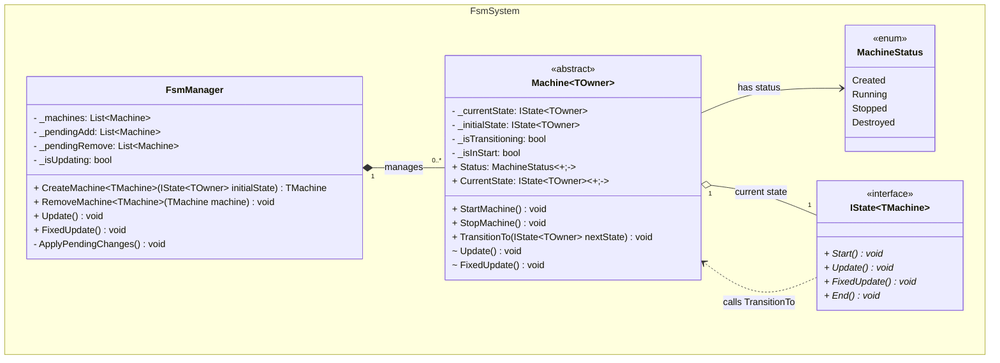
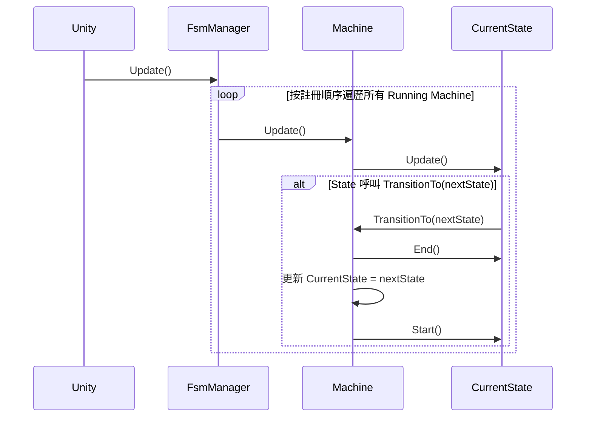
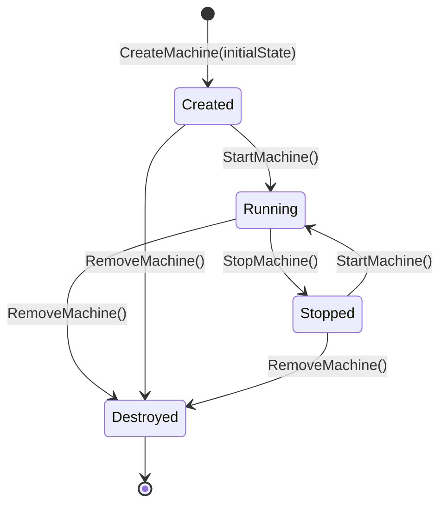

# 技術設計文件：FSM System

## 目錄

- [Overview](#overview)
- [Architecture](#architecture)
  - [整體結構](#整體結構)
  - [系統層次](#系統層次)
- [Components and Interfaces](#components-and-interfaces)
  - [IState 介面](#istate-介面)
  - [Machine 類別](#machine-類別)
  - [FsmManager 類別](#fsmmanager-類別)
  - [MachineStatus 列舉](#machinestatus-列舉)
- [Data Models](#data-models)
- [Correctness Properties](#correctness-properties)
  - [Property 1: Start Invoked Exactly Once](#property-1-start-invoked-exactly-once)
  - [Property 2: Update/FixedUpdate 1-to-1 Call Mapping](#property-2-updatefixedupdate-1-to-1-call-mapping)
  - [Property 3: Transition Sequence Ordering](#property-3-transition-sequence-ordering)
  - [Property 4: End Terminates Lifecycle](#property-4-end-terminates-lifecycle)
  - [Property 5: Exception Propagation Halts Lifecycle](#property-5-exception-propagation-halts-lifecycle)
  - [Property 6: Guarded Transition Rejection](#property-6-guarded-transition-rejection)
  - [Property 7: No Automatic Transitions](#property-7-no-automatic-transitions)
  - [Property 8: Machine Isolation](#property-8-machine-isolation)
  - [Property 9: Registration-Order Update](#property-9-registration-order-update)
  - [Property 10: Deferred Mutation During Update](#property-10-deferred-mutation-during-update)
  - [Property 11: Machine Lifecycle State Transitions](#property-11-machine-lifecycle-state-transitions)
  - [Property 12: Remove Triggers Proper Cleanup](#property-12-remove-triggers-proper-cleanup)
- [Error Handling](#error-handling)
- [Testing Strategy](#testing-strategy)

---

## Overview

本設計描述一個通用有限狀態機（FSM）系統，適用於 Unity/C# 環境。系統由三層組成：`FsmManager`（頂層管理器）、`Machine<TOwner>`（獨立狀態機實例）、`IState<TMachine>`（狀態介面）。

核心設計哲學：
- **State 驅動轉換**：Machine 不自動評估轉換條件，而是由 State 在適當時機主動呼叫 `TransitionTo(IState<TOwner> nextState)` 並傳入目標 State 實例觸發切換。
- **編譯期型別安全**：State 透過泛型宣告其所屬 Machine 型別，型別系統在編譯期阻擋非法的狀態綁定與轉換目標。
- **生命週期保證**：每個 State 嚴格遵循 Start → Update/FixedUpdate → End 的生命週期順序，轉換期間保證 End → Start 的原子執行順序。
- **多實例並行**：FsmManager 支援同時管理多個獨立 Machine，各 Machine 的狀態互不干擾。
- **呼叫端建構 State**：Machine 不負責發現或管理 State 集合，State 實例由呼叫端負責建構並傳入（透過 `CreateMachine` 或 `TransitionTo`）。

[↩](#目錄)
---

## Architecture

### 整體結構

系統採用三層架構，由上而下為：

1. **FsmManager**（單例管理器）：負責所有 Machine 的建立、註冊、移除與統一更新派發。
2. **Machine\<TOwner\>**（狀態機實例）：一個獨立運行的 FSM，僅持有當前狀態與初始狀態的參考，並提供 `TransitionTo` 方法供 State 呼叫。Machine 不維護狀態集合。
3. **IState\<TMachine\>**（狀態介面）：定義 State 的四個生命週期回呼（Start、Update、FixedUpdate、End），並透過泛型綁定至特定 Machine 型別。



### 系統層次

```
┌─────────────────────────────────────────────────┐
│                  FsmManager                      │
│  - 管理所有 Machine 實例                          │
│  - 統一派發 Update / FixedUpdate                  │
│  - 延遲處理迴圈中的註冊/移除                       │
├─────────────────────────────────────────────────┤
│         Machine<TOwner>  (× N)                  │
│  - 僅持有 _currentState 與 _initialState          │
│  - 提供 TransitionTo(IState<TOwner> nextState)   │
│  - 管理 MachineStatus 生命週期                    │
├─────────────────────────────────────────────────┤
│     IState<TMachine>  實作 (× M per Machine)     │
│  - Start / Update / FixedUpdate / End            │
│  - 在適當時機呼叫 Machine.TransitionTo 並傳入目標  │
└─────────────────────────────────────────────────┘
```

**更新流程（每幀）：**



[↩](#目錄)
---

## Components and Interfaces

### IState 介面

```csharp
/// <summary>
/// Defines the lifecycle contract for a state bound to a specific Machine type.
/// </summary>
/// <typeparam name="TMachine">The Machine type this state belongs to.</typeparam>
public interface IState<TMachine>
    where TMachine : Machine<TMachine>
{
    /// <summary>
    /// Called exactly once when the Machine enters this state.
    /// </summary>
    void Start();

    /// <summary>
    /// Called once per Machine.Update() while this state is the current state.
    /// </summary>
    void Update();

    /// <summary>
    /// Called once per Machine.FixedUpdate() while this state is the current state.
    /// </summary>
    void FixedUpdate();

    /// <summary>
    /// Called exactly once when the Machine exits this state.
    /// </summary>
    void End();
}
```

泛型約束 `where TMachine : Machine<TMachine>` 構成**編譯期綁定**的核心機制。State 在宣告時即確定其所屬 Machine 型別，使得：
- `TransitionTo(IState<TOwner> nextState)` 僅接受同一 `TOwner` 的 State 實例
- 無法將 `IState<MachineA>` 的實作用於 `MachineB`

### Machine 類別

```csharp
/// <summary>
/// An independent FSM instance that holds only the current state reference.
/// State instances are provided by the caller.
/// </summary>
/// <typeparam name="TOwner">
/// The concrete Machine subclass type (CRTP pattern for type-safe transitions).
/// </typeparam>
public abstract class Machine<TOwner>
    where TOwner : Machine<TOwner>
{
    // 生命週期狀態
    public MachineStatus Status { get; }

    // 當前狀態（唯讀）
    public IState<TOwner> CurrentState { get; }

    // Machine 生命週期操作
    public void StartMachine();
    public void StopMachine();

    // 狀態轉換（僅供 State 呼叫，接受目標 State 實例）
    public void TransitionTo(IState<TOwner> nextState);

    // 由 FsmManager 呼叫
    internal void Update();
    internal void FixedUpdate();
}
```

**關鍵設計決策：**

1. **CRTP（Curiously Recurring Template Pattern）**：`Machine<TOwner> where TOwner : Machine<TOwner>` 確保 `TransitionTo` 的參數型別限制目標 State 必須綁定至同一 Machine 型別。

2. **呼叫端建構 State**：State 實例由呼叫端（即當前 State）負責建構並傳入 `TransitionTo`。Machine 不持有 State 字典、不執行反射、不需要 `new()` 約束。這使得 State 可以擁有建構子參數，增加彈性。

3. **轉換守衛**：Machine 內部維護 `_isTransitioning` 旗標。在 End → Start 執行期間，任何 `TransitionTo` 呼叫被忽略。同樣，在 Start 方法執行期間（`_isInStart` 旗標）的呼叫也被忽略。

### FsmManager 類別

```csharp
/// <summary>
/// Top-level manager responsible for creating, registering, and updating all Machine instances.
/// </summary>
public class FsmManager
{
    // 建立並註冊新的 Machine，必須傳入初始 State 實例
    public TMachine CreateMachine<TMachine>(IState<TMachine> initialState)
        where TMachine : Machine<TMachine>, new();

    // 移除 Machine（若運行中則先停止）
    public void RemoveMachine<TMachine>(TMachine machine) where TMachine : Machine<TMachine>;

    // 統一更新所有 Running 狀態的 Machine
    public void Update();
    public void FixedUpdate();
}
```

**延遲佇列機制：**

FsmManager 在 Update/FixedUpdate 迴圈中使用 `_pendingAdd` 和 `_pendingRemove` 佇列。迴圈期間的任何 `CreateMachine` 或 `RemoveMachine` 呼叫都會被暫存，直到當次迴圈結束後才套用變更。這避免了迭代中修改集合的問題，並保證當次更新的一致性。

**初始 State 強制傳入：**

`CreateMachine` 要求傳入非 null 的 `initialState` 參數。若傳入 null，立即拋出 `ArgumentNullException` 且不建立 Machine。這消除了「Machine 建立後忘記設定初始 State」的錯誤可能性。

### MachineStatus 列舉

```csharp
/// <summary>
/// Represents the lifecycle status of a Machine instance.
/// </summary>
public enum MachineStatus
{
    /// <summary>Machine has been created but not yet started.</summary>
    Created,

    /// <summary>Machine is actively running and receiving updates.</summary>
    Running,

    /// <summary>Machine has been explicitly stopped.</summary>
    Stopped,

    /// <summary>Machine has been removed from FsmManager and is no longer usable.</summary>
    Destroyed
}
```

[↩](#目錄)
---

## Data Models

### Machine 內部狀態

| 欄位 | 型別 | 說明 |
|------|------|------|
| `_currentState` | `IState<TOwner>` | 當前正在執行的 State 實例 |
| `_initialState` | `IState<TOwner>` | 建立時傳入的初始 State 實例，StartMachine 時進入此 State |
| `_isTransitioning` | `bool` | 轉換中旗標，防止 End/Start 期間的巢狀轉換 |
| `_isInStart` | `bool` | Start 執行中旗標，防止 Start 中觸發轉換 |
| `Status` | `MachineStatus` | 當前生命週期狀態 |

### FsmManager 內部狀態

| 欄位 | 型別 | 說明 |
|------|------|------|
| `_machines` | `List<Machine>` | 已註冊的 Machine 清單（按註冊順序排列） |
| `_pendingAdd` | `List<Machine>` | 等待加入的 Machine 佇列 |
| `_pendingRemove` | `List<Machine>` | 等待移除的 Machine 佇列 |
| `_isUpdating` | `bool` | 更新迴圈執行中旗標 |

### Machine 生命週期狀態轉換



[↩](#目錄)
---

## Correctness Properties

*A property is a characteristic or behavior that should hold true across all valid executions of a system — essentially, a formal statement about what the system should do. Properties serve as the bridge between human-readable specifications and machine-verifiable correctness guarantees.*

### Property 1: Start Invoked Exactly Once

*For any* Machine 和任何 State，當 Machine 進入該 State 時，Start 方法恰好被呼叫一次，無論後續有多少次 Update 或 FixedUpdate 呼叫，Start 都不會被重複執行。

**Validates: Requirements 1.1, 1.8**

### Property 2: Update/FixedUpdate 1-to-1 Call Mapping

*For any* Machine 處於 Running 狀態且擁有 Current_State 的情境下，若 Machine 的 Update 被呼叫 N 次，則 Current_State 的 Update 方法恰好被呼叫 N 次；同理，若 FixedUpdate 被呼叫 M 次，則 Current_State 的 FixedUpdate 方法恰好被呼叫 M 次。

**Validates: Requirements 1.2, 1.3**

### Property 3: Transition Sequence Ordering

*For any* 有效的狀態轉換，Machine 必須嚴格依照「舊 State 的 End 方法完成 → 更新 CurrentState 參考 → 新 State 的 Start 方法執行」的順序進行，三個步驟之間無交錯執行。

**Validates: Requirements 1.5, 2.2**

### Property 4: End Terminates Lifecycle

*For any* State 在被 Machine 退出後，該 State 的 End 方法恰好被呼叫一次，且在 End 完成之後，該 State 不再接收任何 Update 或 FixedUpdate 呼叫。

**Validates: Requirements 1.4**

### Property 5: Exception Propagation Halts Lifecycle

*For any* State 的生命週期方法（Start、Update、FixedUpdate、End）拋出例外時，Machine 必須停止該 State 的所有後續生命週期方法執行，不進入新的 State，並將例外傳播給呼叫端。

**Validates: Requirements 1.7**

### Property 6: Guarded Transition Rejection

*For any* Machine 正在執行轉換流程（End 至 Start 期間）或正在執行 Start 方法時，若 State 呼叫 TransitionTo，該呼叫必須被忽略且不觸發新的轉換，Machine 的 CurrentState 維持不變。

**Validates: Requirements 2.4, 2.7**

### Property 7: No Automatic Transitions

*For any* Machine 和任何數量的 Update/FixedUpdate 呼叫，若 Current_State 從未主動呼叫 TransitionTo，則 Machine 的 CurrentState 永遠不會改變。

**Validates: Requirements 2.5**

### Property 8: Machine Isolation

*For any* 兩個在同一 FsmManager 中的 Machine 實例，當一個 Machine 發生狀態轉換時，另一個 Machine 的 CurrentState 和生命週期流程不受任何影響。

**Validates: Requirements 3.2, 3.6**

### Property 9: Registration-Order Update

*For any* FsmManager 中已註冊的 N 個 Running Machine，當 FsmManager.Update() 被呼叫時，各 Machine 的 Update 方法按照其註冊順序被逐一呼叫。

**Validates: Requirements 3.3**

### Property 10: Deferred Mutation During Update

*For any* 在 FsmManager 更新迴圈執行期間進行的 Machine 註冊或移除操作，該變更必須延遲至當次迴圈完成後才生效，不影響當次迭代中的 Machine 清單。

**Validates: Requirements 3.5**

### Property 11: Machine Lifecycle State Transitions

*For any* Machine 實例，其 MachineStatus 轉換必須遵循以下規則：Created 可轉至 Running 或 Destroyed；Running 可轉至 Stopped 或 Destroyed；Stopped 可轉至 Running 或 Destroyed。對非法轉換（如 Running → Running、Stopped → Stopped）的操作必須被忽略且不產生狀態變更。

**Validates: Requirements 4.1, 4.2, 4.3, 4.4, 4.5**

### Property 12: Remove Triggers Proper Cleanup

*For any* Machine 被移除時，若其 Status 為 Running，則必須先呼叫 Current_State 的 End 方法並停止更新，再將 Status 設為 Destroyed 並從管理清單移除；若 Status 為 Created 或 Stopped，則直接設為 Destroyed 並移除，不呼叫 End。

**Validates: Requirements 4.6, 4.7**

[↩](#目錄)
---

## Error Handling

### 錯誤分類

| 錯誤場景 | 處理方式 | 回傳 |
|----------|----------|------|
| State 生命週期方法拋出例外 | 停止該 State 後續方法執行，不轉換至新 State | 傳播原始例外 |
| CreateMachine() 傳入 null initialState | 操作被拒絕，不建立 Machine | `ArgumentNullException` |
| StartMachine() 在 Running Machine 上 | 忽略，無副作用 | 無（靜默忽略） |
| StopMachine() 在非 Running Machine 上 | 忽略，無副作用 | 無（靜默忽略） |
| TransitionTo() 在轉換進行中 | 忽略，無副作用 | 無（靜默忽略） |
| TransitionTo() 在 Start 方法中 | 忽略，無副作用 | 無（靜默忽略） |
| 操作已 Destroyed 的 Machine | 操作被拒絕 | `ObjectDisposedException` |

### 設計原則

1. **例外傳播，不吞噬**：State 生命週期方法的例外直接向上傳播，不在 Machine 或 FsmManager 層級被捕獲。呼叫端（通常是 Unity 的 MonoBehaviour）負責決定如何處理。

2. **無效操作區分**：
   - **靜默忽略**：對合理但不適用的操作（如停止已停止的 Machine、轉換期間的重複轉換請求），因為這些可能是正常競爭條件的結果。
   - **例外**：對明確違反契約的操作（如傳入 null initialState、對已銷毀物件操作），因為這些代表程式邏輯錯誤。

3. **Machine 故障隔離**：一個 Machine 的 State 例外不影響 FsmManager 中其他 Machine 的更新流程。FsmManager 在 Update 迴圈中對每個 Machine 的更新使用 try-catch，捕獲後記錄錯誤並繼續更新其餘 Machine。

[↩](#目錄)
---

## Testing Strategy

### 測試框架選擇

- **單元測試框架**：NUnit（Unity Test Framework 內建支援）
- **Property-Based Testing 框架**：FsCheck（C# 相容，支援 NUnit 整合）
- **執行環境**：Unity Test Runner（EditMode Tests，不依賴 MonoBehaviour 生命週期）

### Property-Based Testing 配置

- 每個 Property Test 最少執行 **100 次迭代**
- 使用 FsCheck 的 `Arbitrary<T>` 定義自訂產生器
- 每個測試以註解標記對應的設計屬性

標記格式：
```csharp
// Feature: fsm-system, Property 1: Start Invoked Exactly Once
```

### 測試產生器設計

| 產生器 | 產生內容 |
|--------|----------|
| `ArbitraryMachineOps` | 隨機的 Machine 操作序列（Start、Stop、Update、FixedUpdate、Transition） |
| `ArbitraryStateSequence` | 隨機的 State 轉換序列（產生隨機 State 實例傳入 TransitionTo） |
| `ArbitraryUpdateCount` | 隨機正整數（代表 Update/FixedUpdate 呼叫次數） |
| `ArbitraryMachineCount` | 隨機的 Machine 數量（用於多實例測試） |
| `ArbitraryLifecycleException` | 隨機在某個生命週期方法中拋出例外的 State |

### 測試分層

**Property Tests（驗證通用屬性）：**

| Property | 測試策略 |
|----------|----------|
| Property 1 | 產生隨機 State 進入次數和後續 Update 次數，驗證 Start 呼叫計數恆為 1 |
| Property 2 | 產生隨機 N 次 Update/FixedUpdate，驗證 State 的對應方法呼叫次數恰好為 N |
| Property 3 | 產生隨機轉換序列，記錄呼叫日誌，驗證每次轉換的 End-Update-Start 順序 |
| Property 4 | 產生隨機轉換，驗證舊 State 在 End 後不再接收任何呼叫 |
| Property 5 | 產生隨機例外位置，驗證例外後無後續生命週期呼叫且例外被傳播 |
| Property 6 | 產生在 End/Start 中呼叫 TransitionTo 的 State，驗證呼叫被忽略 |
| Property 7 | 產生永不呼叫 TransitionTo 的 State，執行隨機次 Update，驗證 CurrentState 不變 |
| Property 8 | 產生多個 Machine，隨機轉換其中一個，驗證其餘 Machine 的 CurrentState 不變 |
| Property 9 | 產生隨機註冊順序的 Machine 集合，驗證 Update 呼叫順序與註冊順序一致 |
| Property 10 | 在 Update 回呼中註冊/移除 Machine，驗證當次迴圈不受影響 |
| Property 11 | 產生隨機 Machine 生命週期操作序列，驗證 Status 轉換符合狀態機規則 |
| Property 12 | 產生不同 Status 的 Machine 並移除，驗證 End 呼叫和最終狀態 |

**Unit Tests（驗證具體場景與邊界條件）：**

- 初始 State 進入時不呼叫 End（Requirements 1.6 邊界條件）
- TransitionTo 在 Update 和 FixedUpdate 中均可成功呼叫（Requirements 2.6 具體範例）
- CreateMachine 傳入 null initialState 拋出 ArgumentNullException（Requirements 6.3 邊界條件）
- 初始 State 型別約束在編譯期生效（Requirements 5.2, 5.4 型別安全驗證）

[↩](#目錄)
---
