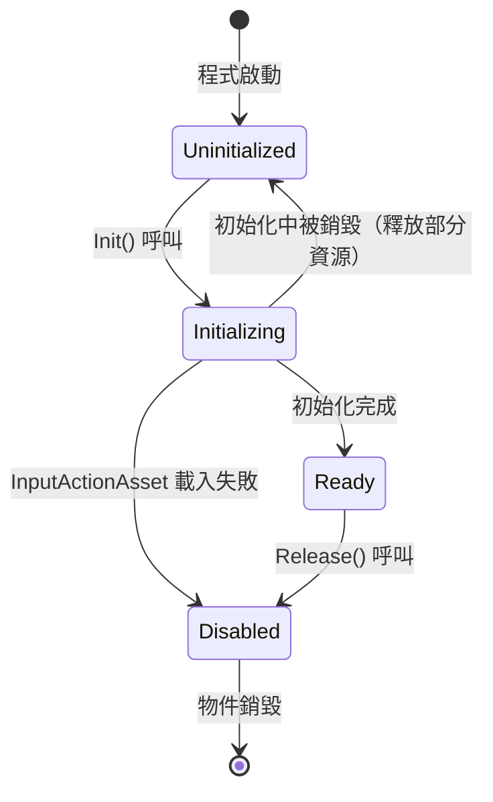
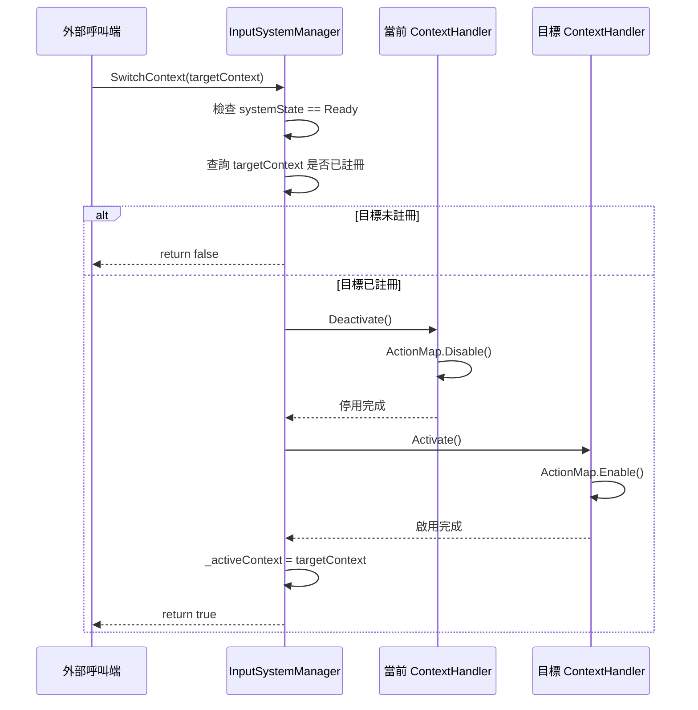

# 技術設計文件：Input System（輸入管理系統）

## 目錄

- [Overview](#overview)
- [Architecture](#architecture)
  - [整體結構](#整體結構)
  - [設計決策](#設計決策)
- [Components and Interfaces](#components-and-interfaces)
  - [1. InputSystemManager — 輸入系統管理器](#1-inputsystemmanager--輸入系統管理器)
  - [2. DeviceDetector — 裝置偵測器](#2-devicedetector--裝置偵測器)
  - [3. BindingManager — 按鍵綁定管理器](#3-bindingmanager--按鍵綁定管理器)
  - [4. ConflictChecker — 衝突檢查器](#4-conflictchecker--衝突檢查器)
  - [5. IContextHandler — 情境處理器介面](#5-icontexthandler--情境處理器介面)
  - [6. BindingProfile — 綁定設定檔](#6-bindingprofile--綁定設定檔)
  - [7. InputActionEnumAttribute and ActionEnumResolver — 動作列舉標註與解析](#7-inputactionenumattribute-and-actionenumresolver--動作列舉標註與解析)
- [Data Models](#data-models)
  - [系統生命週期狀態機](#系統生命週期狀態機)
  - [情境切換流程](#情境切換流程)
  - [關鍵資料結構](#關鍵資料結構)
- [Correctness Properties](#correctness-properties)
  - [Property 1: Device Type Stability — 同裝置連續輸入不重複觸發事件](#property-1-device-type-stability--同裝置連續輸入不重複觸發事件)
  - [Property 2: Binding Override Round-Trip — 綁定儲存載入往返一致性](#property-2-binding-override-round-trip--綁定儲存載入往返一致性)
  - [Property 3: Conflict Symmetry — 衝突檢測對稱性](#property-3-conflict-symmetry--衝突檢測對稱性)
  - [Property 4: Context Exclusivity — 情境處理器互斥啟用](#property-4-context-exclusivity--情境處理器互斥啟用)
  - [Property 5: Binding Query Consistency — 綁定修改後查詢即時一致](#property-5-binding-query-consistency--綁定修改後查詢即時一致)
  - [Property 6: Conflict Scope Isolation — 衝突範圍隔離性](#property-6-conflict-scope-isolation--衝突範圍隔離性)
  - [Property 7: Reset Idempotence — 重置操作冪等性](#property-7-reset-idempotence--重置操作冪等性)
- [Error Handling](#error-handling)
  - [錯誤場景與對應策略](#錯誤場景與對應策略)
  - [錯誤回傳設計](#錯誤回傳設計)
- [Testing Strategy](#testing-strategy)
  - [使用的測試框架](#使用的測試框架)
  - [屬性導向測試（PBT）](#屬性導向測試pbt)
  - [範例導向測試（Unit Tests）](#範例導向測試unit-tests)
  - [整合測試](#整合測試)

---

## Overview

本設計文件定義以 Unity Input System 為基礎的輸入管理系統架構。系統核心目標為：

- **統一輸入管理**：透過單一入口點（`InputSystemManager`）統籌所有輸入相關功能
- **即時裝置偵測**：偵測玩家最後使用的輸入裝置類型（鍵盤滑鼠 / 搖桿），並以事件通知外部系統
- **動態按鍵綁定**：支援執行時期修改按鍵配置，並提供持久化儲存與載入機制。透過型別安全的 Enum 識別動作（取代字串），搭配 `[InputActionEnum]` 屬性標註與 `ActionEnumResolver` 執行期驗證，兼顧編譯期安全與擴充彈性
- **按鍵衝突檢查**：在相同情境與裝置類型範圍內檢測重複綁定
- **情境式輸入架構**：將不同遊戲狀態（主選單、遊戲中、暫停選單等）的輸入處理拆分為獨立模組，透過 ActionMap 的啟用與停用實現情境切換

設計利用專案現有的 `Singleton<T>` 基底類別實現 `InputSystemManager` 的全域唯一存取。系統以 Unity Input System Package（`com.unity.inputsystem`）為底層基礎設施，透過 `InputSystem.onEvent` 偵測裝置輸入、`InputActionRebindingExtensions` 處理動態綁定、`InputActionMap.Enable()/Disable()` 控制情境切換。

[↩](#目錄)
---

## Architecture

### 整體結構


### 設計決策

| 決策 | 選項 | 採用方案 | 理由 |
|------|------|----------|------|
| InputSystemManager 生命週期 | 靜態類別 vs Singleton | **繼承 `Singleton<T>`** | 利用專案現有基礎設施，提供全域唯一存取與執行緒安全初始化 |
| 裝置偵測機制 | `InputSystem.onEvent` vs 輪詢 `InputDevice.lastUpdateTime` | **`InputSystem.onEvent`** | 事件驅動，不浪費 CPU；可直接從 `InputEventPtr` 取得來源裝置 |
| 動態綁定方式 | 直接修改 `InputBinding.path` vs `overridePath` | **`overridePath`（Binding Override）** | 非破壞性修改，保留原始綁定供重置使用；Unity 官方推薦做法 |
| 綁定持久化格式 | 自訂二進位 vs JSON | **JSON（`SaveBindingOverridesAsJson` / `LoadBindingOverridesFromJson`）** | Unity Input System 內建 API，跨平台相容，人類可讀 |
| 儲存抽象層 | 直接使用 `PlayerPrefs` vs 儲存介面 | **`IBindingStorage` 介面** | 解耦儲存實作，便於測試與替換（`PlayerPrefs`、檔案系統、雲端存檔） |
| 情境切換策略 | 同時啟用多個 ActionMap vs 互斥啟用 | **互斥啟用（同一時間僅一個 Context 處於啟用狀態）** | 符合需求 5.2，避免跨情境按鍵衝突 |
| 情境處理器設計 | 抽象類別 vs 介面 | **`IContextHandler` 介面** | 最大化靈活性，不限制繼承結構；符合需求 5.7 |
| 衝突判定範圍 | 全域衝突 vs 同 Context 同裝置 | **同 `InputContext` 且同 `InputDeviceType`** | 符合需求 3.4，跨情境綁定不視為衝突 |
| 衝突判定標準 | 模糊比對 vs 字串相等 | **字串完全相等（Binding Path 字串相等）** | 符合需求 3.4 明確規定 |
| Context 上限 | 無限制 vs 固定上限 | **1 至 32 個** | 符合需求 5.1，防止無限制註冊造成資源浪費 |
| Action 識別方式 | `string` vs `Enum` | **`Enum` + `[InputActionEnum]` Attribute 驗證** | 編譯期避免 typo，Attribute 確保型別合法性，`ActionEnumResolver` 負責轉換為 Unity action name 字串，同時保留擴充彈性 |

[↩](#目錄)
---

## Components and Interfaces

### 1. InputSystemManager — 輸入系統管理器

繼承 `Singleton<InputSystemManager>`，作為輸入系統的統一入口。負責：

- 載入 `InputActionAsset` 並初始化所有子系統
- 管理 `IContextHandler` 的註冊與情境切換
- 協調 `DeviceDetector`、`BindingManager`、`ConflictChecker` 的生命週期
- 維護系統狀態（`SystemState`）並在非就緒狀態下拒絕操作

```csharp
/// <summary>
/// 輸入系統管理器，統籌所有輸入相關功能的核心管理類別。
/// 繼承 Singleton 確保全域唯一存取。
/// </summary>
public class InputSystemManager : Singleton<InputSystemManager>
{
    private InputActionAsset _inputActionAsset;
    private readonly Dictionary<InputContext, IContextHandler> _contextHandlers
        = new Dictionary<InputContext, IContextHandler>();
    private InputContext? _activeContext;

    /// <summary>
    /// Initializes a new instance of the <see cref="InputSystemManager"/> class.
    /// </summary>
    protected InputSystemManager()
    {
    }

    /// <summary>
    /// Gets or sets 系統目前狀態。
    /// </summary>
    public SystemState SystemState { get; private set; } = SystemState.Uninitialized;

    /// <summary>
    /// Gets or sets 裝置偵測器實例。
    /// </summary>
    public DeviceDetector DeviceDetector { get; private set; }

    /// <summary>
    /// Gets or sets 按鍵綁定管理器實例。
    /// </summary>
    public BindingManager BindingManager { get; private set; }

    /// <summary>
    /// Gets or sets 衝突檢查器實例。
    /// </summary>
    public ConflictChecker ConflictChecker { get; private set; }
}
```

**公開介面摘要：**

| 成員 | 回傳型別 | 說明 |
|------|----------|------|
| `Init(InputActionAsset)` | `void` | 載入資產並初始化所有子系統 |
| `RegisterContextHandler(IContextHandler)` | `bool` | 註冊情境處理器，失敗回傳 `false` |
| `SwitchContext(InputContext)` | `bool` | 切換啟用的情境，失敗回傳 `false` |
| `GetActiveContext()` | `InputContext?` | 查詢目前啟用的情境 |
| `Release()` | `void` | 釋放所有資源，停用所有處理器 |

### 2. DeviceDetector — 裝置偵測器

透過 `InputSystem.onEvent` 監聽所有低階輸入事件，根據事件來源裝置的型別判斷目前使用的輸入裝置，並在裝置切換時觸發回呼通知。

```csharp
/// <summary>
/// 裝置偵測器，負責即時偵測最後使用的輸入裝置來源。
/// 透過 InputSystem.onEvent 監聽所有低階輸入事件。
/// </summary>
public class DeviceDetector
{
    private readonly float _mouseMoveThreshold;
    private readonly float _gamepadAxisThreshold;
    private Action<InputDeviceType> _onDeviceChanged;

    /// <summary>
    /// Initializes a new instance of the <see cref="DeviceDetector"/> class.
    /// </summary>
    /// <param name="mouseMoveThreshold">滑鼠移動距離閥值。</param>
    /// <param name="gamepadAxisThreshold">搖桿類比軸位移閥值。</param>
    public DeviceDetector(float mouseMoveThreshold = 0.1f, float gamepadAxisThreshold = 0.2f)
    {
        this._mouseMoveThreshold = mouseMoveThreshold;
        this._gamepadAxisThreshold = gamepadAxisThreshold;
    }

    /// <summary>
    /// Gets or sets 目前偵測到的輸入裝置類型。
    /// </summary>
    public InputDeviceType CurrentDeviceType { get; private set; } = InputDeviceType.KeyboardMouse;

    /// <summary>
    /// 註冊裝置切換事件回呼。
    /// </summary>
    /// <param name="callback">切換時呼叫的回呼。</param>
    public void RegisterDeviceChangedCallback(Action<InputDeviceType> callback)
    {
        this._onDeviceChanged += callback;
    }

    /// <summary>
    /// 取消註冊裝置切換事件回呼。
    /// </summary>
    /// <param name="callback">要取消的回呼。</param>
    public void UnregisterDeviceChangedCallback(Action<InputDeviceType> callback)
    {
        this._onDeviceChanged -= callback;
    }
}
```

**裝置判定邏輯：**

- 事件來源為 `Keyboard`、`Mouse`（按鍵、滾輪、移動距離超過閥值）→ `KeyboardMouse`
- 事件來源為 `Gamepad`（按鍵按下、類比軸絕對值超過閥值）→ `Gamepad`
- 同一裝置類型連續輸入時不重複觸發事件

### 3. BindingManager — 按鍵綁定管理器

負責動態按鍵綁定、綁定持久化、以及綁定查詢。使用 Unity 的 `InputActionRebindingExtensions` 提供的 `ApplyBindingOverride` 進行非破壞性綁定修改，並透過 `SaveBindingOverridesAsJson` / `LoadBindingOverridesFromJson` 處理序列化。所有接受動作參數的 API 採用 `Enum action` 型別，內部透過 `ActionEnumResolver` 驗證並轉換為 Unity action name 字串。

```csharp
/// <summary>
/// 按鍵綁定管理器，負責動態按鍵綁定與綁定資料的儲存管理。
/// </summary>
public class BindingManager
{
    private InputActionAsset _inputActionAsset;
    private IBindingStorage _storage;
    private readonly Dictionary<InputDeviceType, BindingProfile> _profiles
        = new Dictionary<InputDeviceType, BindingProfile>();

    /// <summary>
    /// 套用指定 Action 的綁定覆寫。同一幀內立即生效。
    /// </summary>
    /// <param name="action">動作列舉值（需標註 [InputActionEnum]）。</param>
    /// <param name="bindingPath">新的 Binding Path。</param>
    /// <param name="deviceType">目標裝置類型。</param>
    public void ApplyBinding(Enum action, string bindingPath, InputDeviceType deviceType)
    {
        // ActionEnumResolver.Validate(action) → Resolve → ApplyBindingOverride
    }

    /// <summary>
    /// 查詢指定 Action 在指定裝置類型下所有綁定的顯示名稱。
    /// </summary>
    /// <param name="action">動作列舉值（需標註 [InputActionEnum]）。</param>
    /// <param name="deviceType">裝置類型。</param>
    /// <returns>顯示名稱清單；Action 無效或無綁定時回傳空集合。</returns>
    public IReadOnlyList<string> GetDisplayNames(Enum action, InputDeviceType deviceType)
    {
        // 回傳對應 InputBinding 的 ToDisplayString()
        return Array.Empty<string>();
    }

    /// <summary>
    /// 查詢指定 Action 在指定裝置類型下所有綁定的路徑。
    /// </summary>
    /// <param name="action">動作列舉值（需標註 [InputActionEnum]）。</param>
    /// <param name="deviceType">裝置類型。</param>
    /// <returns>Binding Path 清單；Action 無效或無綁定時回傳空集合。</returns>
    public IReadOnlyList<string> GetBindingPaths(Enum action, InputDeviceType deviceType)
    {
        return Array.Empty<string>();
    }

    /// <summary>
    /// 儲存指定裝置類型的綁定設定至儲存媒體。
    /// </summary>
    /// <param name="deviceType">裝置類型。</param>
    /// <returns>儲存成功回傳 true；失敗回傳 false 且保留現有綁定。</returns>
    public bool SaveBindings(InputDeviceType deviceType)
    {
        return false;
    }

    /// <summary>
    /// 從儲存媒體載入指定裝置類型的綁定設定。
    /// </summary>
    /// <param name="deviceType">裝置類型。</param>
    /// <returns>載入成功回傳 true；失敗時回退至預設值。</returns>
    public bool LoadBindings(InputDeviceType deviceType)
    {
        return false;
    }

    /// <summary>
    /// 重置指定 Action 的綁定至預設值。
    /// </summary>
    /// <param name="action">動作列舉值（需標註 [InputActionEnum]）。</param>
    /// <param name="deviceType">裝置類型。</param>
    public void ResetBinding(Enum action, InputDeviceType deviceType)
    {
    }

    /// <summary>
    /// 重置指定裝置類型所有綁定至預設值。
    /// </summary>
    /// <param name="deviceType">裝置類型。</param>
    public void ResetAllBindings(InputDeviceType deviceType)
    {
    }
}
```

### 4. ConflictChecker — 衝突檢查器

負責在相同 `InputContext` 與相同 `InputDeviceType` 範圍內檢測按鍵綁定衝突。衝突判定標準為 Binding Path 字串完全相等。所有接受動作參數的 API 採用 `Enum action` 型別，內部透過 `ActionEnumResolver` 驗證並轉換。

```csharp
/// <summary>
/// 衝突檢查器，負責檢查按鍵綁定是否存在衝突。
/// </summary>
public class ConflictChecker
{
    private InputActionAsset _inputActionAsset;
    private Dictionary<InputContext, IContextHandler> _contextHandlers;

    /// <summary>
    /// 衝突被偵測到時觸發的事件。
    /// 參數為觸發綁定的動作列舉值與衝突動作列舉值清單。
    /// </summary>
    public event Action<Enum, IReadOnlyList<Enum>> OnConflictDetected;

    /// <summary>
    /// 檢查指定 Action 與 Binding Path 是否存在衝突。
    /// </summary>
    /// <param name="action">要檢查的動作列舉值（需標註 [InputActionEnum]）。</param>
    /// <param name="bindingPath">要檢查的按鍵路徑。</param>
    /// <param name="deviceType">裝置類型。</param>
    /// <returns>衝突清單；無衝突時回傳空集合。</returns>
    public IReadOnlyList<BindingConflict> CheckConflict(
        Enum action,
        string bindingPath,
        InputDeviceType deviceType)
    {
        return Array.Empty<BindingConflict>();
    }

    /// <summary>
    /// 全域衝突掃描，回傳指定裝置類型下所有存在衝突的 Binding Path 群組。
    /// </summary>
    /// <param name="deviceType">裝置類型。</param>
    /// <returns>所有衝突清單。</returns>
    public IReadOnlyList<BindingConflict> ScanAllConflicts(InputDeviceType deviceType)
    {
        return Array.Empty<BindingConflict>();
    }
}
```

### 5. IContextHandler — 情境處理器介面

定義情境處理器的公開契約。每個具體實作對應一個 `InputContext`，內部對映至 Unity `InputActionMap`。啟用時監聽 ActionMap 的輸入事件並透過 C# `event` 對外發布；停用時停止所有事件發布。

```csharp
/// <summary>
/// 情境處理器介面，定義各情境輸入處理的公開契約。
/// </summary>
public interface IContextHandler
{
    /// <summary>
    /// Gets 此處理器對應的 InputContext。
    /// </summary>
    InputContext Context { get; }

    /// <summary>
    /// Gets a value indicating whether 此處理器是否處於啟用狀態。
    /// </summary>
    bool IsActive { get; }

    /// <summary>
    /// 啟用此情境處理器，開始監聽對應 ActionMap 並發布輸入事件。
    /// </summary>
    void Activate();

    /// <summary>
    /// 停用此情境處理器，停止發布所有輸入事件。
    /// </summary>
    void Deactivate();
}
```

### 6. BindingProfile — 綁定設定檔

儲存特定裝置類型的完整按鍵綁定配置。以 JSON 字串形式保存 Unity Input System 的 binding overrides 資料。

```csharp
/// <summary>
/// 綁定設定檔，儲存特定裝置類型的完整按鍵綁定配置。
/// </summary>
public class BindingProfile
{
    /// <summary>
    /// Initializes a new instance of the <see cref="BindingProfile"/> class.
    /// </summary>
    /// <param name="deviceType">裝置類型。</param>
    /// <param name="overridesJson">綁定覆寫的 JSON 字串。</param>
    public BindingProfile(InputDeviceType deviceType, string overridesJson)
    {
        this.DeviceType = deviceType;
        this.OverridesJson = overridesJson;
    }

    /// <summary>
    /// Gets 此設定檔對應的裝置類型。
    /// </summary>
    public InputDeviceType DeviceType { get; }

    /// <summary>
    /// Gets or sets 綁定覆寫的 JSON 字串。
    /// </summary>
    public string OverridesJson { get; set; }
}
```

### 7. InputActionEnumAttribute and ActionEnumResolver — 動作列舉標註與解析

提供型別安全的動作識別機制。透過 `[InputActionEnum]` 屬性將 Enum 與特定 `InputContext` 關聯，`ActionEnumResolver` 負責執行期驗證與名稱解析。

```csharp
/// <summary>
/// 標記一個列舉為合法的輸入動作列舉。
/// 該屬性將列舉與特定的 InputContext 關聯。
/// </summary>
[AttributeUsage(AttributeTargets.Enum)]
public class InputActionEnumAttribute : Attribute
{
    /// <summary>
    /// Initializes a new instance of the <see cref="InputActionEnumAttribute"/> class.
    /// </summary>
    /// <param name="context">此動作列舉所屬的情境。</param>
    public InputActionEnumAttribute(InputContext context)
    {
        this.Context = context;
    }

    /// <summary>
    /// Gets 此動作列舉所屬的 InputContext。
    /// </summary>
    public InputContext Context { get; }
}
```

```csharp
/// <summary>
/// 動作列舉解析器，負責驗證列舉合法性並轉換為 Unity action name 字串。
/// </summary>
public static class ActionEnumResolver
{
    /// <summary>
    /// 驗證指定列舉值所屬的列舉型別是否標註 [InputActionEnum]。
    /// </summary>
    /// <param name="action">要驗證的列舉值。</param>
    /// <returns>驗證通過回傳 true；未標註回傳 false。</returns>
    public static bool Validate(Enum action)
    {
        return action.GetType().GetCustomAttribute<InputActionEnumAttribute>() != null;
    }

    /// <summary>
    /// 將列舉值解析為對應的 Unity action name 字串。
    /// 若列舉成員標註 [ActionName] 屬性則使用其值，否則使用 Enum.ToString()。
    /// </summary>
    /// <param name="action">動作列舉值。</param>
    /// <returns>對應的 Unity action name 字串。</returns>
    public static string Resolve(Enum action)
    {
        // 檢查成員是否有 [ActionName("...")] 屬性，有則使用，否則 ToString()
        return action.ToString();
    }

    /// <summary>
    /// 取得指定動作列舉值所屬的 InputContext。
    /// </summary>
    /// <param name="action">動作列舉值。</param>
    /// <returns>關聯的 InputContext。</returns>
    public static InputContext GetContext(Enum action)
    {
        var attr = action.GetType().GetCustomAttribute<InputActionEnumAttribute>();
        return attr.Context;
    }
}
```

**範例動作列舉定義：**

```csharp
[InputActionEnum(InputContext.Gameplay)]
public enum GameplayAction
{
    Move,
    Jump,
    Attack,
    Interact
}

[InputActionEnum(InputContext.MainMenu)]
public enum MainMenuAction
{
    Navigate,
    Confirm,
    Cancel
}
```

[↩](#目錄)
---

## Data Models

### 系統生命週期狀態機



### 情境切換流程



### 關鍵資料結構

| 資料結構 | 型別 | 用途 |
|----------|------|------|
| `_contextHandlers` | `Dictionary<InputContext, IContextHandler>` | 儲存已註冊的情境處理器（上限 32 個） |
| `_profiles` | `Dictionary<InputDeviceType, BindingProfile>` | 儲存每種裝置類型的綁定設定檔 |
| `_activeContext` | `InputContext?` | 目前啟用的情境（null 表示無啟用） |
| `_systemState` | `SystemState` | 系統生命週期狀態 |
| `_currentDeviceType` | `InputDeviceType` | 最後偵測到的輸入裝置類型 |
| `_onDeviceChanged` | `Action<InputDeviceType>` | 裝置切換事件的多播委派 |
| `OverridesJson` | `string` | Unity `SaveBindingOverridesAsJson()` 產生的 JSON 字串 |

**BindingConflict 資料模型：**

```csharp
/// <summary>
/// 表示一個綁定衝突的資料結構。
/// </summary>
public class BindingConflict
{
    /// <summary>
    /// Initializes a new instance of the <see cref="BindingConflict"/> class.
    /// </summary>
    /// <param name="bindingPath">衝突的 Binding Path。</param>
    /// <param name="action">觸發衝突的動作列舉值。</param>
    /// <param name="conflictingActions">衝突的動作列舉值清單。</param>
    /// <param name="context">衝突所在的情境。</param>
    /// <param name="deviceType">衝突所在的裝置類型。</param>
    public BindingConflict(
        string bindingPath,
        Enum action,
        IReadOnlyList<Enum> conflictingActions,
        InputContext context,
        InputDeviceType deviceType)
    {
        this.BindingPath = bindingPath;
        this.Action = action;
        this.ConflictingActions = conflictingActions;
        this.Context = context;
        this.DeviceType = deviceType;
    }

    /// <summary>
    /// Gets 衝突的 Binding Path。
    /// </summary>
    public string BindingPath { get; }

    /// <summary>
    /// Gets 觸發衝突的動作列舉值。
    /// </summary>
    public Enum Action { get; }

    /// <summary>
    /// Gets 綁定至相同 Binding Path 的動作列舉值清單。
    /// </summary>
    public IReadOnlyList<Enum> ConflictingActions { get; }

    /// <summary>
    /// Gets 衝突所在的情境。
    /// </summary>
    public InputContext Context { get; }

    /// <summary>
    /// Gets 衝突所在的裝置類型。
    /// </summary>
    public InputDeviceType DeviceType { get; }
}
```

[↩](#目錄)
---

## Correctness Properties

*屬性（Property）是在所有合法執行情境下均應成立的行為特徵——本質上是對「系統應做什麼」的形式化陳述。屬性作為人類可讀規格與機器可驗證正確性保證之間的橋樑。*

> **屬性反思說明：**
> 經過去重分析後，原始 41 條驗收標準中有以下合併與篩選：
> - 需求 1.7（同裝置不重複觸發）為獨立的去重不變式 → **屬性 1**
> - 需求 2.4 + 2.6（儲存與載入）具備明確的往返性質 → **屬性 2**
> - 需求 3.1 + 3.2（衝突檢測結果）具備對稱性 → **屬性 3**
> - 需求 5.2 + 5.4 + 5.5（情境切換互斥）合併為互斥不變式 → **屬性 4**
> - 需求 2.3 + 4.6（綁定修改後即時查詢一致）合併 → **屬性 5**
> - 需求 3.4（同 Context 同裝置才衝突）為獨立的範圍隔離屬性 → **屬性 6**
> - 需求 2.9 + 2.10（重置操作冪等性）合併 → **屬性 7**
> - API 存在性（1.4, 1.5, 1.6）、初始狀態（1.8, 5.10）、架構設計（5.3, 5.6, 5.7）歸為範例測試
> - 錯誤處理邊界案例（2.5, 2.7, 3.6, 4.3-4.5, 5.8, 5.9, 6.3, 6.5-6.7）歸為邊界案例/範例測試
> - 最終保留 7 個各自提供獨立驗證價值的屬性。

---

### Property 1: Device Type Stability — 同裝置連續輸入不重複觸發事件

*對於任意長度的輸入事件序列，若所有事件均來自同一裝置類型，則 `DeviceDetector` 的裝置切換事件觸發次數應為零（初始設定後不再觸發），且 `CurrentDeviceType` 保持不變。*

**Validates: Requirements 1.7**

---

### Property 2: Binding Override Round-Trip — 綁定儲存載入往返一致性

*對於任意合法的 `InputDeviceType` 與任意組合的綁定覆寫操作，執行 `SaveBindings` 後再執行 `LoadBindings`，所得到的各 Action 綁定路徑應與儲存前完全一致。*

**Validates: Requirements 2.4, 2.6**

---

### Property 3: Conflict Symmetry — 衝突檢測對稱性

*對於任意兩個動作列舉值 A 和 B（屬於相同 `InputContext` 的 action enum），若 A 綁定至路徑 P 時 `CheckConflict` 回傳 B 為衝突項，則 B 綁定至路徑 P 時 `CheckConflict` 回傳也應包含 A 為衝突項（在相同 Context 與 DeviceType 下）。*

**Validates: Requirements 3.1, 3.2**

---

### Property 4: Context Exclusivity — 情境處理器互斥啟用

*對於任意長度的情境切換序列，在每次 `SwitchContext` 完成後，系統中所有已註冊的 `IContextHandler` 中 `IsActive == true` 的數量最多為 1，且僅有切換目標的處理器處於啟用狀態；被停用的處理器不再發布任何輸入事件。*

**Validates: Requirements 5.2, 5.4, 5.5**

---

### Property 5: Binding Query Consistency — 綁定修改後查詢即時一致

*對於任意合法的動作列舉值 `action`、`bindingPath` 與 `deviceType` 的組合，執行 `ApplyBinding` 後立即呼叫 `GetBindingPaths` 查詢相同 action 與裝置類型，回傳結果應包含剛設定的 `bindingPath`。*

**Validates: Requirements 2.3, 4.6**

---

### Property 6: Conflict Scope Isolation — 衝突範圍隔離性

*對於任意兩個不同的 `InputContext` C1 與 C2，即使兩個 Context 下各自存在綁定至相同 Binding Path 的 Action，跨 Context 的綁定不應被 `CheckConflict` 視為衝突。同理，不同 `InputDeviceType` 下的相同 Binding Path 也不構成衝突。*

**Validates: Requirements 3.4**

---

### Property 7: Reset Idempotence — 重置操作冪等性

*對於任意合法的動作列舉值 `action` 與 `deviceType`，執行 `ResetBinding` 一次後再執行一次，兩次查詢結果應完全相同（`f(x) == f(f(x))`）。同樣，`ResetAllBindings` 連續執行多次後，綁定狀態應與執行一次時完全一致。*

**Validates: Requirements 2.9, 2.10**

[↩](#目錄)
---

## Error Handling

### 錯誤場景與對應策略

| 場景 | 觸發條件 | 處理方式 | 對應需求 |
|------|----------|----------|----------|
| InputActionAsset 載入失敗 | 初始化時資產遺失或損毀 | 記錄錯誤，系統進入 `Disabled` 狀態，拒絕所有操作 | 6.5 |
| 系統未就緒時操作 | `SystemState != Ready` 時呼叫任何輸入操作 | 拒絕操作並回傳錯誤指示（回傳值 `false` 或空集合） | 6.6 |
| 初始化中被銷毀 | 初始化流程未完成即收到銷毀通知 | 釋放已建立的部分資源，取消已訂閱的事件 | 6.7 |
| 綁定儲存失敗 | `IBindingStorage.Save()` 回傳 `false`（磁碟寫入錯誤等） | 保留記憶體中現有綁定不變，`SaveBindings()` 回傳 `false` | 2.5 |
| 綁定載入格式無效 | JSON 反序列化失敗 | 回退至預設綁定設定，記錄警告訊息 | 2.7 |
| 查詢不存在的 Action | `ActionEnumResolver.Resolve()` 產出的 action name 未在 `InputActionAsset` 中找到 | 回傳空集合，不拋出例外 | 4.3 |
| 傳入未標註 `[InputActionEnum]` 的 Enum 值 | `ActionEnumResolver.Validate()` 回傳 `false` | 記錄警告，回傳空集合或 `false`，不拋出例外 | 4.3 |
| 查詢 Action 無對應裝置綁定 | Action 存在但指定裝置類型下無 binding | 回傳空集合 | 4.4 |
| 未定義的 DeviceType 列舉值 | 傳入非法列舉值 | 回傳空集合，不拋出例外 | 4.5 |
| 衝突檢查的 Action 未註冊 | `action` 所屬列舉型別的 `[InputActionEnum]` Context 未註冊於任何 Context Handler | 回傳錯誤指示（特殊的錯誤結果物件或空集合搭配標記） | 3.6 |
| 切換至未註冊的 Context | `SwitchContext` 的目標 Context 無對應處理器 | 維持當前 Context 不變，回傳 `false` | 5.8 |
| 重複註冊同一 Context | 已有 handler 對應該 Context | 拒絕註冊，回傳 `false` | 5.9 |
| Context 註冊數量超過上限 | 已達 32 個 handler | 拒絕註冊，回傳 `false` | 5.1 |

### 錯誤回傳設計

本系統優先採用**回傳值模式**而非例外拋出，避免在遊戲執行迴圈中頻繁使用 try-catch 影響效能：

- **布林回傳**：用於操作型方法（`RegisterContextHandler`、`SwitchContext`、`SaveBindings`、`LoadBindings`），`true` 代表成功，`false` 代表失敗
- **空集合回傳**：用於查詢型方法（`GetDisplayNames`、`GetBindingPaths`、`CheckConflict`），失敗或無結果時回傳空集合
- **日誌記錄**：嚴重錯誤（如 Asset 載入失敗、資料損毀）透過 `UnityEngine.Debug.LogError` 或 `Debug.LogWarning` 記錄

```csharp
// 系統未就緒時的操作守衛（各公開方法開頭）
if (this._systemState != SystemState.Ready)
{
    Debug.LogWarning($"[InputSystem] 操作被拒絕：系統狀態為 {this._systemState}");
    return false; // 或回傳空集合
}
```

[↩](#目錄)
---

## Testing Strategy

本功能涉及裝置偵測邏輯、綁定往返一致性、衝突檢測對稱性、情境切換互斥性等可形式化的行為屬性，適合採用**屬性導向測試（Property-Based Testing）** 與 **範例導向測試（Example-Based Testing）** 雙軌策略。

### 使用的測試框架

| 框架 | 用途 |
|------|------|
| [NUnit 3](https://nunit.org/) | 基礎測試框架（Unity Test Framework 內建相容） |
| [FsCheck](https://fscheck.github.io/FsCheck/) | C# 屬性導向測試（PBT）框架 |
| [FsCheck.NUnit](https://www.nuget.org/packages/FsCheck.NUnit) | FsCheck 與 NUnit 的整合套件 |
| [NSubstitute](https://nsubstitute.github.io/) | Mock 框架，用於模擬 `IBindingStorage`、`IContextHandler` |

### 屬性導向測試（PBT）

每個屬性測試最少執行 **100 次隨機迭代**，以發現邊界案例。

**標籤格式：** `[Category("Feature: input-system, Property N: <property_text>")]`

| 測試項目 | 對應屬性 | 測試策略 |
|----------|----------|----------|
| 同裝置連續輸入不重複觸發事件 | 屬性 1 | 生成隨機長度（1～500）的同一裝置類型輸入事件序列，模擬送入 `DeviceDetector`，驗證切換回呼觸發次數為 0 |
| 綁定儲存載入往返一致性 | 屬性 2 | 生成隨機的 action enum 值/Path 綁定組合，執行多次 `ApplyBinding`，儲存後重新載入，驗證所有 `GetBindingPaths` 結果與儲存前一致 |
| 衝突檢測對稱性 | 屬性 3 | 生成隨機的同 Context action enum 配對與共用 Binding Path，設定綁定後分別對兩個 action 執行 `CheckConflict`，驗證互相出現在對方的衝突清單中 |
| 情境處理器互斥啟用 | 屬性 4 | 生成隨機的 Context 切換序列（長度 2～100），每次切換後遍歷所有 handler 驗證 `IsActive` 數量 ≤ 1 |
| 綁定修改後查詢即時一致 | 屬性 5 | 生成隨機的 action enum 值/bindingPath/deviceType 組合，執行 `ApplyBinding` 後立即查詢，驗證結果包含新路徑 |
| 衝突範圍隔離性 | 屬性 6 | 生成隨機的兩個不同 Context，各自設定相同 Binding Path 的不同 Action，執行 `CheckConflict` 驗證跨 Context 不報衝突 |
| 重置操作冪等性 | 屬性 7 | 生成隨機綁定修改後執行 `ResetBinding`，記錄結果，再次執行 `ResetBinding`，驗證兩次查詢結果完全相同 |

### 範例導向測試（Unit Tests）

| 測試項目 | 說明 | 對應需求 |
|----------|------|----------|
| 初始裝置類型為 KeyboardMouse | 初始化後未輸入，`CurrentDeviceType == KeyboardMouse` | 1.8 |
| 鍵盤輸入切換至 KeyboardMouse | 模擬鍵盤按鍵事件，驗證類型更新 | 1.1 |
| 搖桿輸入切換至 Gamepad | 模擬搖桿按鍵事件，驗證類型更新 | 1.2 |
| 回呼按註冊順序觸發 | 註冊 3 個回呼，觸發切換，驗證呼叫順序 | 1.3 |
| 取消註冊後不再收到回呼 | 取消註冊後觸發切換，驗證未呼叫 | 1.5 |
| 儲存失敗保留現有綁定 | Mock `IBindingStorage.Save()` 回傳 `false`，驗證綁定未變 | 2.5 |
| 載入無效 JSON 回退至預設 | 注入損毀 JSON，驗證使用預設綁定 | 2.7 |
| 啟動時自動載入已儲存設定 | 預設 storage 有資料，初始化後驗證已套用 | 2.8 |
| 未註冊 Action 衝突檢查回傳錯誤 | 傳入未標註 `[InputActionEnum]` 的 Enum 值，驗證回傳錯誤指示 | 3.6 |
| 動態綁定後自動觸發衝突事件 | 綁定至已衝突路徑，驗證 `OnConflictDetected` 觸發且參數為 Enum 型別 | 3.3 |
| 全域掃描涵蓋所有衝突 | 設定已知衝突，驗證 `ScanAllConflicts` 完整回傳 | 3.5 |
| 查詢不存在 Action 回傳空集合 | 傳入未標註 `[InputActionEnum]` 的 Enum 值，驗證不拋例外且回傳空 | 4.3 |
| 無綁定 Action 回傳空集合 | 存在 Action 但無對應裝置綁定，回傳空 | 4.4 |
| 未定義列舉值回傳空集合 | 傳入 `(InputDeviceType)99`，驗證不拋例外 | 4.5 |
| 切換未註冊 Context 失敗 | 目標未註冊，回傳 `false` 且當前不變 | 5.8 |
| 重複註冊同 Context 失敗 | 已有 handler，回傳 `false` | 5.9 |
| 超過 32 個 handler 拒絕註冊 | 達上限後再註冊，回傳 `false` | 5.1 |
| 初始化完成後所有 handler 皆停用 | 初始化後遍歷所有 handler 驗證 `IsActive == false` | 5.10 |
| Asset 載入失敗進入 Disabled | Mock 資產載入失敗，驗證 `SystemState == Disabled` | 6.5 |
| Disabled 狀態拒絕操作 | 在 Disabled 狀態呼叫操作，驗證回傳失敗 | 6.6 |
| Release 釋放資源 | 呼叫 `Release()`，驗證所有 handler 停用且事件取消訂閱 | 6.4 |

### 整合測試

| 測試項目 | 說明 |
|----------|------|
| 完整初始化流程 | 傳入有效 `InputActionAsset`，驗證系統到達 `Ready` 狀態且子系統正確初始化 |
| 裝置切換觸發 UI 回呼 | 模擬裝置切換，驗證透過回呼的外部系統正確收到通知 |
| 情境切換切實啟用 ActionMap | 切換 Context 後驗證對應 `InputActionMap` 的 `enabled` 狀態 |
| 綁定修改影響實際輸入行為 | 修改綁定後模擬輸入，驗證觸發正確的 Action 回呼 |

**注意事項：**

- 測試需使用 Unity Test Framework 的 **Edit Mode Tests** 以避免需要完整場景生命週期
- `DeviceDetector` 的輸入事件模擬需透過 Unity Input System 的 `InputTestFixture` 提供測試用輸入設備
- `IBindingStorage` 使用 NSubstitute mock 實作，避免測試依賴實際檔案系統
- `IContextHandler` 使用 mock 實作，驗證 `Activate()`/`Deactivate()` 呼叫語義
- 由於 `Singleton<T>` 為全域狀態，每個測試的 `[SetUp]` 需透過反射重置 `_instance` 欄位

[↩](#目錄)
---
