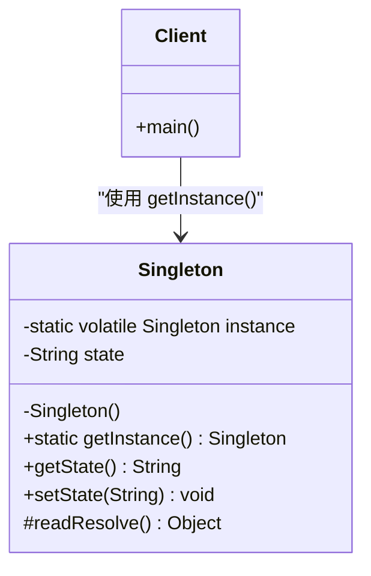
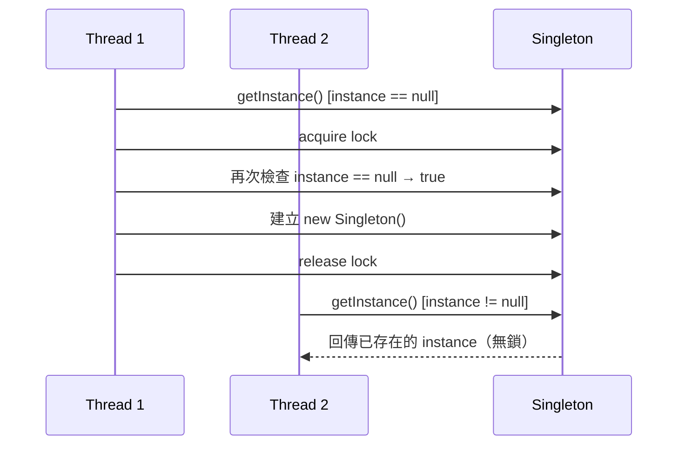
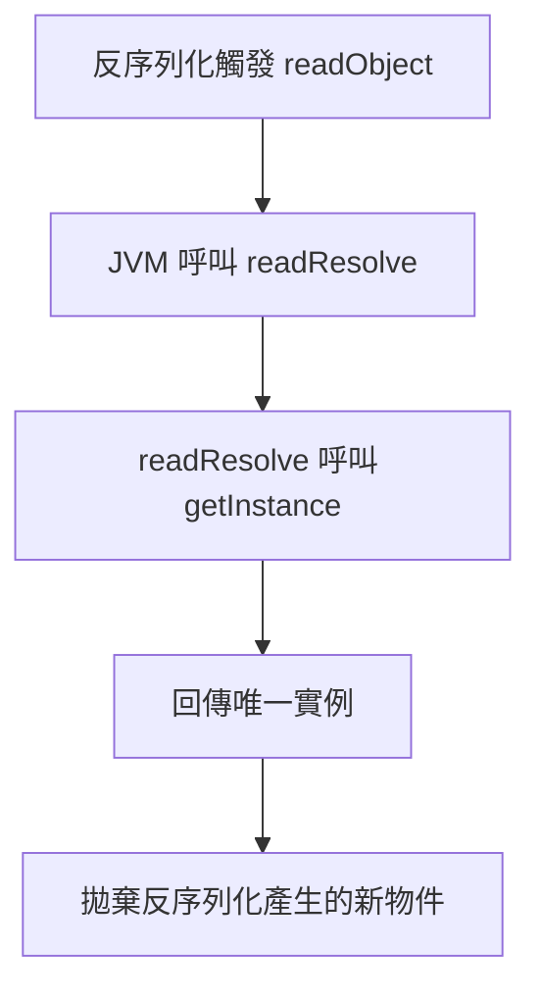
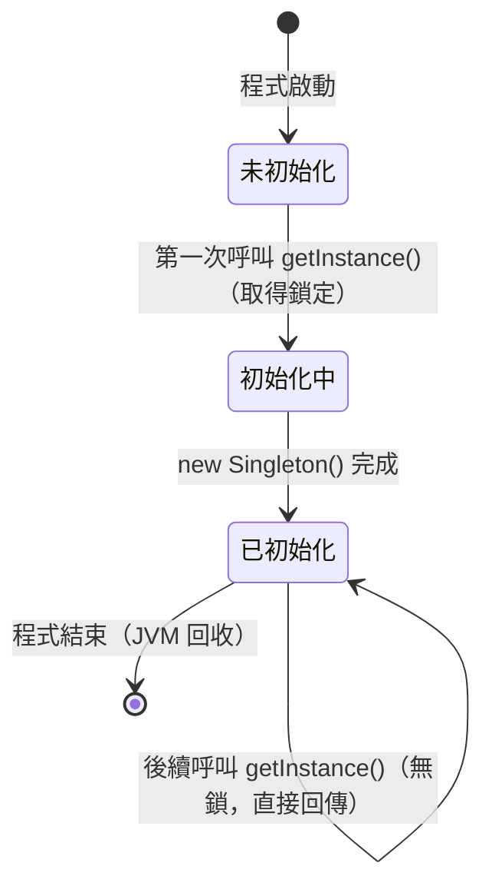

# 技術設計文件：Singleton Pattern（單例模式）

## 目錄

- [概覽](#概覽)
- [架構](#架構)
  - [整體結構](#整體結構)
  - [設計決策](#設計決策)
- [元件與介面](#元件與介面)
  - [1. Singleton 核心類別](#1-singleton-核心類別)
  - [2. 執行緒安全狀態存取設計](#2-執行緒安全狀態存取設計)
  - [3. 序列化防護流程](#3-序列化防護流程)
- [資料模型](#資料模型)
  - [實例生命週期狀態機](#實例生命週期狀態機)
  - [關鍵欄位說明](#關鍵欄位說明)
  - [volatile 的必要性](#volatile-的必要性)
- [正確性屬性](#正確性屬性)
  - [屬性 1：多次存取回傳相同實例](#屬性-1多次存取回傳相同實例)
  - [屬性 2：反射防護](#屬性-2反射防護建構子防衛子句阻止第二個實例)
  - [屬性 3：執行緒安全](#屬性-3執行緒安全並發存取只建立一個實例)
  - [屬性 4：序列化往返保持同一實例](#屬性-4序列化往返保持同一實例)
  - [屬性 5：並發狀態修改的安全性與可見性](#屬性-5並發狀態修改的安全性與可見性)
- [錯誤處理](#錯誤處理)
  - [錯誤場景與對應策略](#錯誤場景與對應策略)
  - [例外訊息設計](#例外訊息設計)
- [測試策略](#測試策略)
  - [使用的測試框架](#使用的測試框架)
  - [屬性導向測試（PBT）](#屬性導向測試pbt)
  - [範例導向測試（Unit Tests）](#範例導向測試unit-tests)
  - [注意事項](#注意事項)

---

## 概覽

Singleton Pattern 是一種創建型設計模式，核心目標是確保某個類別在整個應用程式生命週期中僅存在一個實例，並提供統一的全域存取入口。

本 spec 聚焦以下幾個面向：
- 基本單例實作（私有建構子 + 靜態存取方法）
- **延遲初始化（Lazy Initialization）** 策略：首次存取時才建立實例
- 執行緒安全（Thread-Safe）實作，採用雙重檢查鎖定（Double-Checked Locking）
- 單例完整性保護（防止序列化、反射、複製等破壞手段）
- 內部狀態的執行緒安全管理

設計以 Java 為主要示範語言，但概念可移植至 C#、TypeScript 等語言。

---

## 架構

### 整體結構



### 設計決策

| 決策 | 選項 | 採用方案 | 理由 |
|------|------|----------|------|
| 初始化時機 | Eager vs Lazy | **Lazy** | 節省資源，符合需求 2 |
| 執行緒安全機制 | synchronized 方法 vs DCL vs Holder | **Double-Checked Locking (DCL)** | 效能最佳，僅在首次初始化需要鎖定 |
| volatile 使用 | 有 vs 無 | **有 (`volatile`)** | 防止 JVM 指令重排造成部分初始化物件被回傳 |
| 防複製 | 實作 Cloneable vs 不實作 | **不實作 Cloneable** | 最簡單可靠的防複製手段 |
| 防反射 | 建構子內拋出例外 | **建構子防衛子句** | 偵測到已有實例時拋出 `IllegalStateException` |

---

## 元件與介面

### 1. `Singleton` 核心類別

```java
public final class Singleton {

    // volatile 確保多執行緒環境下的可見性與有序性
    private static volatile Singleton instance;

    // 私有建構子：防止外部直接建立實例，並防禦反射攻擊
    private Singleton() {
        if (instance != null) {
            throw new IllegalStateException("請透過 getInstance() 取得實例");
        }
    }

    // 雙重檢查鎖定（DCL）：執行緒安全的延遲初始化
    public static Singleton getInstance() {
        if (instance == null) {                     // 第一次檢查（無鎖）
            synchronized (Singleton.class) {
                if (instance == null) {             // 第二次檢查（持鎖）
                    instance = new Singleton();
                }
            }
        }
        return instance;
    }

    // 防止反序列化建立新實例
    protected Object readResolve() {
        return getInstance();
    }

    // --- 狀態管理 ---
    private volatile String state;

    public String getState() {
        return state;
    }

    public synchronized void setState(String newState) {
        this.state = newState;
    }
}
```

**公開介面摘要：**

| 方法 | 回傳型別 | 說明 |
|------|----------|------|
| `getInstance()` | `Singleton` | 取得唯一實例（執行緒安全） |
| `getState()` | `String` | 讀取內部狀態（`volatile` 保證可見性） |
| `setState(String)` | `void` | 修改內部狀態（`synchronized` 保證原子性） |

### 2. 執行緒安全狀態存取設計



### 3. 序列化防護流程



---

## 資料模型

### 實例生命週期狀態機



### 關鍵欄位說明

| 欄位 | 型別 | 修飾詞 | 說明 |
|------|------|--------|------|
| `instance` | `Singleton` | `private static volatile` | 唯一實例參考，`volatile` 確保跨執行緒可見性 |
| `state` | `String` | `private volatile` | 示範用內部狀態欄位 |

### `volatile` 的必要性

JVM 可能重排指令，使得 `instance = new Singleton()` 分三步驟執行：
1. 配置記憶體空間
2. 將 `instance` 指向該空間（**此時物件尚未初始化完成**）
3. 執行建構子初始化

若沒有 `volatile`，執行緒 B 可能在步驟 2 後讀取到「非 null 但未完整初始化」的物件。`volatile` 透過寫入屏障（write barrier）確保步驟 3 在步驟 2 前對其他執行緒可見。

---

## 正確性屬性

*屬性（Property）是在所有合法執行情境下均應成立的行為特徵——本質上是對「系統應做什麼」的形式化陳述。屬性作為人類可讀規格與機器可驗證正確性保證之間的橋樑。*

> **屬性反思說明：**
> 經過去重分析後，原始分析中有以下合併：
> - 需求 1.2 與 2.3（多次存取回傳相同參考）完全相同 → **合併為屬性 1**
> - 需求 2.4（僅初始化一次）可從屬性 1 推導出，但並發情境下另有獨立意義 → **與需求 3.1 合併為屬性 3**
> - 需求 1.4 與 4.3（反射防護）描述完全相同的行為 → **合併為屬性 2**
> - 需求 6.1、6.2、6.4 均描述並發狀態修改的安全性 → **合併為屬性 5**
> - 最終保留 5 個各自提供獨立驗證價值的屬性。

---

#### 屬性 1：多次存取回傳相同實例

*對於任意呼叫次數 n（n ≥ 2），每次呼叫 `getInstance()` 所回傳的實例參考（reference identity）均應相同（`==` 成立）。*

**驗證：需求 1.2、2.3**

---

#### 屬性 2：反射防護——建構子防衛子句阻止第二個實例

*對於任意透過反射存取私有建構子的嘗試（在 `getInstance()` 已被呼叫、實例已存在之後），每次嘗試均應拋出 `IllegalStateException`，且整個應用程式中不得存在兩個不同的 `Singleton` 參考。*

**驗證：需求 1.4、4.3**

---

#### 屬性 3：執行緒安全——並發存取只建立一個實例

*對於任意數量的並發執行緒（n ≥ 2）同時第一次呼叫 `getInstance()`，系統應僅建立一個 `Singleton` 實例（建構子只被呼叫一次），且所有執行緒均取得同一個參考。*

**驗證：需求 2.4、3.1、3.2**

---

#### 屬性 4：序列化往返保持同一實例

*對於任意內部狀態值的 `Singleton` 實例 s，將其序列化後再反序列化，所得到的物件應與 s 為同一個參考（`readResolve` 攔截機制），即 `deserialize(serialize(s)) == s`。*

**驗證：需求 4.1、5.3**

---

### 屬性 5：並發狀態修改的安全性與可見性

*對於任意數量的並發執行緒和任意一組合法字串寫入操作，多執行緒同時呼叫 `setState()` 後，任意執行緒讀取到的 `getState()` 值均應屬於該合法寫入集合中的某一個值（不得為 `null` 或部分寫入的損壞值），且寫入操作結束後所有執行緒均能看見最新狀態。*

**驗證：需求 6.1、6.2、6.4**

---

## 錯誤處理

### 錯誤場景與對應策略

| 場景 | 錯誤類型 | 處理方式 |
|------|----------|----------|
| 嘗試直接呼叫建構子 | 編譯期：`private` 存取控制 | 編譯失敗，無需執行期處理 |
| 反射破壞（第二次呼叫建構子） | `IllegalStateException` | 建構子內偵測 `instance != null` 後拋出 |
| 反序列化建立新物件 | 實例不一致 | `readResolve()` 攔截並回傳唯一實例 |
| 嘗試 `clone()` | `CloneNotSupportedException` | 未實作 `Cloneable`，`Object.clone()` 拋出例外 |
| 多執行緒建立競爭 | 競爭條件（Race Condition） | DCL + `volatile` 防止，僅建立一個實例 |
| `setState` 並發衝突 | 資料損毀 | `synchronized` 關鍵字確保原子性 |

### 例外訊息設計

```java
// 反射防護例外
throw new IllegalStateException(
    "Singleton 實例已存在，禁止透過反射建立第二個實例。請使用 Singleton.getInstance()。"
);
```

---

## 測試策略

本功能涉及執行緒行為、序列化往返、反射防護等邏輯，適合採用**屬性導向測試（Property-Based Testing）**與**範例導向測試（Example-Based Testing）**雙軌策略。

### 使用的測試框架

| 框架 | 用途 |
|------|------|
| [JUnit 5](https://junit.org/junit5/) | 基礎測試框架 |
| [jqwik](https://jqwik.net/) | Java 屬性導向測試（PBT）框架 |
| [AssertJ](https://assertj.github.io/doc/) | 斷言函式庫 |

### 屬性導向測試（PBT）

每個屬性測試最少執行 **100 次隨機迭代**，以發現邊界案例。

**標籤格式：** `@Tag("Feature: singleton-pattern, Property N: <property_text>")`

| 測試項目 | 對應屬性 | 測試策略 |
|----------|----------|----------|
| 多次 `getInstance()` 回傳同一參考 | 屬性 1 | 生成隨機呼叫次數（2~1000），驗證所有回傳值的 `==` 關係 |
| 反射防護拋出例外 | 屬性 2 | 生成多次反射呼叫嘗試（在實例存在後），驗證每次均拋出 `IllegalStateException` |
| 並發存取只建立一個實例 | 屬性 3 | 生成隨機執行緒數量（2~50），使用 `CountDownLatch` 同時啟動，驗證建構子呼叫次數為 1 且所有回傳參考相同 |
| 序列化往返保持同一實例 | 屬性 4 | 生成隨機狀態值，序列化後反序列化，驗證 `==` 關係 |
| 並發狀態修改不損壞資料 | 屬性 5 | 生成隨機字串集合和執行緒數量，多執行緒並發寫入，驗證最終值屬於合法寫入集合 |

### 範例導向測試（Unit Tests）

| 測試項目 | 說明 |
|----------|------|
| 首次存取前 `instance == null` | 驗證延遲初始化（需要重置靜態欄位，可用反射輔助） |
| `private` 建構子存取控制 | 使用反射確認修飾詞為 `private` |
| `clone()` 拋出 `CloneNotSupportedException` | 驗證複製防護 |
| `readResolve()` 攔截反序列化 | 具體序列化/反序列化範例 |

### 注意事項

由於 `Singleton` 為全域靜態狀態，部分測試（尤其是延遲初始化測試）需要在測試前重置靜態欄位。建議：
- 使用反射在 `@BeforeEach` 中將 `instance` 欄位設回 `null`，或
- 提供僅用於測試的 `resetForTesting()` 套件私有方法（`package-private`）。
