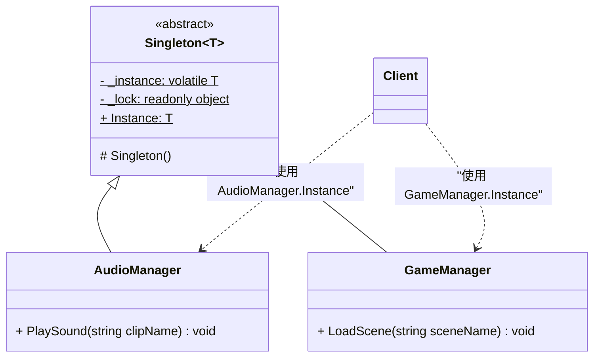
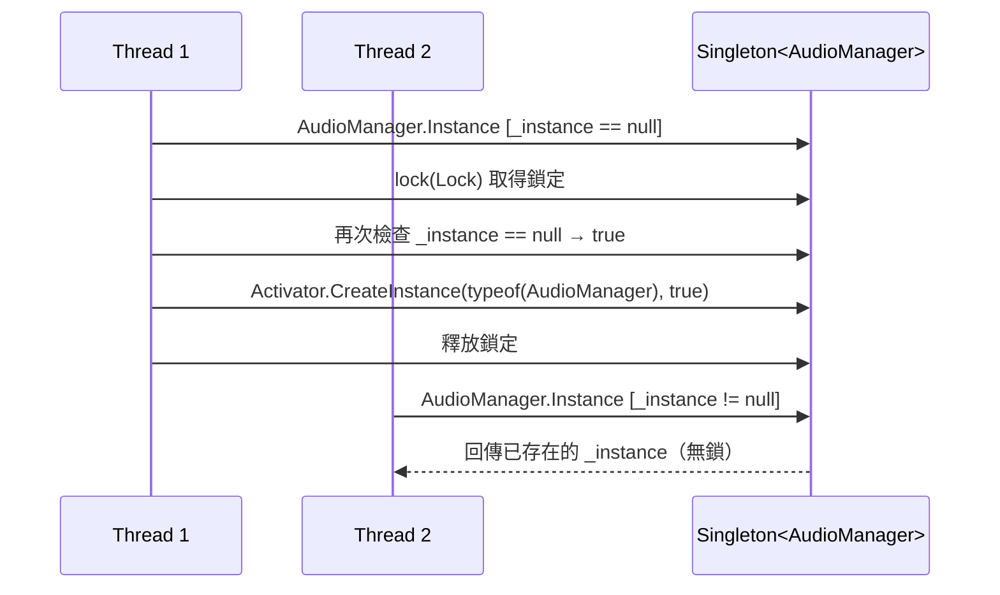
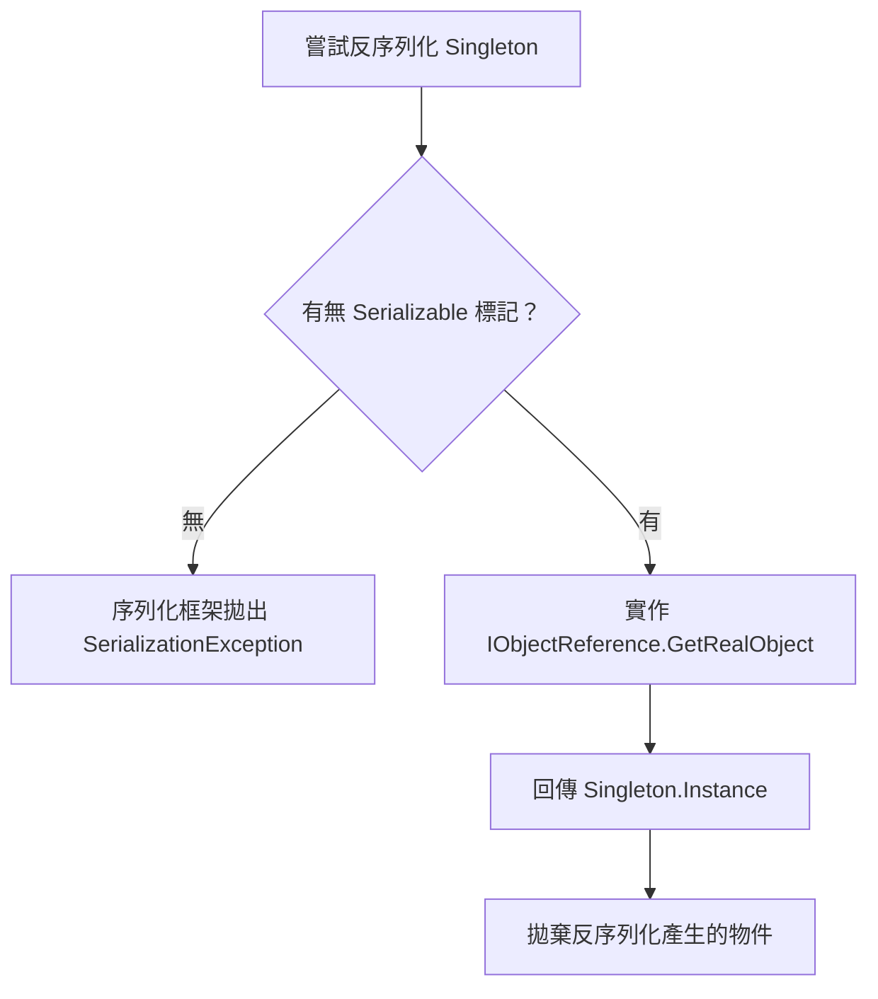
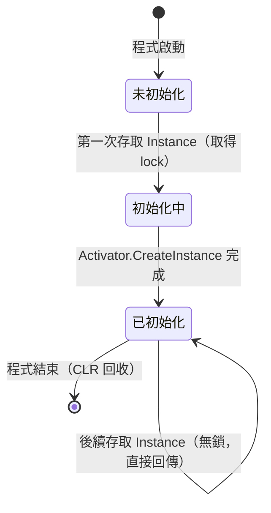

# 技術設計文件：Singleton Pattern（單例模式）

## 目錄

- [Overview](#overview)
- [Architecture](#architecture)
  - [整體結構](#整體結構)
  - [設計決策](#設計決策)
- [Components and Interfaces](#components-and-interfaces)
  - [1. Singleton&lt;T&gt; 抽象基底類別](#1-singletont-抽象基底類別)
  - [2. 範例子類別](#2-範例子類別)
  - [3. 執行緒安全狀態存取設計](#3-執行緒安全狀態存取設計)
  - [4. 序列化防護流程](#4-序列化防護流程)
- [Data Models](#data-models)
  - [實例生命週期狀態機](#實例生命週期狀態機)
  - [關鍵欄位說明](#關鍵欄位說明)
  - [volatile 的必要性](#volatile-的必要性)
- [Correctness Properties](#correctness-properties)
  - [Property 1: Identity Preservation — 多次存取回傳相同實例](#property-1-identity-preservation--多次存取回傳相同實例)
  - [Property 2: Reflection Guard — 建構子防衛子句阻止第二個實例](#property-2-reflection-guard--建構子防衛子句阻止第二個實例)
  - [Property 3: Thread Safety — 並發存取只建立一個實例](#property-3-thread-safety--並發存取只建立一個實例)
  - [Property 4: Serialization Round-Trip — 反序列化保持同一實例](#property-4-serialization-round-trip--反序列化保持同一實例)
  - [Property 5: Concurrent State Safety — 並發狀態修改的安全性與可見性](#property-5-concurrent-state-safety--並發狀態修改的安全性與可見性)
  - [Property 6: Per-Subclass Instance Isolation — 子類別實例獨立性](#property-6-per-subclass-instance-isolation--子類別實例獨立性)
- [Error Handling](#error-handling)
  - [錯誤場景與對應策略](#錯誤場景與對應策略)
  - [例外訊息設計](#例外訊息設計)
- [Testing Strategy](#testing-strategy)
  - [使用的測試框架](#使用的測試框架)
  - [屬性導向測試（PBT）](#屬性導向測試pbt)
  - [範例導向測試（Unit Tests）](#範例導向測試unit-tests)
  - [注意事項](#注意事項)

---

## Overview

Singleton Pattern 是一種創建型設計模式，核心目標是確保某個類別在整個應用程式生命週期中僅存在一個實例，並提供統一的全域存取入口。

本 spec 聚焦以下幾個面向：

- **可繼承的泛型抽象基底類別**：透過 `abstract class Singleton<T> where T : Singleton<T>` 提供可繼承的單例基底，子類別（如 `AudioManager`、`GameManager`）僅需繼承即可獲得完整單例功能，無需重複實作
- 基本單例實作（`protected` 建構子 + 靜態存取屬性）
- **延遲初始化（Lazy Initialization）** 策略：首次存取時才建立實例
- 執行緒安全（Thread-Safe）實作，採用雙重檢查鎖定（Double-Checked Locking）
- 單例完整性保護（防止反射等破壞手段）
- 內部狀態的執行緒安全管理
- **子類別實例隔離**：每個繼承自基底類別的子類別各自維護獨立的實例

設計以 **C#** 為實作語言，遵循 Unity 相容的 C# 版本，並符合本專案的 StyleCop 規範。

[↩](#目錄)
---

## Architecture

### 整體結構



### 設計決策

| 決策 | 選項 | 採用方案 | 理由 |
|------|------|----------|------|
| 初始化時機 | Eager vs Lazy | **Lazy** | 節省資源，符合需求 2 |
| 執行緒安全機制 | `lock` 方法 vs DCL vs `Lazy<T>` | **Double-Checked Locking (DCL)** | 效能最佳，僅在首次初始化需要鎖定；`Lazy<T>` 不適合 Unity 環境 |
| volatile 使用 | 有 vs 無 | **有（`volatile`）** | 防止 CLR 指令重排造成部分初始化物件被回傳 |
| 鎖定物件 | `typeof(Singleton)` vs 私有 `object` | **私有 `readonly object _lock`** | 避免外部程式碼對同一型別鎖定產生死鎖 |
| 防複製 | 實作 `ICloneable` vs 不實作 | **不實作 `ICloneable`** | 最簡單可靠的防複製手段 |
| 防反射 | 建構子內拋出例外 | **建構子防衛子句** | 偵測到已有實例時拋出 `InvalidOperationException` |
| 類別可繼承性 | `sealed` vs `abstract class` | **`abstract class`** | 需求 7 要求可繼承性；透過泛型約束 `where T : Singleton<T>` 確保型別安全 |
| 實例建立方式 | `Activator.CreateInstance` vs `new()` 約束 | **`Activator.CreateInstance(typeof(T), true)`** | 建構子為 `protected`，無法使用 `new()` 泛型約束；`Activator.CreateInstance` 的 `nonPublic: true` 參數可呼叫非公開建構子 |
| 存取介面 | 靜態方法 `GetInstance()` vs 靜態屬性 `Instance` | **靜態屬性 `Instance`** | 符合 C# 慣例 |

[↩](#目錄)
---

## Components and Interfaces

### 1. `Singleton<T>` 抽象基底類別

```csharp
/// <summary>
/// 可繼承的泛型抽象單例基底類別。
/// 子類別僅需繼承即可獲得完整的單例功能（延遲初始化、執行緒安全、反射防護）。
/// </summary>
/// <typeparam name="T">子類別型別，受限為 <see cref="Singleton{T}"/> 的子類別。</typeparam>
public abstract class Singleton<T>
    where T : Singleton<T>
{
    // volatile 確保多執行緒環境下的可見性與有序性
    private static volatile T _instance;

    // 專用鎖定物件，避免對 typeof(T) 加鎖造成潛在死鎖
    private static readonly object Lock = new object();

    /// <summary>
    /// Initializes a new instance of the <see cref="Singleton{T}"/> class.
    /// 防禦反射攻擊：若實例已存在，拋出例外阻止第二個實例產生。
    /// </summary>
    protected Singleton()
    {
        if (_instance != null)
        {
            throw new InvalidOperationException(
                $"{typeof(T).Name} 實例已存在，禁止建立第二個實例。請使用 {typeof(T).Name}.Instance。");
        }
    }

    /// <summary>
    /// Gets 唯一的 <typeparamref name="T"/> 實例，採用雙重檢查鎖定確保執行緒安全的延遲初始化。
    /// </summary>
    public static T Instance
    {
        get
        {
            if (_instance == null)                   // 第一次檢查（無鎖）
            {
                lock (Lock)
                {
                    if (_instance == null)           // 第二次檢查（持鎖）
                    {
                        _instance = (T)System.Activator.CreateInstance(typeof(T), true);
                    }
                }
            }

            return _instance;
        }
    }
}
```

### 2. 範例子類別

```csharp
/// <summary>
/// 範例：音訊管理器，繼承 Singleton 基底類別即可自動獲得單例功能。
/// </summary>
public class AudioManager : Singleton<AudioManager>
{
    private volatile string _state;

    /// <summary>
    /// Initializes a new instance of the <see cref="AudioManager"/> class.
    /// </summary>
    protected AudioManager()
    {
    }

    /// <summary>
    /// Gets or sets 單例的內部狀態。
    /// get 由 volatile 保證跨執行緒可見性；set 由 lock 保證原子性。
    /// </summary>
    public string State
    {
        get
        {
            return this._state;
        }

        set
        {
            lock (StateLock)
            {
                this._state = value;
            }
        }
    }

    // 子類別自身的狀態鎖定物件
    private static readonly object StateLock = new object();

    /// <summary>
    /// 播放音效。
    /// </summary>
    /// <param name="clipName">音效片段名稱。</param>
    public void PlaySound(string clipName)
    {
        // 實作細節省略
    }
}

/// <summary>
/// 範例：遊戲管理器。
/// </summary>
public class GameManager : Singleton<GameManager>
{
    /// <summary>
    /// Initializes a new instance of the <see cref="GameManager"/> class.
    /// </summary>
    protected GameManager()
    {
    }

    /// <summary>
    /// 載入場景。
    /// </summary>
    /// <param name="sceneName">場景名稱。</param>
    public void LoadScene(string sceneName)
    {
        // 實作細節省略
    }
}
```

**公開介面摘要：**

| 成員 | 型別 | 說明 |
|------|------|------|
| `Singleton<T>.Instance` | `T`（靜態屬性） | 取得唯一的子類別實例（執行緒安全、延遲初始化） |
| `AudioManager.State` | `string`（屬性） | 讀取／修改內部狀態（`volatile` + `lock` 雙重保護） |
| `AudioManager.PlaySound(string)` | `void` | 播放指定音效 |
| `GameManager.LoadScene(string)` | `void` | 載入指定場景 |

### 3. 執行緒安全狀態存取設計



### 4. 序列化防護流程

C# 中透過自訂 `ISerializable` 或控制 `[Serializable]` 的反序列化回呼來防止建立第二個實例。本設計選擇**不標記 `[Serializable]`**，從根本上杜絕序列化破壞途徑；若業務需要序列化支援，應實作 `IObjectReference` 介面，使反序列化時直接回傳 `Instance`。



[↩](#目錄)
---

## Data Models

### 實例生命週期狀態機



### 關鍵欄位說明

| 欄位 | C# 型別 | 修飾詞 | 說明 |
|------|---------|--------|------|
| `_instance` | `T` | `private static volatile` | 唯一子類別實例參考，`volatile` 確保跨執行緒可見性；每個封閉泛型型別各自擁有獨立的靜態欄位 |
| `Lock` | `object` | `private static readonly` | 鎖定物件，避免對型別本身加鎖；同樣為每個封閉泛型型別各自獨立 |

### `volatile` 的必要性

CLR 可能重排指令，使 `Activator.CreateInstance` 的結果賦值分為多步驟執行：

1. 配置記憶體空間
2. 將 `_instance` 指向該空間（**此時物件尚未初始化完成**）
3. 執行建構子初始化

若沒有 `volatile`，執行緒 B 可能在步驟 2 後讀取到「非 `null` 但未完整初始化」的物件。`volatile` 透過寫入屏障（write barrier）確保步驟 3 在步驟 2 前對其他執行緒可見。

[↩](#目錄)
---

## Correctness Properties

*屬性（Property）是在所有合法執行情境下均應成立的行為特徵——本質上是對「系統應做什麼」的形式化陳述。屬性作為人類可讀規格與機器可驗證正確性保證之間的橋樑。*

> **屬性反思說明：**
> 經過去重分析後，原始分析中有以下合併：
> - 需求 1.2 與 2.3（多次存取回傳相同參考）完全相同 → **合併為屬性 1**
> - 需求 2.4（僅初始化一次）可從屬性 1 推導出，但並發情境下另有獨立意義 → **與需求 3.1 合併為屬性 3**
> - 需求 1.4 與 4.3（反射防護）描述完全相同的行為 → **合併為屬性 2**
> - 需求 6.1、6.2、6.4 均描述並發狀態修改的安全性 → **合併為屬性 5**
> - 需求 7.4（子類別實例獨立性）為全新的隔離屬性 → **新增為屬性 6**
> - 需求 7.3（繼承即可使用）由屬性 1 + 屬性 6 共同涵蓋；需求 7.6（子類別執行緒安全）由屬性 3 的泛型 DCL 機制涵蓋
> - 最終保留 6 個各自提供獨立驗證價值的屬性。

---

### Property 1: Identity Preservation — 多次存取回傳相同實例

*對於任意呼叫次數 n（n ≥ 2），每次存取 `Singleton<T>.Instance` 所回傳的實例參考（reference identity）均應相同（`ReferenceEquals` 成立）。*

**Validates: Requirements 1.2, 2.3**

---

### Property 2: Reflection Guard — 建構子防衛子句阻止第二個實例

*對於任意透過反射存取 `protected` 建構子的嘗試（在 `Instance` 已被存取、實例已存在之後），每次嘗試均應拋出 `InvalidOperationException`，且整個應用程式中不得存在兩個不同的同型別實例參考。*

**Validates: Requirements 1.4, 4.3**

---

### Property 3: Thread Safety — 並發存取只建立一個實例

*對於任意數量的並發執行緒（n ≥ 2）同時第一次存取 `Singleton<T>.Instance`，系統應僅建立一個實例（建構子只被呼叫一次），且所有執行緒均取得同一個參考。*

**Validates: Requirements 2.4, 3.1, 3.2, 7.6**

---

### Property 4: Serialization Round-Trip — 反序列化保持同一實例

*對於有序列化需求的 `Singleton<T>` 子類別實例 s，透過 `IObjectReference` 實作，反序列化後所得到的物件應與 s 為同一個參考，即 `ReferenceEquals(Deserialize(Serialize(s)), s)` 成立。若未標記 `[Serializable]`，則嘗試序列化應拋出 `SerializationException`，而非產生第二個實例。*

**Validates: Requirements 4.1, 5.3**

---

### Property 5: Concurrent State Safety — 並發狀態修改的安全性與可見性

*對於任意數量的並發執行緒和任意一組合法字串寫入操作，多執行緒同時呼叫 `State` setter 後，任意執行緒讀取到的 `State` 值均應屬於該合法寫入集合中的某一個值（不得為部分寫入的損壞值），且寫入操作結束後所有執行緒均能看見最新狀態。*

**Validates: Requirements 6.1, 6.2, 6.4**

---

### Property 6: Per-Subclass Instance Isolation — 子類別實例獨立性

*對於任意兩個不同的子類別 A 和 B（均繼承自 `Singleton<T>`），`A.Instance` 與 `B.Instance` 必須是各自獨立的物件（`!ReferenceEquals(A.Instance, B.Instance)` 成立），且各自在其型別範圍內保持唯一性（即 `ReferenceEquals(A.Instance, A.Instance)` 成立）。*

**Validates: Requirements 7.4**

[↩](#目錄)
---

## Error Handling

### 錯誤場景與對應策略

| 場景 | 錯誤類型 | 處理方式 |
|------|----------|----------|
| 外部程式碼嘗試直接實例化 | 編譯期：`protected` 存取控制 | 編譯失敗，無需執行期處理 |
| 反射破壞（第二次呼叫建構子） | `InvalidOperationException` | 建構子內偵測 `_instance != null` 後拋出 |
| 反序列化建立新物件 | `SerializationException` | 不標記 `[Serializable]`，序列化框架直接拒絕 |
| 子類別未提供 `protected` 無參建構子 | `MissingMethodException` | `Activator.CreateInstance(typeof(T), true)` 找不到建構子時拋出；設計文件與 XML 註解中明確說明子類別必須提供 `protected` 無參建構子 |
| 多執行緒建立競爭 | 競爭條件（Race Condition） | DCL + `volatile` 防止，僅建立一個實例 |
| `State` 並發衝突 | 資料損壞 | `lock` 確保 setter 原子性 |

### 例外訊息設計

```csharp
// 反射防護例外（基底類別建構子中）
throw new InvalidOperationException(
    $"{typeof(T).Name} 實例已存在，禁止建立第二個實例。請使用 {typeof(T).Name}.Instance。");
```

[↩](#目錄)
---

## Testing Strategy

本功能涉及執行緒行為、序列化往返、反射防護、泛型繼承隔離等邏輯，適合採用**屬性導向測試（Property-Based Testing）** 與 **範例導向測試（Example-Based Testing）** 雙軌策略。

### 使用的測試框架

| 框架 | 用途 |
|------|------|
| [NUnit 3](https://nunit.org/) | 基礎測試框架（Unity Test Framework 內建相容） |
| [FsCheck](https://fscheck.github.io/FsCheck/) | C# 屬性導向測試（PBT）框架 |
| [FsCheck.NUnit](https://www.nuget.org/packages/FsCheck.NUnit) | FsCheck 與 NUnit 的整合套件 |

### 屬性導向測試（PBT）

每個屬性測試最少執行 **100 次隨機迭代**，以發現邊界案例。

**標籤格式：** `[Category("Feature: singleton-pattern, Property N: <property_text>")]`

| 測試項目 | 對應屬性 | 測試策略 |
|----------|----------|----------|
| 多次 `Instance` 存取回傳同一參考 | 屬性 1 | 生成隨機存取次數（2～1000），驗證所有回傳值的 `ReferenceEquals` 關係 |
| 反射防護拋出例外 | 屬性 2 | 生成多次反射呼叫嘗試（在實例存在後），驗證每次均拋出 `InvalidOperationException` |
| 並發存取只建立一個實例 | 屬性 3 | 生成隨機執行緒數量（2～50），使用 `ManualResetEventSlim` 同時啟動，驗證建構子呼叫次數為 1 且所有回傳參考相同 |
| 序列化往返保持同一實例 | 屬性 4 | 驗證未標記 `[Serializable]` 時，`BinaryFormatter` 拋出 `SerializationException` 而非產生第二個實例 |
| 並發狀態修改不損壞資料 | 屬性 5 | 生成隨機字串集合和執行緒數量，多執行緒並發寫入，驗證最終 `State` 值屬於合法寫入集合 |
| 不同子類別各自擁有獨立 Instance | 屬性 6 | 生成隨機存取順序和組合（多個子類別），驗證任意兩個不同子類別的 `Instance` 之間 `!ReferenceEquals` 成立，且同一子類別的多次存取滿足 `ReferenceEquals` |

### 範例導向測試（Unit Tests）

| 測試項目 | 說明 |
|----------|------|
| 首次存取前 `_instance == null` | 驗證延遲初始化（使用反射讀取私有欄位，搭配 `[SetUp]` 重置） |
| `protected` 建構子存取控制 | 使用反射確認建構子修飾詞為 `Family`（`protected`） |
| `abstract` 類別驗證 | 驗證 `typeof(Singleton<>).IsAbstract == true` |
| 泛型約束驗證 | 驗證泛型參數 `T` 的約束為 `Singleton<T>` 本身的子類別 |
| 反射觸發第二次建構子拋出例外 | 驗證 `InvalidOperationException` 訊息內容 |
| 子類別繼承後即可使用 Instance | 驗證自訂子類別無需額外單例邏輯即可透過 `.Instance` 取得實例 |
| 子類別未提供無參建構子時拋出例外 | 驗證 `MissingMethodException` |

### 注意事項

由於 `Singleton<T>` 為全域靜態狀態，部分測試（尤其是延遲初始化測試）需要在測試前重置靜態欄位。建議：

- 使用反射在 `[SetUp]` 中將 `_instance` 欄位設回 `null`，或
- 提供僅用於測試的 `ResetForTesting()` `internal` 方法，並透過 `[assembly: InternalsVisibleTo("Tests")]` 開放給測試專案。

Unity Test Runner 執行測試時應使用 **Edit Mode Tests**，確保靜態狀態在不同測試間可正確重置。

[↩](#目錄)
---
